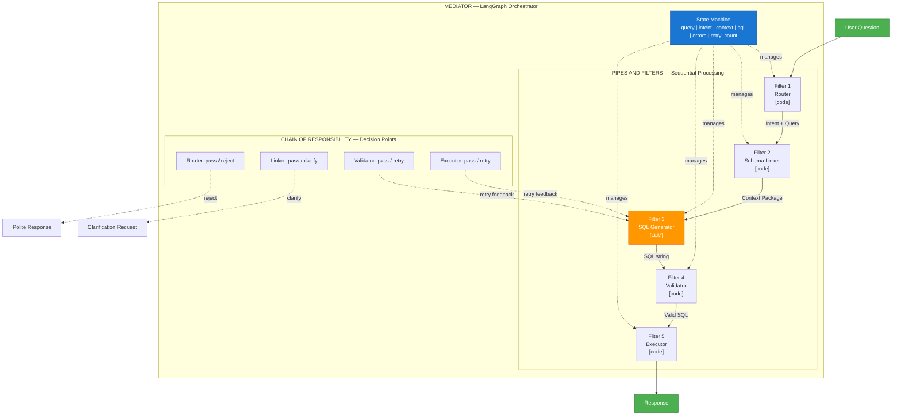
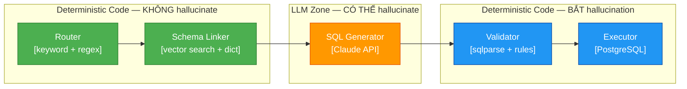
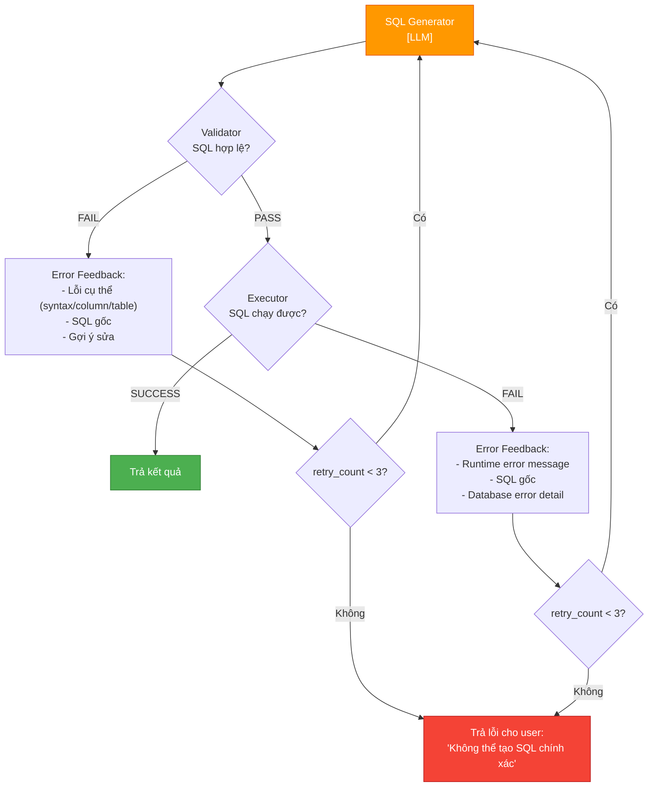

# Design Pattern — LLM-in-the-middle Pipeline

### Pattern Analysis cho Text-to-SQL Agent Platform (Banking/POS)

---

## MỤC LỤC

1. [Tổng quan Pattern](#1-tổng-quan-pattern)
2. [Pipes and Filters](#2-pipes-and-filters)
3. [Chain of Responsibility](#3-chain-of-responsibility)
4. [Mediator](#4-mediator)
5. [Mối quan hệ giữa 3 Patterns](#5-mối-quan-hệ-giữa-3-patterns)
6. [Khái niệm LLM-in-the-middle](#6-khái-niệm-llm-in-the-middle)
7. [Self-Correction Loop Pattern](#7-self-correction-loop-pattern)
8. [Lợi ích trong domain Banking](#8-lợi-ích-trong-domain-banking)

---

## 1. TỔNG QUAN PATTERN

Kiến trúc LLM-in-the-middle Pipeline được xây dựng dựa trên sự kết hợp của **3 design patterns** kinh điển:

| Pattern | Vai trò trong hệ thống | Áp dụng ở đâu |
|---------|------------------------|----------------|
| **Pipes and Filters** | Xử lý tuần tự qua các bước, output bước trước = input bước sau | Toàn bộ pipeline: Router → Linker → Generator → Validator → Executor |
| **Chain of Responsibility** | Mỗi bước có quyền pass/reject/retry | Router quyết định có xử lý không, Validator reject SQL sai |
| **Mediator** | Điều phối tập trung, các component không biết nhau trực tiếp | LangGraph orchestrator quản lý state và routing |

---

## 2. PIPES AND FILTERS

### 2.1 Tại sao phù hợp?

Pattern **Pipes and Filters** chia quá trình xử lý thành các **stage (filter)** độc lập, kết nối bằng **pipe** (dữ liệu truyền giữa các stage). Mỗi filter nhận input, xử lý, và tạo output cho filter tiếp theo.

Điều này hoàn toàn khớp với pipeline Text-to-SQL:

```
User Question ──pipe──→ [Router] ──pipe──→ [Schema Linker] ──pipe──→ [SQL Generator] ──pipe──→ [Validator] ──pipe──→ [Executor]
                         Filter 1            Filter 2                Filter 3               Filter 4             Filter 5
```

### 2.2 Đặc điểm Pipes and Filters trong pipeline này

| Đặc điểm | Cách áp dụng |
|-----------|-------------|
| **Transformation** | Mỗi step biến đổi dữ liệu: câu hỏi → intent → context package → SQL → validation result → execution result |
| **Independence** | Mỗi filter chỉ biết format input/output, không biết logic bên trong filter khác |
| **Composability** | Có thể thêm/bỏ filter mà không ảnh hưởng filter khác (ví dụ: bỏ Insight Analyzer ở Phase 1) |
| **Testability** | Test từng filter độc lập bằng unit test với input/output cố định |

### 2.3 Data flow giữa các Pipes

```
┌─────────────┐    UserQuery     ┌─────────────┐    Intent +       ┌──────────────┐
│  User Input  │ ──────────────→ │   Router     │  UserQuery       │ Schema Linker │
│  (string)    │                 │  (Filter 1)  │ ──────────────→  │  (Filter 2)   │
└─────────────┘                  └─────────────┘                   └──────────────┘
                                                                          │
                                                                   ContextPackage
                                                                          │
                                                                          ▼
┌─────────────┐  ExecutionResult ┌─────────────┐  ValidationResult ┌──────────────┐
│  Executor    │ ◄────────────── │  Validator   │ ◄──────────────── │ SQL Generator │
│  (Filter 5)  │                 │  (Filter 4)  │                   │  (Filter 3)   │
└─────────────┘                  └─────────────┘                   └──────────────┘
```

---

## 3. CHAIN OF RESPONSIBILITY

### 3.1 Tại sao phù hợp?

Pattern **Chain of Responsibility** cho phép mỗi handler trong chuỗi quyết định: **xử lý tiếp**, **từ chối**, hoặc **yêu cầu retry**. Trong pipeline Text-to-SQL, không phải mọi câu hỏi đều đi hết pipeline — một số bị reject sớm, một số phải quay lại retry.

### 3.2 Các điểm quyết định trong pipeline

| Step | Quyết định | Hành động khi reject |
|------|-----------|---------------------|
| **Router** | Câu hỏi có liên quan đến SQL không? | Chitchat → trả lời mặc định, Out-of-scope → từ chối lịch sự |
| **Schema Linker** | Có tìm được bảng/column liên quan không? | Không tìm được → yêu cầu clarification |
| **Validator** | SQL có hợp lệ, an toàn, và chính xác không? | Sai → reject kèm error feedback → retry Generator |
| **Executor** | SQL có chạy được và trả kết quả không? | Runtime error → feedback → retry Generator |

### 3.3 Chain of Responsibility flow

```
User Question
      │
      ▼
  ┌────────┐  reject: chitchat/out-of-scope
  │ Router  │ ─────────────────────────────→ Polite Response
  └────┬───┘
       │ pass: SQL intent
       ▼
  ┌───────────┐  reject: no matching schema
  │ Sch.Linker │ ─────────────────────────→ Clarification Request
  └─────┬─────┘
        │ pass: context found
        ▼
  ┌───────────┐
  │ Generator  │ ← ─ ─ ─ ─ ─ ─ ┐
  └─────┬─────┘                  │ retry (max 3)
        │ SQL output             │
        ▼                        │
  ┌───────────┐  reject: invalid │
  │ Validator  │ ────────────────┘
  └─────┬─────┘
        │ pass: valid SQL
        ▼
  ┌───────────┐  fail: runtime   │
  │ Executor   │ ────────────────┘ retry (max 3)
  └─────┬─────┘
        │ success
        ▼
    Response
```

---

## 4. MEDIATOR

### 4.1 Tại sao phù hợp?

Pattern **Mediator** đảm bảo các component không giao tiếp trực tiếp với nhau — tất cả đều thông qua một **trung tâm điều phối** (mediator). Trong hệ thống này, **LangGraph** đóng vai trò mediator:

- Router không gọi trực tiếp Schema Linker
- Validator không gọi trực tiếp Generator để retry
- Tất cả đều thông qua LangGraph state machine

### 4.2 Lợi ích của Mediator trong hệ thống

| Lợi ích | Giải thích |
|---------|-----------|
| **Loose coupling** | Thay đổi Validator logic không ảnh hưởng Generator code |
| **Centralized state** | LangGraph giữ toàn bộ state (query, intent, context, SQL, errors, retry_count) |
| **Conditional routing** | LangGraph quyết định next step dựa trên state hiện tại (pass/reject/retry) |
| **Observable** | Mọi state transition đều được log → audit trail hoàn chỉnh |

### 4.3 LangGraph như Mediator

```
                    ┌──────────────────────────┐
                    │    LangGraph Orchestrator  │
                    │       (MEDIATOR)           │
                    │                            │
                    │  ┌──────────────────────┐  │
                    │  │   State Machine       │  │
                    │  │   - query: string     │  │
                    │  │   - intent: Intent    │  │
                    │  │   - context: CtxPkg   │  │
                    │  │   - sql: string       │  │
                    │  │   - errors: list      │  │
                    │  │   - retry_count: int  │  │
                    │  └──────────────────────┘  │
                    └──────┬───┬───┬───┬───┬────┘
                           │   │   │   │   │
              ┌────────────┘   │   │   │   └────────────┐
              ▼                ▼   │   ▼                ▼
         ┌────────┐   ┌────────┐  │  ┌─────────┐  ┌─────────┐
         │ Router  │   │ Linker │  │  │Validator│  │Executor │
         └────────┘   └────────┘  │  └─────────┘  └─────────┘
                                  ▼
                            ┌──────────┐
                            │Generator │
                            └──────────┘
```

---

## 5. MỐI QUAN HỆ GIỮA 3 PATTERNS

### 5.1 Diagram tổng hợp



### 5.2 Cách 3 patterns hợp tác

| Tình huống | Pattern hoạt động | Hành vi |
|-----------|-------------------|---------|
| Câu hỏi SQL bình thường, qua mọi bước | **Pipes and Filters** | Dữ liệu chảy tuần tự qua 5 filters |
| Câu hỏi chitchat, bị Router từ chối | **Chain of Responsibility** | Router quyết định reject, pipeline dừng sớm |
| Validator phát hiện SQL sai | **Chain of Responsibility** + **Mediator** | Validator reject → LangGraph điều phối retry → Generator nhận error feedback |
| Thay đổi Validator logic | **Mediator** | Chỉ sửa Validator, LangGraph vẫn routing giống cũ, Generator không thay đổi |
| Thêm Insight Analyzer | **Pipes and Filters** + **Mediator** | Thêm Filter 6, LangGraph thêm edge mới, các filter cũ không ảnh hưởng |

---

## 6. KHÁI NIỆM LLM-IN-THE-MIDDLE

### 6.1 Ý tưởng cốt lõi

**LLM-in-the-middle** nghĩa là LLM bị "kẹp" giữa các bước deterministic code. Trong pipeline 5 bước, **chỉ có đúng 1 bước dùng LLM** (SQL Generator). Tất cả các bước còn lại đều là **code thuần** — không có khả năng hallucinate.



### 6.2 Vai trò từng vùng

| Vùng | Steps | Vai trò | Có thể hallucinate? |
|------|-------|---------|---------------------|
| **Pre-LLM (Deterministic)** | Router, Schema Linker | Chuẩn bị context chính xác cho LLM, lọc câu hỏi không liên quan | **Không** — code chỉ trả về kết quả match/no-match |
| **LLM Zone** | SQL Generator | Nhận context package, sinh SQL query | **Có** — LLM có thể tạo SQL sai, dùng bảng/column không tồn tại |
| **Post-LLM (Deterministic)** | Validator, Executor | Kiểm tra và bắt mọi hallucination trước khi trả kết quả | **Không** — code kiểm tra cú pháp, tồn tại, và chạy thực tế |

### 6.3 Tại sao thiết kế này quan trọng?

**Hallucination bị kẹp giữa 2 lớp bảo vệ:**

1. **Pre-LLM**: Schema Linker chỉ đưa vào context package những bảng/columns/joins **thực sự tồn tại**. LLM nhận thông tin chính xác → giảm hallucination từ đầu vào.

2. **Post-LLM**: Validator kiểm tra SQL output bằng **code deterministic**:
   - `sqlparse` kiểm tra cú pháp → bắt SQL syntax sai
   - Rule checking kiểm tra bảng/column có tồn tại trong schema → bắt hallucinated entities
   - DML check đảm bảo chỉ SELECT → ngăn SQL nguy hiểm
   - `EXPLAIN` kiểm tra cost → ngăn query quá nặng

3. **Executor**: PostgreSQL là lớp bảo vệ cuối cùng — nếu SQL vẫn sai logic, database sẽ trả error (không phải kết quả sai im lặng).

---

## 7. SELF-CORRECTION LOOP PATTERN

### 7.1 Cơ chế hoạt động

Khi Validator hoặc Executor phát hiện lỗi, pipeline không dừng lại mà **quay lại Generator** kèm theo error feedback. Generator nhận lỗi cụ thể và thử sinh SQL mới. Vòng lặp này chạy **tối đa 3 lần**.



### 7.2 Error Feedback Format

Khi retry, Generator nhận prompt bổ sung chứa:

```
Previous SQL: SELECT * FROM transaction WHERE ...
Error: Column 'transaction_type' does not exist in table 'transactions'
Available columns: id, merchant_id, amount, status, created_at, ...
Instruction: Fix the SQL query to use only existing columns.
Attempt: 2/3
```

### 7.3 Thống kê kỳ vọng

| Metric | Giá trị kỳ vọng |
|--------|-----------------|
| Lần 1 thành công | ~85% queries |
| Cần retry 1 lần | ~10% queries |
| Cần retry 2-3 lần | ~3% queries |
| Fail sau 3 lần | ~2% queries |

---

## 8. LỢI ÍCH TRONG DOMAIN BANKING

### 8.1 Tại sao pattern combination này phù hợp đặc biệt cho Banking/POS?

| Yêu cầu Banking | Pattern đáp ứng | Cách đáp ứng |
|-----------------|-----------------|---------------|
| **Accuracy cao** | Pipes and Filters + Self-Correction | Mỗi bước kiểm tra, sai thì retry, đảm bảo SQL chính xác trước khi execute |
| **An toàn dữ liệu** | Chain of Responsibility | Validator reject DML nguy hiểm (INSERT/UPDATE/DELETE), kiểm tra sensitive columns |
| **Debuggability** | Mediator (LangGraph) | Mọi state transition được log, trace từ question → SQL → result |
| **Auditability** | Pipes and Filters + Mediator | Audit trail đầy đủ: ai hỏi gì, sinh SQL gì, chạy lúc nào, kết quả gì |
| **Compliance** | Chain of Responsibility | Sensitive columns (account_number, balance) bị flagged và xử lý đặc biệt |
| **Predictability** | LLM-in-the-middle | 4/5 bước là deterministic → hành vi dự đoán được, chỉ 1 bước LLM cần monitor |

### 8.2 So sánh với approach khác

| Tiêu chí | LLM-in-the-middle (Pattern 1) | Multi-Agent (nhiều LLM calls) | Direct Prompting (1 LLM call) |
|----------|-------------------------------|-------------------------------|-------------------------------|
| Số LLM calls | **1** (chỉ Generator) | 3-5 (Router + Linker + Generator + Validator) | **1** (tất cả trong 1 prompt) |
| Hallucination surface | **Nhỏ nhất** — chỉ 1 điểm | Lớn — mỗi LLM call có thể sai | Trung bình — 1 call nhưng không có validation |
| Cost | **Thấp nhất** | Cao (nhiều API calls) | Thấp nhưng token nhiều |
| Latency | **Thấp** (~2-4s) | Cao (~5-10s) | Thấp (~1-3s) nhưng thiếu validation |
| Debuggability | **Cao** — biết chính xác bước nào sai | Trung bình — khó biết agent nào sai | Thấp — black box |
| Audit compliance | **Đầy đủ** — log mỗi step | Đầy đủ nhưng phức tạp | Thiếu — không có breakdown |

---

## 9. TÓM TẮT

Pattern combination **Pipes and Filters + Chain of Responsibility + Mediator** tạo nên kiến trúc:

- **An toàn**: Deterministic code kiểm soát 4/5 bước, LLM chỉ sinh SQL
- **Chính xác**: Self-correction loop sửa lỗi tự động, validation bắt hallucination
- **Dễ debug**: Mỗi bước độc lập, state machine log mọi transition
- **Dễ mở rộng**: Thêm/sửa filter không ảnh hưởng filter khác
- **Phù hợp Banking**: Audit trail, sensitive data protection, DML restriction, compliance-ready
