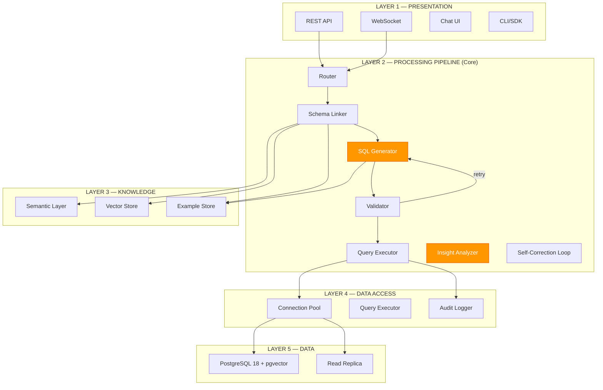
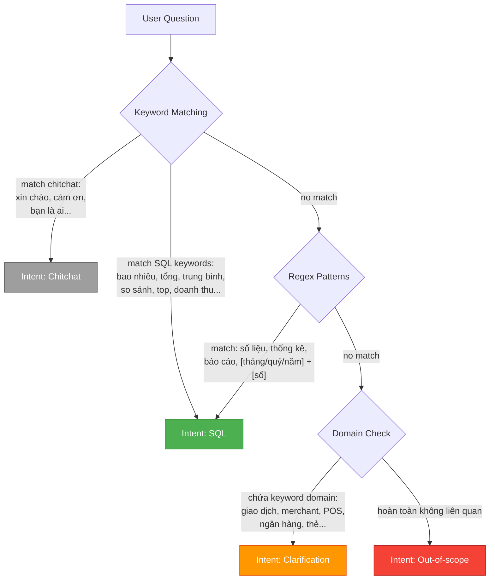
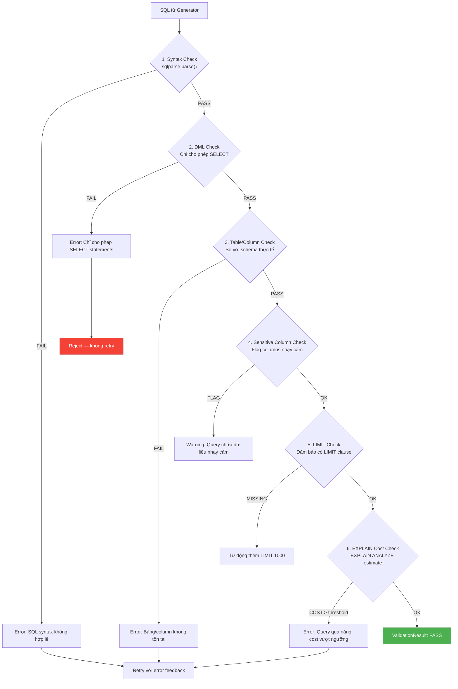
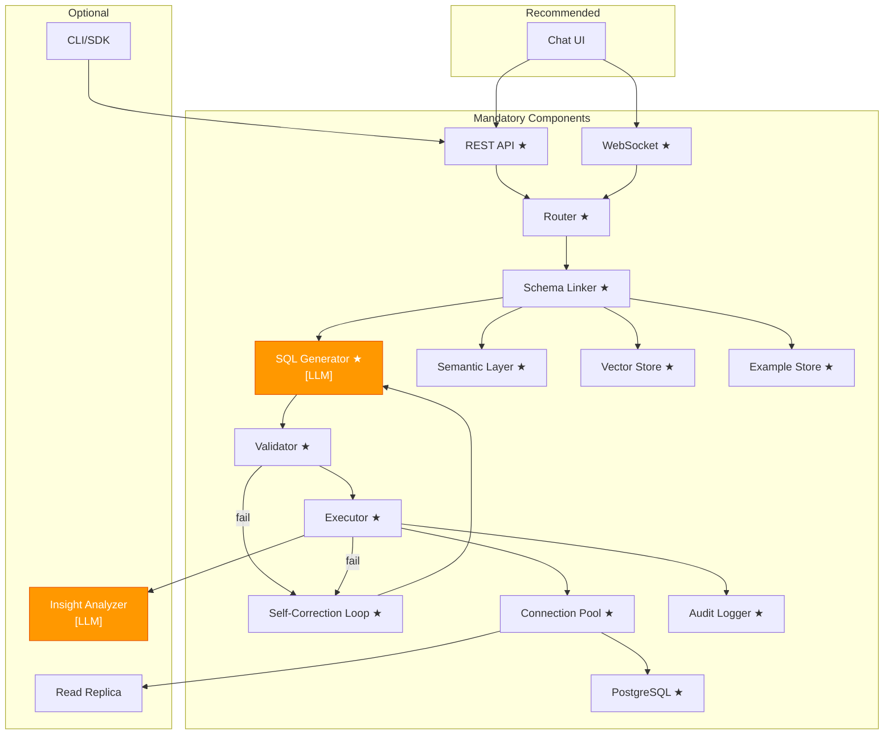

# Các Components Chính — LLM-in-the-middle Pipeline

### Chi tiết từng component theo 5 layers | Text-to-SQL Agent Platform (Banking/POS)

---

## MỤC LỤC

1. [Tổng quan 5 Layers](#1-tổng-quan-5-layers)
2. [Layer 1: Presentation](#2-layer-1-presentation)
3. [Layer 2: Processing Pipeline](#3-layer-2-processing-pipeline)
4. [Layer 3: Knowledge](#4-layer-3-knowledge)
5. [Layer 4: Data Access](#5-layer-4-data-access)
6. [Layer 5: Data](#6-layer-5-data)
7. [Component Dependency Map](#7-component-dependency-map)

---

## 1. TỔNG QUAN 5 LAYERS



**Tổng hợp nhanh:**

| Layer | Số components | LLM calls | Mức độ quan trọng |
|-------|--------------|-----------|-------------------|
| Presentation | 4 | 0 | Giao diện người dùng |
| Processing Pipeline | 7 | 1 (Generator) + 1 optional (Insight) | **Core — Logic xử lý chính** |
| Knowledge | 3 | 0 | Tri thức nghiệp vụ và schema |
| Data Access | 3 | 0 | Kết nối và bảo mật database |
| Data | 2 | 0 | Lưu trữ dữ liệu |

---

## 2. LAYER 1: PRESENTATION

Layer tiếp nhận request từ người dùng và trả response.

### 2.1 REST API (`/api/query`)

| Thuộc tính | Giá trị |
|-----------|---------|
| **Vai trò** | Endpoint chính nhận câu hỏi từ người dùng, trả kết quả SQL |
| **Loại** | Code (FastAPI) |
| **Bắt buộc** | Có |
| **Technology** | FastAPI + Pydantic v2 |

**Chi tiết:**
- Endpoint chính: `POST /api/query` — nhận câu hỏi, trả kết quả
- Endpoint phụ: `GET /api/health`, `GET /api/schema/tables`, `POST /api/feedback`
- Authentication: API Key hoặc JWT (Phase 2+)
- Rate limiting: 10 req/min per user (configurable)
- Request/Response format: JSON, auto-generated OpenAPI docs

**Request schema:**
```json
{
  "question": "Tổng doanh thu tháng 1/2025?",
  "session_id": "optional-uuid",
  "options": {
    "include_sql": true,
    "include_explanation": false,
    "max_rows": 100
  }
}
```

**Response schema:**
```json
{
  "status": "success",
  "sql": "SELECT SUM(amount) FROM sales WHERE ...",
  "data": [{"total_revenue": 1500000000}],
  "metadata": {
    "execution_time_ms": 245,
    "rows_returned": 1,
    "tables_used": ["sales"],
    "retry_count": 0
  }
}
```

### 2.2 WebSocket (Streaming Response)

| Thuộc tính | Giá trị |
|-----------|---------|
| **Vai trò** | Stream từng phần kết quả real-time (SQL generation, insight narrative) |
| **Loại** | Code (FastAPI WebSocket) |
| **Bắt buộc** | Có |
| **Technology** | FastAPI WebSocket + asyncio |

**Chi tiết:**
- Endpoint: `ws://host/ws/query`
- Stream events: `sql_token`, `sql_complete`, `executing`, `result`, `insight_token`, `complete`, `error`
- Heartbeat: ping/pong mỗi 30s
- Reconnection: client-side retry logic

**Event format:**
```json
{"event": "sql_token", "data": "SELECT SUM(amount)"}
{"event": "sql_complete", "data": "SELECT SUM(amount) FROM sales WHERE ..."}
{"event": "executing", "data": null}
{"event": "result", "data": {"rows": [...], "columns": [...]}}
{"event": "complete", "data": {"total_time_ms": 1500}}
```

### 2.3 Chat UI

| Thuộc tính | Giá trị |
|-----------|---------|
| **Vai trò** | Giao diện chat cho người dùng đặt câu hỏi và xem kết quả |
| **Loại** | Code (Frontend) |
| **Bắt buộc** | Khuyến nghị (recommended) |
| **Technology** | Streamlit (POC) → React (production) |

**Chi tiết:**
- POC Phase: Streamlit với `st.chat_message`, `st.dataframe`, `st.code` (hiển thị SQL)
- Production Phase: React + TanStack Query + WebSocket client
- Tính năng: Chat history, SQL highlighting, data table, chart visualization (Phase 3)

### 2.4 CLI/SDK

| Thuộc tính | Giá trị |
|-----------|---------|
| **Vai trò** | Command-line interface và Python SDK cho developer/data team |
| **Loại** | Code |
| **Bắt buộc** | Tùy chọn (optional) |
| **Technology** | Click (CLI) + httpx (SDK) |

**Chi tiết:**
- CLI: `text2sql query "Tổng doanh thu tháng 1?"` → trả kết quả trên terminal
- SDK: `client.query("Tổng doanh thu tháng 1?")` → trả Python dict
- Phù hợp cho automation, batch queries, integration với notebooks

---

## 3. LAYER 2: PROCESSING PIPELINE

Đây là **core** của hệ thống — nơi logic xử lý chính diễn ra. Gồm 7 components, trong đó chỉ có **1 component dùng LLM** (SQL Generator) và 1 optional (Insight Analyzer).

### 3.1 Router [CODE]

| Thuộc tính | Giá trị |
|-----------|---------|
| **Vai trò** | Phân loại intent của câu hỏi: SQL / Chitchat / Clarification / Out-of-scope |
| **Loại** | **Code** (deterministic) — KHÔNG dùng LLM |
| **Bắt buộc** | Có |
| **Hallucinate?** | **Không** — chỉ là keyword matching và regex |

**Cơ chế hoạt động:**



**Output:** `RouterResult(intent, confidence, original_query)`

**Ví dụ:**

| Input | Intent | Confidence |
|-------|--------|-----------|
| "Tổng doanh thu tháng 1 là bao nhiêu?" | SQL | 0.95 |
| "Xin chào" | Chitchat | 0.99 |
| "Merchant nào bán nhiều nhất?" | SQL | 0.90 |
| "Thời tiết hôm nay thế nào?" | Out-of-scope | 0.85 |
| "Giao dịch" (quá mơ hồ) | Clarification | 0.70 |

### 3.2 Schema Linker [CODE]

| Thuộc tính | Giá trị |
|-----------|---------|
| **Vai trò** | Tìm bảng/column liên quan và xây dựng Context Package cho LLM |
| **Loại** | **Code** (deterministic) — KHÔNG dùng LLM |
| **Bắt buộc** | Có |
| **Hallucinate?** | **Không** — chỉ trả về những gì tồn tại trong schema |

**Cơ chế hoạt động:**

1. **Vector Search**: Embed câu hỏi → tìm top-k schema chunks tương đồng (cosine similarity)
2. **Dict Lookup**: Tra cứu Semantic Layer → tìm metrics, dimensions, aliases phù hợp
3. **JOIN Resolution**: Từ các bảng được tìm, tra JOIN map → xác định cách nối bảng
4. **Context Assembly**: Gộp tất cả thành Context Package

**Context Package output:**
```json
{
  "tables": [
    {
      "name": "sales",
      "columns": ["id", "merchant_id", "amount", "status", "created_at"],
      "description": "Bảng giao dịch bán hàng"
    },
    {
      "name": "merchants",
      "columns": ["id", "name", "category", "city"],
      "description": "Bảng thông tin merchant"
    }
  ],
  "joins": [
    {"from": "sales.merchant_id", "to": "merchants.id", "type": "INNER JOIN"}
  ],
  "metrics": [
    {"name": "tổng_doanh_thu", "sql": "SUM(sales.amount)", "description": "Tổng doanh thu"}
  ],
  "dimensions": [
    {"name": "tháng", "sql": "DATE_TRUNC('month', sales.created_at)"}
  ],
  "examples": [
    {"question": "Tổng doanh thu tháng 12?", "sql": "SELECT SUM(amount) FROM sales WHERE DATE_TRUNC('month', created_at) = '2024-12-01'"}
  ],
  "enums": {
    "sales.status": ["completed", "pending", "failed", "refunded"]
  },
  "sensitive_columns": ["accounts.account_number", "accounts.balance"],
  "business_rules": [
    "Doanh thu chỉ tính giao dịch có status = 'completed'"
  ]
}
```

### 3.3 SQL Generator [LLM]

| Thuộc tính | Giá trị |
|-----------|---------|
| **Vai trò** | Sinh SQL từ câu hỏi + Context Package. **ĐÂY LÀ BƯỚC DUY NHẤT DÙNG LLM** |
| **Loại** | **LLM** (Claude Sonnet 4.6 primary, Opus 4.6 fallback) |
| **Bắt buộc** | Có |
| **Hallucinate?** | **Có thể** — do đó cần Validator và Executor kiểm tra |

**Cơ chế hoạt động:**

1. **Prompt Assembly**: Ghép system prompt + Context Package + user question + few-shot examples
2. **LLM Call**: Gọi Claude API với prompt đã build
3. **Parse Output**: Extract SQL từ response (regex: `\`\`\`sql ... \`\`\``)
4. **Return**: SQL string + metadata (model used, tokens, latency)

**Prompt structure:**
```
[System Prompt]
Bạn là SQL expert cho PostgreSQL. Chỉ sinh duy nhất 1 câu SELECT.
Không giải thích. Không dùng bảng/column ngoài context.

[Context Package]
Tables: ... Joins: ... Metrics: ... Examples: ...

[User Question]
{question}

[Output Format]
Trả về SQL trong block ```sql ... ```
```

**Model selection logic:**
- Default: **Claude Sonnet 4.6** (nhanh, rẻ, đủ tốt cho L1-L2 queries)
- Fallback: **Claude Opus 4.6** (khi Sonnet fail 3 lần liên tiếp, hoặc query L3-L4 phức tạp)

### 3.4 Validator [CODE]

| Thuộc tính | Giá trị |
|-----------|---------|
| **Vai trò** | Kiểm tra SQL output trước khi execute. Đây là "cửa ngăn" bảo vệ hệ thống |
| **Loại** | **Code** (deterministic) — KHÔNG dùng LLM |
| **Bắt buộc** | Có |
| **Hallucinate?** | **Không** — kiểm tra bằng rules cố định |

**6 bước kiểm tra:**



**ValidationResult:**
```json
{
  "status": "pass|fail|warning",
  "checks": {
    "syntax": true,
    "dml_safe": true,
    "tables_exist": true,
    "columns_exist": true,
    "sensitive_flagged": false,
    "has_limit": true,
    "cost_acceptable": true
  },
  "errors": [],
  "warnings": [],
  "modified_sql": "SELECT ... LIMIT 1000"
}
```

### 3.5 Query Executor [CODE]

| Thuộc tính | Giá trị |
|-----------|---------|
| **Vai trò** | Chạy SQL đã validate trên PostgreSQL, trả kết quả |
| **Loại** | **Code** (deterministic) — KHÔNG dùng LLM |
| **Bắt buộc** | Có |
| **Hallucinate?** | **Không** — chạy SQL thực trên database |

**Chi tiết:**
- **Read-only connection**: User database chỉ có quyền SELECT
- **statement_timeout**: 30 giây — tự động cancel query chạy quá lâu
- **Auto LIMIT**: Nếu SQL không có LIMIT → tự động thêm `LIMIT 1000`
- **Retry logic**: Khi gặp connection error → retry 1 lần
- **Audit logging**: Mỗi query được log: user_id, SQL, timestamp, execution_time, row_count

**ExecutionResult:**
```json
{
  "status": "success|error",
  "data": [{"column1": "value1"}],
  "columns": ["column1", "column2"],
  "row_count": 42,
  "execution_time_ms": 245,
  "error": null
}
```

### 3.6 Insight Analyzer [LLM, OPTIONAL]

| Thuộc tính | Giá trị |
|-----------|---------|
| **Vai trò** | Sinh narrative giải thích kết quả SQL bằng ngôn ngữ tự nhiên |
| **Loại** | **LLM** (Claude Sonnet) — optional |
| **Bắt buộc** | Không — Phase 2+ |
| **Hallucinate?** | **Có thể** — nhưng chỉ giải thích, không ảnh hưởng data |

**Ví dụ:**
- Input: `{question: "Tổng doanh thu Q1?", data: [{total: 15000000000}]}`
- Output: "Tổng doanh thu Quý 1 đạt 15 tỷ đồng. Đây là..."

### 3.7 Self-Correction Loop [CODE]

| Thuộc tính | Giá trị |
|-----------|---------|
| **Vai trò** | Điều phối retry khi Validator/Executor fail |
| **Loại** | **Code** (LangGraph conditional edges) — KHÔNG dùng LLM |
| **Bắt buộc** | Có |
| **Hallucinate?** | **Không** — chỉ là logic retry |

**Logic:**
```
if validator.fail OR executor.fail:
    if retry_count < 3:
        retry_count += 1
        feedback = format_error(error, original_sql, schema_context)
        → quay lại Generator với feedback
    else:
        → trả lời cho user: "Không thể tạo SQL chính xác sau 3 lần thử"
```

---

## 4. LAYER 3: KNOWLEDGE

Layer chứa tri thức để giúp LLM sinh SQL chính xác hơn.

### 4.1 Semantic Layer

| Thuộc tính | Giá trị |
|-----------|---------|
| **Vai trò** | Ánh xạ business terms → SQL, định nghĩa metrics, dimensions, business rules |
| **Loại** | Code (config YAML/JSON) |
| **Bắt buộc** | Có |

**Cấu trúc Semantic Layer:**

| Thành phần | Mục đích | Ví dụ |
|-----------|---------|-------|
| **Metrics** | Định nghĩa cách tính các chỉ số | `tổng_doanh_thu → SUM(sales.amount) WHERE status='completed'` |
| **Dimensions** | Các chiều phân tích | `theo_tháng → DATE_TRUNC('month', created_at)` |
| **Aliases** | Ánh xạ tên tiếng Việt → tên bảng/column | `giao dịch → sales`, `nhà cung cấp → merchants` |
| **JOIN Map** | Định nghĩa cách nối các bảng | `sales.merchant_id → merchants.id (INNER JOIN)` |
| **Sensitive Columns** | Danh sách column nhạy cảm | `accounts.account_number`, `accounts.balance` |
| **Enums** | Giá trị hợp lệ của enum columns | `sales.status: [completed, pending, failed, refunded]` |
| **Business Rules** | Quy tắc nghiệp vụ | `"Doanh thu chỉ tính status = 'completed'"` |

### 4.2 Vector Store

| Thuộc tính | Giá trị |
|-----------|---------|
| **Vai trò** | Lưu trữ schema embeddings để tìm bảng/column liên quan qua semantic search |
| **Loại** | Code (pgvector) |
| **Bắt buộc** | Có |

**Chi tiết:**
- **Embedding model**: bge-m3 (multilingual, hỗ trợ tiếng Việt)
- **Chunking strategy**: Cluster-based chunking (nhóm các bảng liên quan), KHÔNG phải per-table
- **Storage**: PostgreSQL pgvector (hợp nhất — không cần ChromaDB riêng)
- **Index**: IVFFlat hoặc HNSW (tùy data size)
- **Similarity**: Cosine similarity, top-k = 5

### 4.3 Example Store

| Thuộc tính | Giá trị |
|-----------|---------|
| **Vai trò** | Lưu trữ golden queries, user corrections, SQL pattern templates |
| **Loại** | Code (database + config) |
| **Bắt buộc** | Có |

**3 loại examples:**

| Loại | Số lượng | Nguồn | Mục đích |
|------|---------|-------|---------|
| **Golden Queries** | 40+ | Team phát triển tạo thủ công | Few-shot examples cho LLM, coverage mọi pattern |
| **User Corrections** | Động (tăng dần) | User feedback khi SQL sai | Học từ sai lầm, cải thiện accuracy |
| **Pattern Templates** | 15-20 | Tự động generate | SQL patterns chung: aggregation, filter, join, subquery |

---

## 5. LAYER 4: DATA ACCESS

Layer quản lý kết nối database và bảo mật.

### 5.1 Connection Pool

| Thuộc tính | Giá trị |
|-----------|---------|
| **Vai trò** | Quản lý connection tới PostgreSQL, đảm bảo read-only |
| **Loại** | Code (asyncpg/psycopg pool) |
| **Bắt buộc** | Có |

**Cấu hình:**
| Tham số | Giá trị | Lý do |
|---------|---------|-------|
| `min_connections` | 2 | Luôn sẵn sàng cho queries |
| `max_connections` | 10 | Giới hạn tải database |
| `max_idle_time` | 300s | Giải phóng connection không dùng |
| `connection_mode` | read-only | An toàn — chỉ SELECT |

### 5.2 Query Executor (Data Access Level)

| Thuộc tính | Giá trị |
|-----------|---------|
| **Vai trò** | Thực thi SQL queries với timeout, auto LIMIT, error handling |
| **Loại** | Code |
| **Bắt buộc** | Có |

**Bảo vệ:**
- `statement_timeout = 30s`: Tự động cancel query chạy quá 30 giây
- `auto LIMIT 1000`: Nếu query không có LIMIT → thêm LIMIT 1000
- `max_result_size`: Giới hạn kết quả trả về (tránh OOM)
- `retry_on_connection_error`: Retry 1 lần khi mất kết nối

### 5.3 Audit Logger

| Thuộc tính | Giá trị |
|-----------|---------|
| **Vai trò** | Log mọi query để audit (yêu cầu compliance domain Banking) |
| **Loại** | Code |
| **Bắt buộc** | Có |

**Log fields:**
| Field | Mục đích |
|-------|---------|
| `user_id` | Ai thực hiện query |
| `question` | Câu hỏi gốc |
| `generated_sql` | SQL được sinh ra |
| `execution_time_ms` | Thời gian chạy |
| `row_count` | Số dòng kết quả |
| `timestamp` | Thời điểm thực hiện |
| `status` | success/fail |
| `error_message` | Lỗi (nếu có) |
| `retry_count` | Số lần retry |
| `model_used` | LLM model đã dùng |
| `sensitive_access` | Có truy cập dữ liệu nhạy cảm không |

---

## 6. LAYER 5: DATA

### 6.1 PostgreSQL 18 + pgvector

| Thuộc tính | Giá trị |
|-----------|---------|
| **Vai trò** | Database chính chứa dữ liệu nghiệp vụ và vector embeddings |
| **Loại** | Infrastructure |
| **Bắt buộc** | Có |

**Chi tiết:**
- **Business data**: 14 bảng, 90+ columns, 200K+ records (sales)
- **Vector data**: pgvector extension cho embedding storage và similarity search
- **Schema**: Tách biệt schema cho business data (`public`) và app data (`app`)

### 6.2 Read Replica

| Thuộc tính | Giá trị |
|-----------|---------|
| **Vai trò** | Bản sao read-only cho production, tránh ảnh hưởng write workload |
| **Loại** | Infrastructure |
| **Bắt buộc** | Production only (không cần cho POC) |

**Chi tiết:**
- POC: Dùng trực tiếp primary database
- Production: Text-to-SQL chỉ đọc từ Read Replica → không ảnh hưởng write performance
- Replication lag chấp nhận: < 1 giây (đủ cho báo cáo)

---

## 7. COMPONENT DEPENDENCY MAP



**Tổng kết:**
- **14 mandatory components** — bắt buộc phải có để pipeline hoạt động
- **1 recommended** — Chat UI giúp demo và sử dụng
- **3 optional** — CLI/SDK, Insight Analyzer, Read Replica (thêm khi cần)
- **Chỉ có 1 LLM component bắt buộc** (SQL Generator), 1 optional (Insight Analyzer)
- **Mọi component khác đều là deterministic code** — không hallucinate, dễ test, dễ debug
