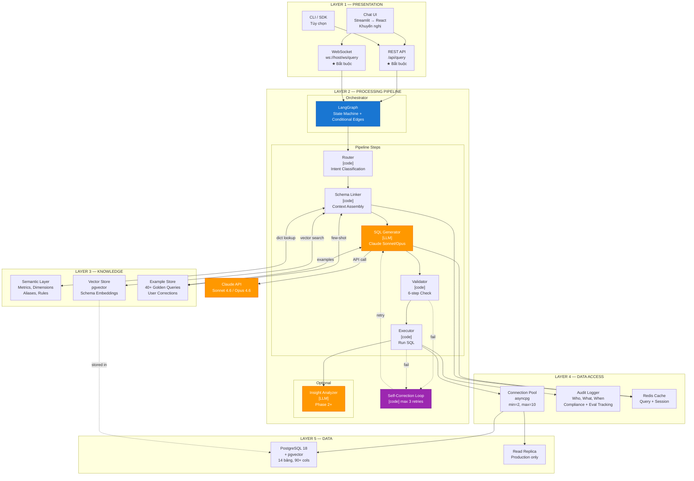
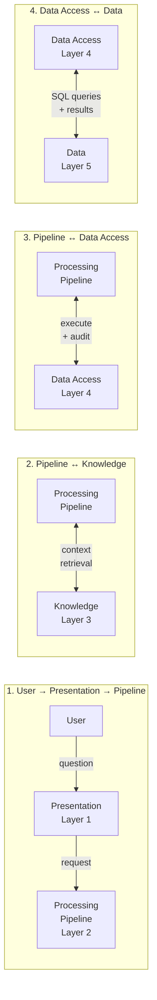
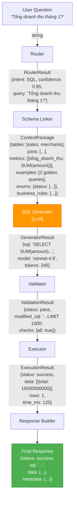
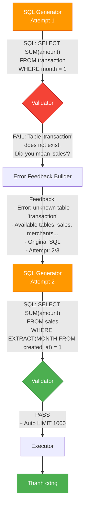
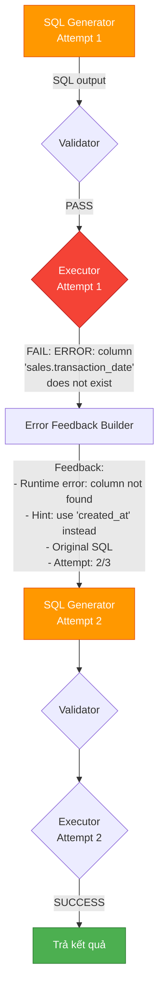
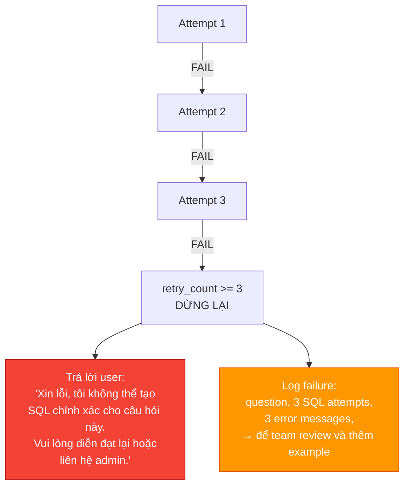
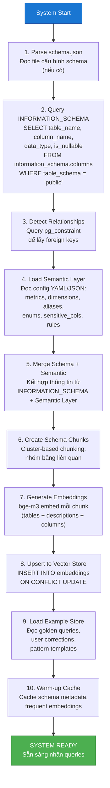
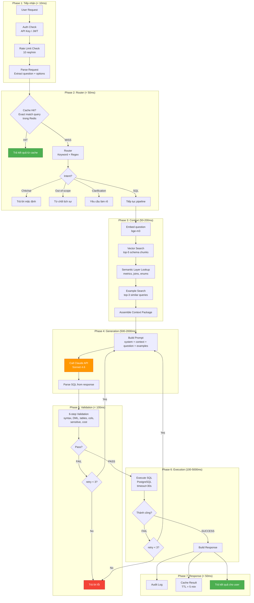
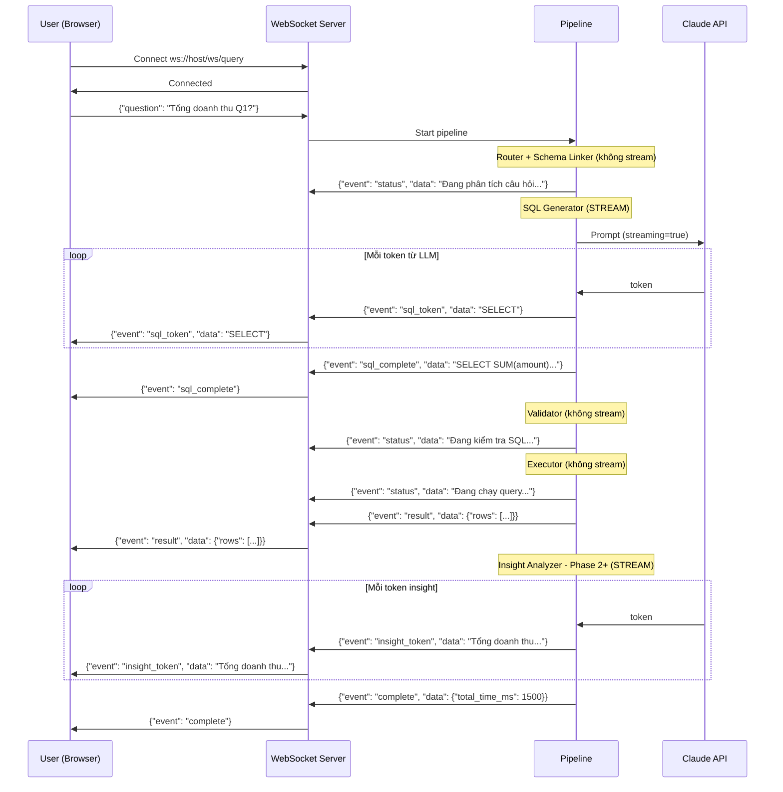

# Luồng Architecture Tổng Thể — LLM-in-the-middle Pipeline

### Kiến trúc hệ thống và data flow chi tiết | Text-to-SQL Agent Platform (BIRD → Production)

---

## MỤC LỤC

1. [Sơ đồ Kiến trúc Tổng thể 5 Layers](#1-sơ-đồ-kiến-trúc-tổng-thể-5-layers)
2. [Tương tác giữa các Layers](#2-tương-tác-giữa-các-layers)
3. [Main Data Flow — Happy Path](#3-main-data-flow--happy-path)
4. [Self-Correction Loop Flow](#4-self-correction-loop-flow)
5. [Knowledge Layer Boot Process](#5-knowledge-layer-boot-process)
6. [Runtime Flow (Per Query)](#6-runtime-flow-per-query)
7. [Streaming Architecture](#7-streaming-architecture)

---

## 1. SƠ ĐỒ KIẾN TRÚC TỔNG THỂ 5 LAYERS

---

## 2. TƯƠNG TÁC GIỮA CÁC LAYERS

### 2.1 Bốn luồng tương tác chính

### 2.2 Chi tiết từng luồng

| Luồng | Từ → Đến | Dữ liệu truyền | Mục đích |
|-------|---------|---------------|---------|
| **1** | User → Presentation → Pipeline | UserQuery (string + options) | Nhận câu hỏi từ user |
| **2** | Pipeline → Knowledge | Query embedding, keyword | Lấy context (bảng, metrics, examples) |
| **2** | Knowledge → Pipeline | Context Package (tables, joins, metrics, examples) | Cung cấp thông tin cho LLM |
| **3** | Pipeline → Data Access | Validated SQL string | Thực thi query |
| **3** | Data Access → Pipeline | ExecutionResult (data, columns, row_count) | Trả kết quả |
| **3** | Pipeline → Data Access | AuditRecord | Ghi log cho compliance |
| **4** | Data Access → Data | SQL query qua connection pool | Đọc dữ liệu từ PostgreSQL |
| **4** | Data → Data Access | Result set | Trả kết quả về |

---

## 3. MAIN DATA FLOW — HAPPY PATH

### 3.1 Dữ liệu truyền giữa từng bước

### 3.2 Data payload chi tiết tại mỗi bước

| Bước | Input | Output | Data Format |
|------|-------|--------|-------------|
| **Router** | `"Tổng doanh thu tháng 1?"` | `RouterResult` | `{intent: "sql", confidence: 0.95, query: str}` |
| **Schema Linker** | `RouterResult` + query tới Knowledge Layer | `ContextPackage` | `{tables: [], joins: [], metrics: [], examples: [], enums: {}, sensitive: [], rules: []}` |
| **SQL Generator** | `ContextPackage` + query tới Claude API | `GeneratorResult` | `{sql: str, model: str, tokens: int, latency_ms: int}` |
| **Validator** | `GeneratorResult.sql` + schema metadata | `ValidationResult` | `{status: pass/fail, checks: {}, errors: [], modified_sql: str}` |
| **Executor** | `ValidationResult.modified_sql` tới PostgreSQL | `ExecutionResult` | `{status: success/error, data: [], columns: [], row_count: int, time_ms: int}` |
| **Response Builder** | `ExecutionResult` + metadata | `FinalResponse` | `{status: str, sql: str, data: [], metadata: {}}` |

---

## 4. SELF-CORRECTION LOOP FLOW

### 4.1 Validation Error → Retry

### 4.2 Execution Error → Retry

### 4.3 Max Retry Exceeded

---

## 5. KNOWLEDGE LAYER BOOT PROCESS

Đây là quy trình khởi tạo **một lần** khi hệ thống start. Mục đích: xây dựng Knowledge Layer từ schema thực tế.

### 5.1 Boot Flow

### 5.2 Chi tiết từng bước boot

| Bước | Hành động | Input | Output | Thời gian ước tính |
|------|----------|-------|--------|-------------------|
| 1 | Parse schema.json | File config | Schema metadata | < 100ms |
| 2 | Query INFORMATION_SCHEMA | PostgreSQL connection | Table/column metadata | < 500ms |
| 3 | Detect Relationships | pg_constraint query | FK relationships | < 200ms |
| 4 | Load Semantic Layer | YAML/JSON config files | Metrics, dimensions, aliases | < 100ms |
| 5 | Merge Schema + Semantic | Steps 2-4 output | Merged schema | < 50ms |
| 6 | Create Schema Chunks | Merged schema | Clustered chunks | < 100ms |
| 7 | Generate Embeddings | Chunks + bge-m3 model | Embedding vectors | ~2-5s (14 bảng) |
| 8 | Upsert Vector Store | Embeddings | Indexed vectors in pgvector | < 500ms |
| 9 | Load Example Store | Golden queries + corrections | In-memory example index | < 200ms |
| 10 | Warm-up Cache | Schema + embeddings | Redis cache populated | < 300ms |
| **Tổng** | | | | **~5-8 giây** |

---

## 6. RUNTIME FLOW (PER QUERY)

### 6.1 Runtime Flow chi tiết

### 6.2 Timeline ước tính (Happy Path, không retry)

| Phase | Thời gian | Tích lũy |
|-------|----------|-------------|
| 1. Tiếp nhận | ~10ms | 10ms |
| 2. Router | ~30ms | 40ms |
| 3. Context Assembly | ~150ms | 190ms |
| 4. SQL Generation (LLM) | ~1000ms | 1190ms |
| 5. Validation | ~50ms | 1240ms |
| 6. Execution | ~200ms | 1440ms |
| 7. Response | ~30ms | **1470ms** |
| **Tổng (Happy Path)** | | **~1.5 giây** |

| Trường hợp | Thời gian ước tính |
|-----------|-------------------|
| Cache hit | < 50ms |
| Happy path (không retry) | ~1.5s |
| 1 retry | ~2.5s |
| 2 retries | ~3.5s |
| 3 retries + fail | ~4.5s |
| Complex query (L3-L4, Opus fallback) | ~4-6s |

---

## 7. STREAMING ARCHITECTURE

### 7.1 Gì được stream vs không stream

| Component | Stream? | Lý do |
|-----------|---------|-------|
| Router | Không | Kết quả ngay lập tức (< 50ms) |
| Schema Linker | Không | Kết quả ngay lập tức (< 200ms) |
| **SQL Generator** | **Có** | LLM sinh SQL từng token → stream để user thấy SQL đang hình thành |
| Validator | Không | Kết quả ngay lập tức (< 100ms) |
| Executor | Không | Đợi kết quả từ PostgreSQL rồi trả 1 lần |
| **Insight Analyzer** | **Có** (Phase 2+) | LLM sinh narrative từng token → stream để user đọc dần |

### 7.2 Streaming Flow

### 7.3 WebSocket Event Types

| Event | Khi nào | Data |
|-------|---------|------|
| `status` | Các bước không stream (Router, Linker, Validator, Executor) | String mô tả trạng thái |
| `sql_token` | Mỗi token SQL từ LLM | SQL token string |
| `sql_complete` | SQL đã sinh xong | Full SQL string |
| `result` | Executor trả kết quả | `{rows: [], columns: [], row_count: int}` |
| `insight_token` | Mỗi token insight từ LLM (Phase 2+) | Insight text token |
| `complete` | Pipeline hoàn tất | `{total_time_ms: int}` |
| `error` | Bất kỳ lỗi nào | `{message: str, code: str}` |
| `retry` | Đang retry SQL generation | `{attempt: int, reason: str}` |

---

## 8. TÓM TẮT

Kiến trúc LLM-in-the-middle Pipeline có các đặc điểm:

- **5 layers rõ ràng**: Presentation → Processing → Knowledge → Data Access → Data
- **1 LLM call duy nhất** trong main flow (SQL Generator), còn lại là deterministic code
- **Self-correction loop** tự động sửa lỗi, tối đa 3 lần retry
- **Knowledge Layer boot 1 lần** (~5-8s), runtime per-query ~1.5s (happy path)
- **Streaming** cho 2 bước LLM (SQL Generation và Insight), các bước khác trả kết quả ngay
- **Audit trail đầy đủ** tại mỗi bước — phù hợp compliance và evaluation tracking
