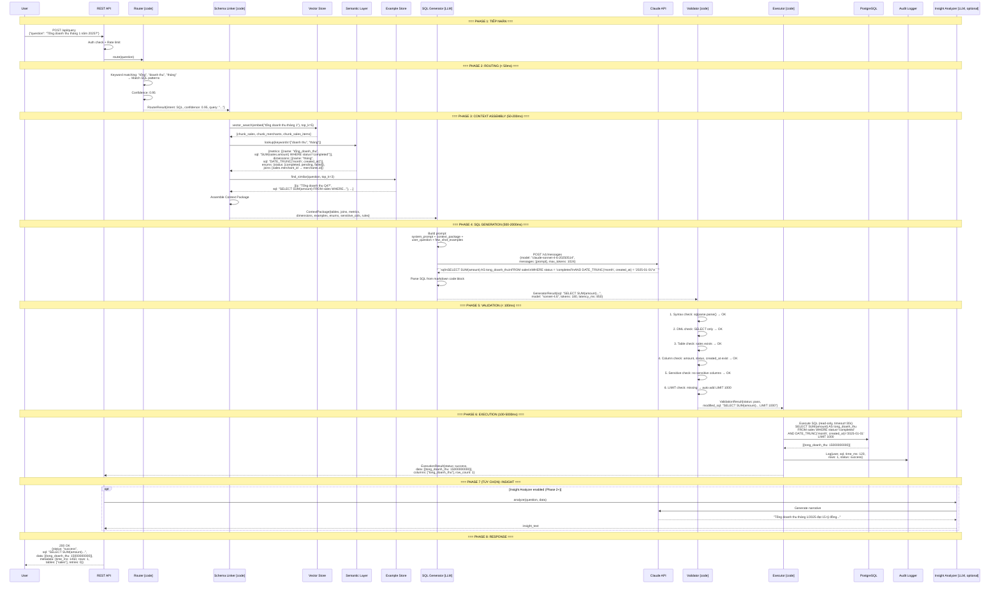
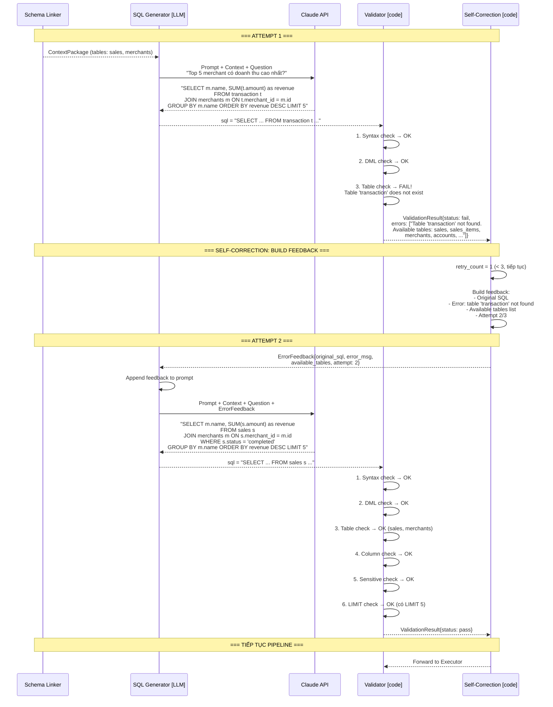
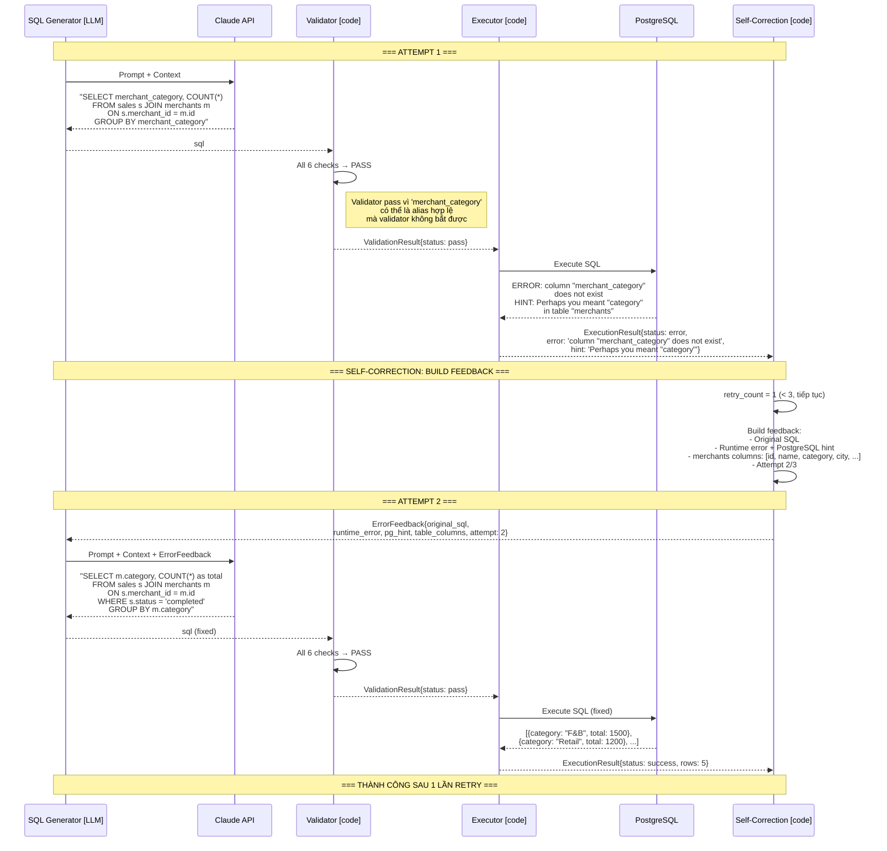
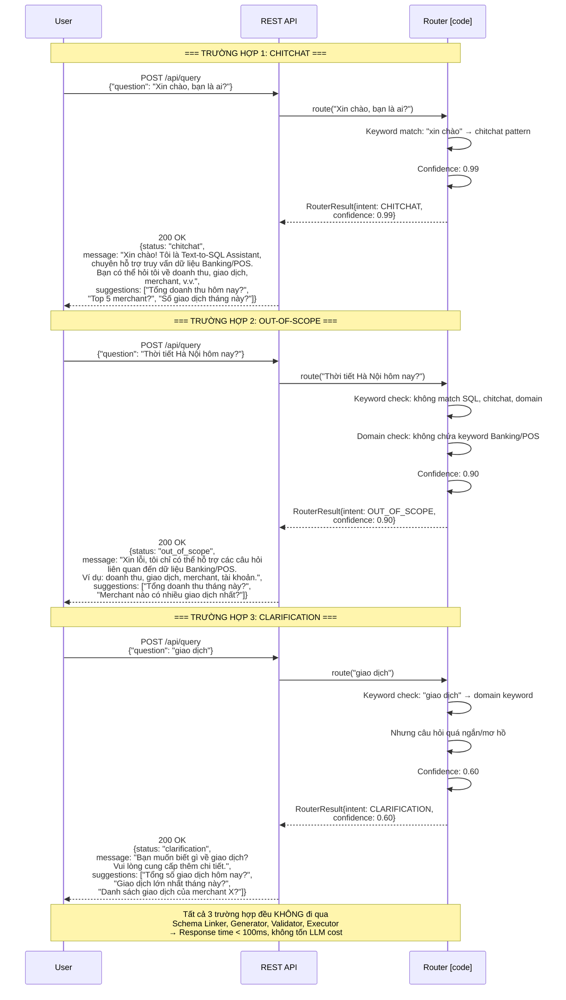
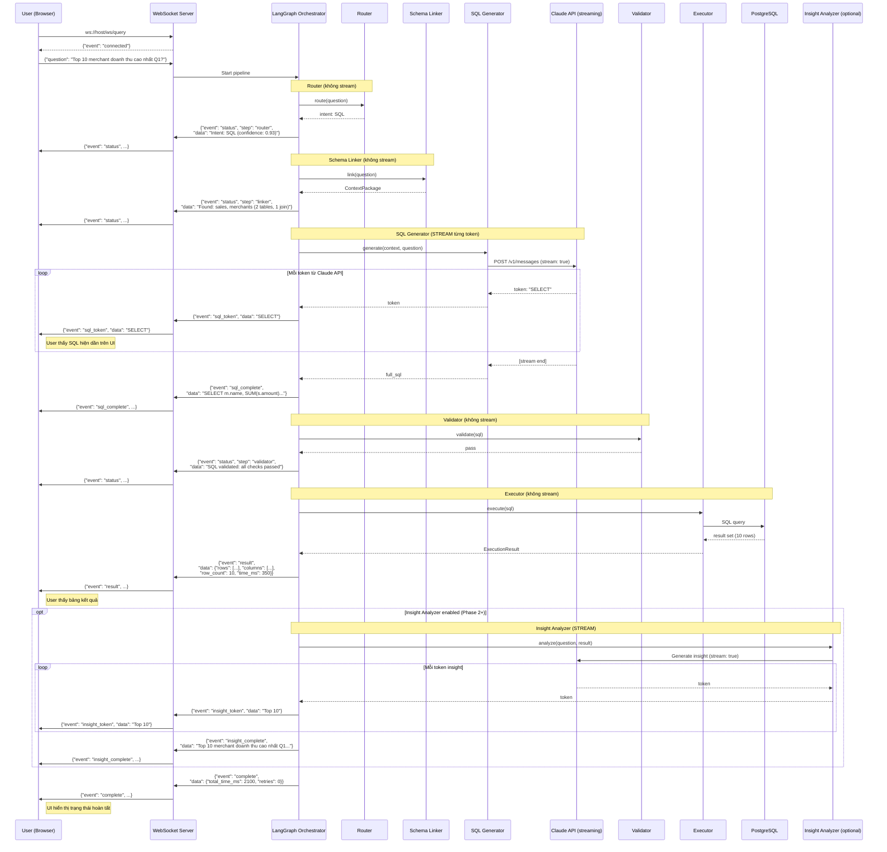
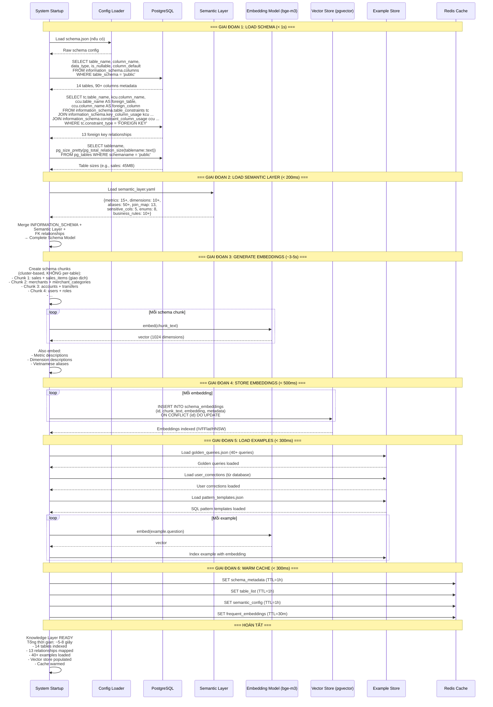

# Sequence Diagrams — LLM-in-the-middle Pipeline

### Các sequence diagram chi tiết cho mỗi luồng xử lý | Text-to-SQL Agent Platform (Banking/POS)

---

## MỤC LỤC

1. [Diagram 1: E2E Happy Path](#1-diagram-1-e2e-happy-path)
2. [Diagram 2: Self-Correction Flow (Validation Error)](#2-diagram-2-self-correction-flow-validation-error)
3. [Diagram 3: Self-Correction Flow (Runtime Error)](#3-diagram-3-self-correction-flow-runtime-error)
4. [Diagram 4: Router Rejection Flow](#4-diagram-4-router-rejection-flow)
5. [Diagram 5: Streaming Flow](#5-diagram-5-streaming-flow)
6. [Diagram 6: Knowledge Layer Boot](#6-diagram-6-knowledge-layer-boot)

---

## 1. DIAGRAM 1: E2E HAPPY PATH

Luồng đầy đủ từ câu hỏi người dùng đến kết quả trả về — trường hợp thành công, không cần retry.

---

## 2. DIAGRAM 2: SELF-CORRECTION FLOW (VALIDATION ERROR)

Khi Validator phát hiện SQL không hợp lệ → error feedback → Generator retry.

---

## 3. DIAGRAM 3: SELF-CORRECTION FLOW (RUNTIME ERROR)

Khi Validator pass nhưng PostgreSQL trả về runtime error → feedback → retry.

---

## 4. DIAGRAM 4: ROUTER REJECTION FLOW

Khi Router phát hiện câu hỏi không phải SQL → trả lời trực tiếp, không đi qua pipeline.

---

## 5. DIAGRAM 5: STREAMING FLOW

Luồng streaming qua WebSocket — user thấy kết quả dần dần.

---

## 6. DIAGRAM 6: KNOWLEDGE LAYER BOOT

Quy trình khởi tạo hệ thống — chạy một lần khi startup.

---

## TÓM TẮT CÁC DIAGRAMS

| Diagram | Mục đích | Các actors chính | Thời gian |
|---------|---------|-------------------|----------|
| **1. E2E Happy Path** | Luồng hoàn chỉnh từ đầu đến cuối | Tất cả 13 components | ~1.5s |
| **2. Validation Error** | Xử lý khi SQL syntax/schema sai | Generator, Validator, Self-Correction | +1s mỗi retry |
| **3. Runtime Error** | Xử lý khi PostgreSQL trả lỗi | Generator, Executor, Self-Correction | +1s mỗi retry |
| **4. Router Rejection** | Xử lý chitchat/out-of-scope | User, API, Router | < 100ms |
| **5. Streaming** | Stream SQL + insight qua WebSocket | WebSocket, Generator, Insight | ~2-3s |
| **6. Knowledge Boot** | Khởi tạo knowledge layer | System, PostgreSQL, Embedding, Vector Store | ~5-8s (1 lần) |
