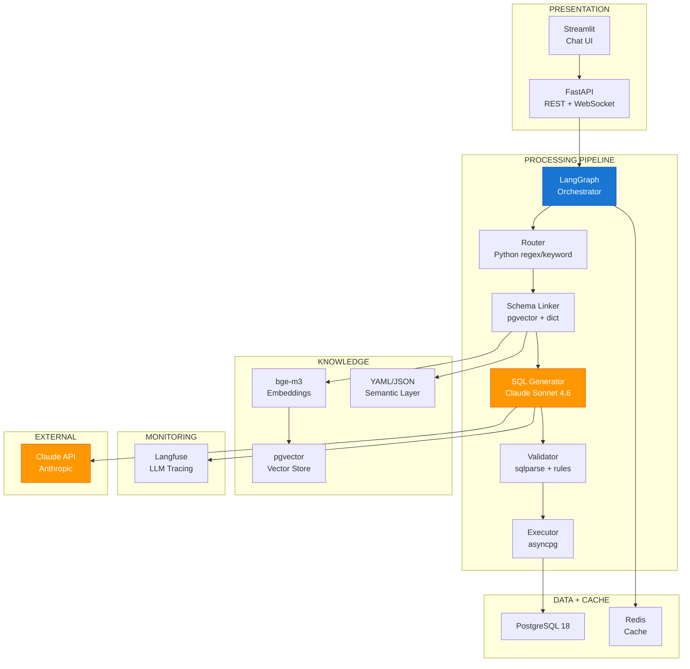
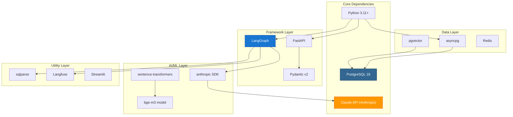

# Tech Stack Đề Xuất — LLM-in-the-middle Pipeline

### Đề xuất công nghệ cho Phase 2 (POC) | Text-to-SQL Agent Platform (BIRD → Production)

---

## MỤC LỤC

1. [Tổng quan Tech Stack](#1-tổng-quan-tech-stack)
2. [Chi tiết từng Technology](#2-chi-tiết-từng-technology)
3. [Why LangGraph over Alternatives](#3-why-langgraph-over-alternatives)
4. [Why Claude over Alternatives](#4-why-claude-over-alternatives)
5. [Phase 2 vs Phase 1 — Những gì thay đổi](#5-phase-2-vs-phase-1--những-gì-thay-đổi)
6. [Dependency Map](#6-dependency-map)

---

## 1. TỔNG QUAN TECH STACK

Đây là tech stack cho **Phase 2 (POC)** — kế thừa từ Phase 1 (Research) và bổ sung thêm các thành phần cần thiết để xây dựng pipeline hoàn chỉnh.

### 1.1 Bảng tổng hợp

| Layer | Component | Technology | Tại sao chọn | Alternatives đã xem xét |
|-------|-----------|-----------|-------------|------------------------|
| **LLM (Primary)** | SQL Generation | **Claude Sonnet 4.6** | Accuracy cao với SQL, hỗ trợ tiếng Việt tốt, cân bằng cost/performance | GPT-4o, DeepSeek V3, Qwen 2.5 |
| **LLM (Complex)** | L3-L4 queries | **Claude Opus 4.6** | Fallback khi Sonnet fail 3x, xử lý query phức tạp (multi-JOIN, subquery) | GPT-4o, o1-mini |
| **Embedding** | Multilingual | **bge-m3** | Hỗ trợ đa ngôn ngữ (tiếng Việt + Anh), 1024 dims, hiệu năng tốt | bge-large-en, text-embedding-3-large, multilingual-e5 |
| **Framework** | Orchestration | **LangGraph** | Graph-based routing, state management, conditional edges, streaming | LangChain, CrewAI, AutoGen, Custom code |
| **API** | Web Server | **FastAPI** | Async native, WebSocket support, auto OpenAPI docs, Pydantic v2 | Flask, Django, Litestar |
| **Vector DB** | Production | **PostgreSQL pgvector** | Hợp nhất với primary DB, không cần infra riêng, đủ nhanh cho 14 bảng | ChromaDB, Pinecone, Weaviate, Qdrant |
| **Cache** | Query + Session | **Redis** | In-memory, cực nhanh, TTL support, pub/sub cho streaming | Memcached, PostgreSQL cache |
| **Database** | Primary | **PostgreSQL 18 + pgvector** | Đã dùng sẵn, mature, pgvector extension, JSONB, full-text search | MySQL, CockroachDB |
| **Monitoring** | LLM-specific | **Langfuse** | Trace LLM calls, cost tracking, prompt versioning, A/B testing | LangSmith, Helicone, PromptLayer |
| **UI** | POC | **Streamlit** | Nhanh chóng tạo prototype, tích hợp tốt với Python, có chat component | Gradio, Panel, Dash |
| **Language** | Runtime | **Python 3.11+** | Ecosystem AI/ML tốt nhất, async support, type hints | TypeScript, Go, Rust |

### 1.2 Architecture Diagram với Tech Stack



---

## 2. CHI TIẾT TỪNG TECHNOLOGY

### 2.1 Claude Sonnet 4.6 — LLM Chính

| Thuộc tính | Giá trị |
|-----------|---------|
| **Vai trò** | Sinh SQL từ natural language (bước duy nhất dùng LLM) |
| **Model** | `claude-sonnet-4-6-20250514` |
| **Context window** | 200K tokens |
| **Tại sao chọn** | Accuracy cao với SQL generation, hiểu cấu trúc database, hỗ trợ tiếng Việt, cân bằng giữa cost và performance |

**Cấu hình:**
```python
{
    "model": "claude-sonnet-4-6-20250514",
    "max_tokens": 1024,        # SQL không cần dài
    "temperature": 0,          # Deterministic output cho SQL
    "stop_sequences": ["```"], # Dừng sau code block
    "stream": True             # Stream tokens cho UX
}
```

### 2.2 Claude Opus 4.6 — LLM Fallback

| Thuộc tính | Giá trị |
|-----------|---------|
| **Vai trò** | Fallback khi Sonnet fail 3 lần, hoặc cho query phức tạp (L3-L4) |
| **Model** | `claude-opus-4-6-20250514` |
| **Khi nào dùng** | Sonnet fail 3x liên tiếp, hoặc query có > 3 JOINs, subquery, window function |
| **Tại sao chọn** | Reasoning mạnh hơn Sonnet, xử lý tốt query phức tạp, nhưng chậm và đắt hơn |

**Logic chuyển đổi:**
```python
if retry_count >= 3 and current_model == "sonnet":
    switch_to("opus")
    retry_count = 0  # Reset retry cho Opus

# Hoặc pre-detect complex query
if query_complexity in ["L3", "L4"]:
    use_model = "opus"
```

### 2.3 bge-m3 — Embedding Model

| Thuộc tính | Giá trị |
|-----------|---------|
| **Vai trò** | Embed câu hỏi + schema chunks cho vector search |
| **Model** | `BAAI/bge-m3` |
| **Dimensions** | 1024 |
| **Tại sao chọn** | Hỗ trợ đa ngôn ngữ (100+ ngôn ngữ, bao gồm tiếng Việt), embedding quality cao |

**Lý do upgrade từ bge-large-en (Phase 1):**
- bge-large-en chỉ tốt với tiếng Anh
- bge-m3 hỗ trợ tiếng Việt → schema search chính xác hơn khi user hỏi bằng tiếng Việt
- bge-m3 có dense + sparse + ColBERT retrieval → linh hoạt hơn

### 2.4 LangGraph — Orchestration Framework

| Thuộc tính | Giá trị |
|-----------|---------|
| **Vai trò** | Điều phối pipeline, quản lý state, conditional routing, retry logic |
| **Version** | LangGraph >= 0.2 |
| **Tại sao chọn** | Graph-based architecture phù hợp với pipeline, state management built-in, conditional edges cho retry |

**Key features được sử dụng:**
| Feature | Sử dụng cho |
|---------|-----------|
| **StateGraph** | Định nghĩa pipeline flow với typed state |
| **Conditional edges** | Router branching (SQL/chitchat/OOS), retry logic |
| **State management** | Lưu query, intent, context, sql, errors, retry_count |
| **Streaming** | Stream LLM tokens qua pipeline ra WebSocket |
| **Checkpointing** | Lưu state để debug và audit |

### 2.5 FastAPI — Web Server

| Thuộc tính | Giá trị |
|-----------|---------|
| **Vai trò** | REST API + WebSocket server |
| **Version** | FastAPI >= 0.110 |
| **Tại sao chọn** | Async native (quan trọng cho LLM streaming), auto OpenAPI docs, Pydantic v2 validation |

**Key features:**
- `async def` cho mọi endpoint → không block khi đợi LLM response
- WebSocket support native → streaming
- Pydantic v2 → request/response validation nhanh
- Auto-generated OpenAPI → Swagger UI để test

### 2.6 PostgreSQL pgvector — Vector Store

| Thuộc tính | Giá trị |
|-----------|---------|
| **Vai trò** | Lưu và search schema embeddings |
| **Tại sao chọn** | Hợp nhất với primary database, không cần thêm infrastructure, đủ nhanh cho dataset nhỏ (14 bảng) |

**Lý do chuyển từ ChromaDB (Phase 1):**
- ChromaDB là in-memory → không persist khi restart (hoặc cần thêm config)
- pgvector chạy trong PostgreSQL đã có → giảm operational complexity
- Với 14 bảng, pgvector đủ nhanh (< 10ms search time)
- Production-ready: ACID, backup, replication

**Cấu hình:**
```sql
CREATE EXTENSION IF NOT EXISTS vector;

CREATE TABLE schema_embeddings (
    id TEXT PRIMARY KEY,
    chunk_text TEXT NOT NULL,
    embedding vector(1024),  -- bge-m3 dimension
    metadata JSONB,
    created_at TIMESTAMPTZ DEFAULT NOW()
);

CREATE INDEX ON schema_embeddings
    USING ivfflat (embedding vector_cosine_ops)
    WITH (lists = 10);
```

### 2.7 Redis — Cache

| Thuộc tính | Giá trị |
|-----------|---------|
| **Vai trò** | Cache kết quả query (tránh gọi LLM lặp), session management |
| **Tại sao chọn** | Cực nhanh (in-memory), TTL support, pub/sub cho streaming events |

**Cache strategy:**
| Key Pattern | TTL | Mục đích |
|-------------|-----|---------|
| `query:{hash(question)}` | 5 min | Cache kết quả cho câu hỏi giống nhau |
| `schema:metadata` | 1 hour | Cache schema metadata |
| `session:{session_id}` | 30 min | Lưu chat history |
| `embed:{hash(text)}` | 1 hour | Cache embedding results |

### 2.8 Langfuse — LLM Monitoring

| Thuộc tính | Giá trị |
|-----------|---------|
| **Vai trò** | Trace LLM calls, theo dõi cost, prompt versioning, A/B testing |
| **Tại sao chọn** | Open-source (self-host được), thiết kế dành riêng cho LLM apps, tích hợp tốt với LangChain/LangGraph |

**Theo dõi gì:**
| Metric | Mục đích |
|--------|---------|
| **Latency per step** | Biết bước nào chậm |
| **Token usage** | Theo dõi cost |
| **Success rate** | Bao nhiêu % query thành công |
| **Retry rate** | Bao nhiêu % query cần retry |
| **Model comparison** | So sánh Sonnet vs Opus |
| **Prompt versions** | A/B test prompt khác nhau |

### 2.9 Streamlit — POC UI

| Thuộc tính | Giá trị |
|-----------|---------|
| **Vai trò** | Giao diện chat cho POC |
| **Tại sao chọn** | Nhanh nhất để tạo prototype, Python-native, có `st.chat_message` |

**Lưu ý:** Streamlit chỉ dành cho POC. Production sẽ chuyển sang React + WebSocket cho UX tốt hơn.

### 2.10 Python 3.11+ — Runtime

| Thuộc tính | Giá trị |
|-----------|---------|
| **Vai trò** | Ngôn ngữ lập trình chính |
| **Tại sao chọn** | Ecosystem AI/ML (LangGraph, transformers, sqlparse), async/await, type hints |

**Key dependencies:**
```
python >= 3.11
langgraph >= 0.2
fastapi >= 0.110
anthropic >= 0.40       # Claude SDK
asyncpg >= 0.29         # Async PostgreSQL driver
sqlparse >= 0.5         # SQL parser for validation
pgvector >= 0.3         # pgvector Python client
redis >= 5.0            # Redis client
sentence-transformers   # bge-m3 embedding
langfuse >= 2.0         # LLM monitoring
streamlit >= 1.38       # POC UI
pydantic >= 2.5         # Data validation
```

---

## 3. WHY LANGGRAPH OVER ALTERNATIVES

### 3.1 So sánh chi tiết

| Tiêu chí | **LangGraph** | LangChain (LCEL) | CrewAI | AutoGen | Custom Code |
|----------|:------------:|:-----------------:|:------:|:-------:|:-----------:|
| **Pipeline architecture** | Graph-based (nodes + edges) | Chain-based (sequential) | Agent-based (roles) | Multi-agent conversation | Tự code |
| **Conditional routing** | Built-in conditional edges | Limited (RunnableBranch) | Agent decides | Agent decides | Tự code if/else |
| **State management** | TypedDict state, checkpointing | Limited | Agent memory | Conversation history | Tự code |
| **Retry/loop support** | Native (cyclic graphs) | Không có | Không trực tiếp | Không trực tiếp | Tự code |
| **Streaming** | Built-in token streaming | Có nhưng phức tạp | Không | Không | Tự code |
| **Debugging** | State inspection, trace | LangSmith | Limited | Limited | printf debugging |
| **Overhead** | Thấp (lightweight) | Cao (nhiều abstraction) | Cao (agent framework) | Cao (conversation) | Không có |
| **Learning curve** | Trung bình | Cao | Thấp | Trung bình | Tùy độ phức tạp |
| **Phù hợp cho pipeline** | **Rất tốt** | Tạm được | Không lý tưởng | Không lý tưởng | Tốt nhưng mất thời gian |

### 3.2 Tại sao chọn LangGraph?

**1. Graph-based architecture khớp với pipeline:**
- Pipeline Text-to-SQL là một directed graph: Router → Linker → Generator → Validator → Executor
- Có conditional edges: Validator fail → quay lại Generator (self-correction loop)
- LangGraph mô hình chính xác cấu trúc này

**2. State management tích hợp:**
- Mỗi node trong graph truy cập và cập nhật state chung
- State gồm: query, intent, context, sql, errors, retry_count
- Checkpointing lưu state tại mỗi bước → dễ debug và audit

**3. Streaming native:**
- LangGraph stream tokens từ LLM node ra ngoài
- Không cần tự code streaming logic phức tạp

**4. Không phải LangChain:**
- LangChain có quá nhiều abstraction, verbose, khó debug
- LangGraph lightweight hơn, chỉ tập trung vào graph orchestration
- Có thể dùng LangGraph mà KHÔNG cần LangChain

**5. Không phải CrewAI/AutoGen:**
- CrewAI và AutoGen thiết kế cho multi-agent (nhiều LLM agent nói chuyện với nhau)
- Pipeline của chúng ta chỉ có 1 LLM call → không cần multi-agent framework
- Agent framework thêm overhead và độ phức tạp không cần thiết

### 3.3 Ví dụ LangGraph code

```python
from langgraph.graph import StateGraph, END
from typing import TypedDict

class PipelineState(TypedDict):
    query: str
    intent: str
    context: dict
    sql: str
    validation: dict
    result: dict
    errors: list
    retry_count: int

# Định nghĩa graph
graph = StateGraph(PipelineState)

# Thêm nodes
graph.add_node("router", router_node)
graph.add_node("linker", linker_node)
graph.add_node("generator", generator_node)
graph.add_node("validator", validator_node)
graph.add_node("executor", executor_node)

# Thêm edges
graph.set_entry_point("router")
graph.add_conditional_edges("router", route_by_intent, {
    "sql": "linker",
    "chitchat": END,
    "out_of_scope": END,
    "clarification": END,
})
graph.add_edge("linker", "generator")
graph.add_edge("generator", "validator")
graph.add_conditional_edges("validator", check_validation, {
    "pass": "executor",
    "fail_retry": "generator",  # Self-correction loop
    "fail_final": END,
})
graph.add_conditional_edges("executor", check_execution, {
    "success": END,
    "fail_retry": "generator",  # Runtime error retry
    "fail_final": END,
})

pipeline = graph.compile()
```

---

## 4. WHY CLAUDE OVER ALTERNATIVES

### 4.1 So sánh chi tiết

| Tiêu chí | **Claude Sonnet 4.6** | GPT-4o | DeepSeek V3 | Qwen 2.5 72B |
|----------|:--------------------:|:------:|:-----------:|:------------:|
| **SQL generation accuracy** | Rất cao | Rất cao | Cao | Cao |
| **Vietnamese support** | Tốt | Tốt | Khá | Tốt |
| **Context window** | 200K | 128K | 128K | 128K |
| **Streaming** | Có | Có | Có | Có |
| **Cost (per 1M tokens)** | ~$3 input / $15 output | ~$2.5 input / $10 output | ~$0.27 input / $1.10 output | Tự host (GPU cost) |
| **Latency (median)** | ~800ms | ~700ms | ~500ms | Tùy hosting |
| **API reliability** | Cao | Cao | Trung bình | Tùy hosting |
| **Tool use / JSON mode** | Xuất sắc | Rất tốt | Tốt | Khá |
| **Reasoning (complex SQL)** | Rất mạnh (Opus fallback) | Rất mạnh | Mạnh | Khá |
| **Data privacy** | Không train trên data | Không train trên data | Trung Quốc (data concern) | Tự host được |

### 4.2 Tại sao chọn Claude?

**1. SQL Generation accuracy cao:**
- Claude Sonnet 4.6 đạt accuracy cao trên các SQL benchmark
- Hiểu tốt cấu trúc database, foreign key, JOIN logic
- Output SQL clean, ít dùng bảng/column không tồn tại

**2. Tiếng Việt + context window:**
- Hỗ trợ tiếng Việt tốt — hiểu câu hỏi và sinh SQL từ câu hỏi tiếng Việt
- 200K context window → đủ cho context package lớn (nhiều bảng, examples)

**3. Sonnet + Opus combination:**
- Sonnet cho query đơn giản (L1-L2): nhanh, rẻ, đủ tốt
- Opus cho query phức tạp (L3-L4): reasoning mạnh hơn, xử lý multi-JOIN, subquery
- Linh hoạt chuyển đổi dựa trên độ phức tạp và retry count

**4. Tool use và structured output:**
- Claude xuất sắc trong việc trả về output theo format yêu cầu
- Sinh SQL trong code block (`\`\`\`sql ... \`\`\``) rất nhất quán
- Hỗ trợ tool use nếu cần mở rộng trong tương lai

**5. Tại sao không chọn DeepSeek V3?**
- Cost thấp hơn nhiều (~10x rẻ hơn Claude)
- **Nhưng:** API reliability chưa ổn định, data privacy concern (server ở Trung Quốc)
- Production deployment đòi hỏi data privacy và API reliability cao
- Có thể xem xét cho non-sensitive queries trong tương lai

**6. Tại sao không chọn GPT-4o?**
- Performance tương đương Claude
- **Nhưng:** Claude có 200K context (vs 128K GPT-4o), Opus fallback mạnh hơn
- Anthropic API experience tốt với streaming và tool use
- Không có lý do kỹ thuật mạnh để đổi — cả hai đều là lựa chọn tốt

**7. Tại sao không chọn Qwen 2.5?**
- Cần tự host (GPU cost, DevOps complexity)
- Phase POC cần focus vào product, không phải infrastructure
- Có thể xem xét cho Phase Production nếu cần on-premise deployment

---

## 5. PHASE 2 VS PHASE 1 — NHỮNG GÌ THAY ĐỔI

| Thành phần | Phase 1 (Research) | Phase 2 (POC) | Lý do thay đổi |
|-----------|-------------------|---------------|---------------|
| **Embedding** | bge-large-en | **bge-m3** | Hỗ trợ tiếng Việt, multilingual |
| **Vector DB** | ChromaDB (in-memory) | **pgvector** | Persistent, hợp nhất với PostgreSQL |
| **Orchestration** | Script Python | **LangGraph** | State management, conditional routing, streaming |
| **API** | Không có | **FastAPI** | Cần REST + WebSocket cho frontend |
| **Cache** | Không có | **Redis** | Tránh gọi LLM trùng lặp, session management |
| **Monitoring** | print/log | **Langfuse** | Trace LLM calls, cost tracking |
| **UI** | Jupyter Notebook | **Streamlit** | Chat interface cho stakeholder demo |
| **LLM** | Claude Sonnet | **Claude Sonnet 4.6 + Opus 4.6 fallback** | Upgrade model, thêm fallback cho complex queries |
| **Database** | PostgreSQL | **PostgreSQL 18 + pgvector** | Thêm pgvector extension |

### Những gì giữ nguyên:
- Python 3.11+ (runtime)
- PostgreSQL (primary database)
- Claude (LLM provider)
- sqlparse (SQL validation)

---

## 6. DEPENDENCY MAP



---

## TÓM TẮT

Tech stack Phase 2 (POC) được thiết kế với nguyên tắc:

- **Tối giản hóa infrastructure**: pgvector thay ChromaDB (hợp nhất vào PostgreSQL), giảm số service cần deploy
- **Production-ready foundation**: FastAPI, Redis, Langfuse — có thể dùng thẳng cho production
- **LLM flexibility**: Claude Sonnet (nhanh, rẻ) + Opus fallback (mạnh) — cover mọi độ phức tạp
- **Multilingual**: bge-m3 hỗ trợ tiếng Việt native — không cần thay đổi gì khi user hỏi tiếng Việt
- **Observable**: Langfuse trace mọi LLM call — biết chính xác cost, latency, accuracy
- **Modular**: Thay LLM? → Đổi 1 config. Thêm bảng? → Update semantic layer. Đổi UI? → Chỉ đổi presentation layer
