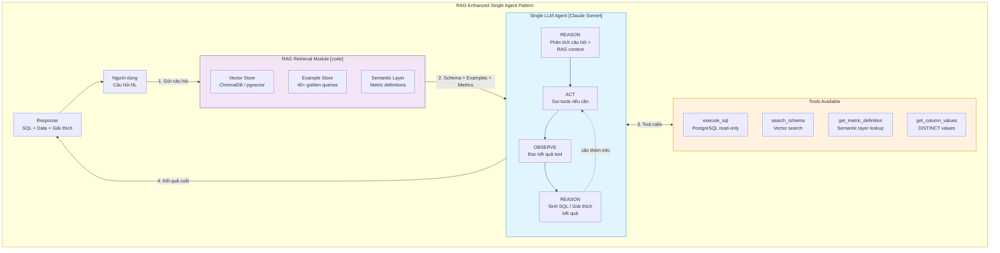
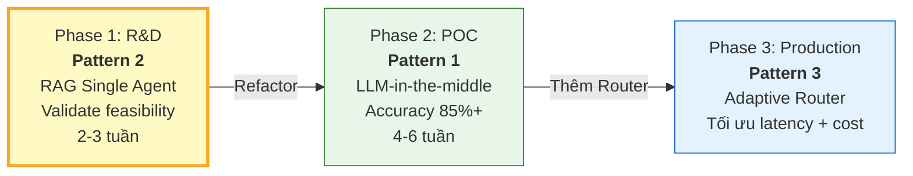

# Design Pattern — RAG-Enhanced Single Agent

## 1. Tên Pattern

**Tool-Augmented Agent** kết hợp **Retrieval-Augmented Generation (RAG)** và **ReAct (Reasoning + Acting)**

Ba pattern này được kết hợp thành một kiến trúc duy nhất: **một LLM agent duy nhất**, được trang bị context từ vector store (RAG) và khả năng gọi tools (Tool-Augmented), sử dụng vòng lặp suy luận-hành động (ReAct) để hoàn thành truy vấn từ đầu đến cuối.

---

## 2. Tại Sao Chọn Các Pattern Này?

### 2.1 Tool-Augmented Agent — LLM làm trung tâm quyết định

Một LLM agent duy nhất (Claude Sonnet) có quyền truy cập vào tập hợp tools thông qua Claude's native tool use:

- **`execute_sql`**: Thực thi câu truy vấn SELECT trên PostgreSQL (read-only, timeout 30s)
- **`search_schema`**: Tìm kiếm vector store cho tables/columns liên quan
- **`get_metric_definition`**: Tra cứu định nghĩa metric từ semantic layer
- **`get_column_values`**: Lấy giá trị DISTINCT của một column (enum lookup)

LLM **tự quyết định** khi nào cần gọi tool nào, dựa trên ngữ cảnh câu hỏi và kết quả trước đó. Không có orchestration code điều phối — LLM chính là orchestrator.

### 2.2 RAG — Giảm hallucination bằng grounding

Trước khi LLM sinh SQL, hệ thống **retrieve context từ vector store**:

- Schema chunks liên quan (tables, columns, relationships)
- Few-shot examples tương tự câu hỏi
- Metric definitions từ semantic layer

RAG đảm bảo LLM không phải "nhớ" schema mà được **cung cấp schema thực tế** trong prompt. Điều này giảm đáng kể hallucination (bịa tên bảng/cột không tồn tại).

**So sánh với Direct Prompting (không RAG):**
- Direct Prompting: nhồi toàn bộ 14 bảng x 90 columns vào prompt -> tốn token, dễ hallucinate
- RAG: chỉ retrieve 2-4 bảng liên quan -> context gọn, accuracy cao hơn 10-15%

### 2.3 ReAct — Suy luận và Hành động trong một lượt

LLM thực hiện vòng lặp **Reason → Act → Observe → Reason** trong cùng một conversation turn:

1. **Reason**: Phân tích câu hỏi, xác định cần thông tin gì
2. **Act**: Gọi tool (ví dụ: `search_schema` để tìm thêm bảng)
3. **Observe**: Đọc kết quả tool trả về
4. **Reason**: Dựa trên kết quả, quyết định bước tiếp theo (sinh SQL hoặc gọi thêm tool)

Toàn bộ diễn ra trong **một lần gọi Claude API** (với tool use loop), không cần code bên ngoài điều phối.

---

## 3. Minh Hoạ Pattern



---

## 4. Sự Đơn Giản Của Pattern

### Một Agent làm tất cả

Đây là điểm khác biệt lớn nhất so với Pattern 1 (LLM-in-the-middle Pipeline):

| Khía cạnh | Pattern 1 (Pipeline) | Pattern 2 (Single Agent) |
|-----------|---------------------|-------------------------|
| Số components xử lý logic | 6 (Router, Linker, Generator, Validator, Executor, Insight) | **1** (Single LLM Agent) |
| Số lần gọi LLM | 1-2 (Generator + optional Insight) | **1** (Agent làm tất cả) |
| Orchestration | LangGraph / custom code | **Không cần** — Claude native tool use |
| Code phải viết | ~100h (nhiều modules) | **~90h** (ít modules hơn) |
| Số moving parts | Nhiều — mỗi step có thể fail riêng | **Ít** — chỉ RAG retrieval + LLM + tools |

**Một Agent duy nhất đảm nhận:**
1. Nhận RAG context (schema, examples, metrics)
2. Hiểu câu hỏi (intent classification — không cần Router riêng)
3. Chọn bảng/cột phù hợp từ context
4. Resolve metrics ("doanh thu" -> SQL expression)
5. Sinh SQL
6. Tự validate (safety rules trong prompt)
7. Execute qua tool `execute_sql`
8. Giải thích kết quả cho người dùng

---

## 5. Mức Độ Phụ Thuộc LLM

### LLM chiếm ~50% thành công tổng thể

Đây là pattern có **mức phụ thuộc LLM cao nhất** trong 3 patterns:

```
                      LLM quality contribution

Pattern 2 (Single Agent)     ████████████████████████████  ~50%
Pattern 3 (Adaptive Router)  ██████████████████            ~33%
Pattern 1 (LLM-in-middle)   ████████████                  ~22%
```

| Thành phần | % đóng góp | Ghi chú |
|-----------|-----------|--------|
| **LLM model quality** | **~45-55%** | Gánh gần như toàn bộ logic xử lý |
| RAG Retrieval quality | ~20-25% | Chỉ đưa context thô, LLM phải tự lọc |
| Few-shot examples | ~10-15% | Quan trọng hơn vì không có validator riêng |
| Prompt engineering | ~10-15% | Rules, output format, constraints trong prompt |
| Validator/Safety (code) | ~0% | Không có — LLM tự validate chính nó |

**Hệ quả:**
- Đổi từ Sonnet -> Haiku: **drop accuracy 15-20%** (impact rất lớn)
- Đổi từ Sonnet -> Opus: **tăng accuracy 5-10%** (cải thiện đáng kể)
- Prompt quality ảnh hưởng trực tiếp đến toàn bộ pipeline

---

## 6. Trade-offs

### Ưu điểm

| Ưu điểm | Chi tiết |
|---------|---------|
| **Đơn giản nhất** | Ít code, ít components, ít failure points |
| **Nhanh nhất** | Latency 3-6s (1 LLM call), không qua nhiều bước pipeline |
| **Chi phí LLM thấp** | 1 API call/query — không có multiple LLM calls |
| **Prototype nhanh** | Có thể build POC trong 2-3 tuần |
| **Dễ hiểu** | Luồng xử lý tuyến tính, không có conditional branching phức tạp |

### Nhược điểm

| Nhược điểm | Chi tiết |
|-----------|---------|
| **Accuracy thấp hơn (~75-85%)** | Không có chuyên biệt hoá — 1 agent làm tất cả, không xuất sắc ở bất kỳ bước nào |
| **Safety yếu** | LLM tự validate chính nó — không có code validator độc lập kiểm tra SQL trước khi execute |
| **Khó debug (black box)** | Khi SQL sai, không biết lỗi ở bước nào: retrieval miss? metric resolution sai? SQL generation sai? |
| **Prompt dài** | Schema + rules + examples + output format -> context window lớn, tốn token |
| **Khó mở rộng** | Thêm tables hoặc features -> prompt càng dài, accuracy càng giảm |
| **Hallucination risk trung bình** | Không có code layer bọc LLM -> lỗi hallucination có thể đi thẳng ra output |

---

## 7. Vị Trí Trong Lộ Trình

Pattern 2 là **Phase 1 (R&D)** — pattern khởi đầu để validate feasibility nhanh nhất:



**Tại sao bắt đầu từ Pattern 2:**
- Prototype nhanh trong 2-3 tuần, validate RAG approach có hoạt động không
- Code Pattern 2 **không bỏ đi** — trở thành SQL Generator agent trong Pattern 1
- Nếu accuracy >85% ngay từ Pattern 2 -> có thể skip Pattern 1 (unlikely nhưng possible)
- Học được về domain, prompt engineering, few-shot selection trước khi build pipeline phức tạp hơn
