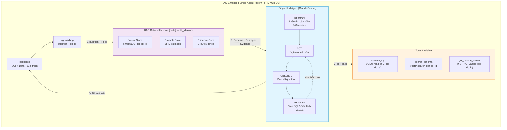
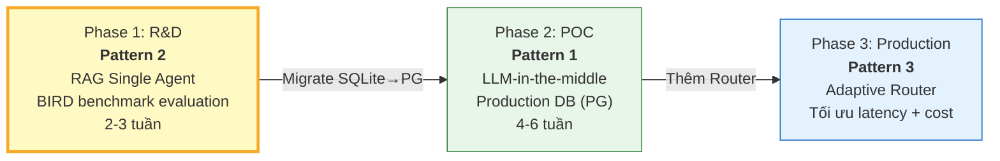

# Design Pattern — RAG-Enhanced Single Agent (BIRD Multi-Database)

## 1. Tên Pattern

**Tool-Augmented Agent** kết hợp **Retrieval-Augmented Generation (RAG)** và **ReAct (Reasoning + Acting)**

Ba pattern này được kết hợp thành một kiến trúc duy nhất: **một LLM agent duy nhất**, được trang bị context từ vector store (RAG) và khả năng gọi tools (Tool-Augmented), sử dụng vòng lặp suy luận-hành động (ReAct) để hoàn thành truy vấn từ đầu đến cuối.

**Phiên bản này** mở rộng cho **multi-database** sử dụng BIRD-SQL benchmark — 70+ databases đa dạng domain, đánh giá bằng execution accuracy.

---

## 2. Tại Sao Chọn Các Pattern Này?

### 2.1 Tool-Augmented Agent — LLM làm trung tâm quyết định

Một LLM agent duy nhất (Claude Sonnet) có quyền truy cập vào tập hợp tools thông qua Claude's native tool use:

- **`execute_sql`**: Thực thi câu truy vấn SELECT trên SQLite database (read-only, per db_id)
- **`search_schema`**: Tìm kiếm vector store cho tables/columns liên quan (filtered by db_id)
- **`get_column_values`**: Lấy giá trị DISTINCT của một column (enum lookup trên SQLite)

LLM **tự quyết định** khi nào cần gọi tool nào, dựa trên ngữ cảnh câu hỏi và kết quả trước đó. Không có orchestration code điều phối — LLM chính là orchestrator.

### 2.2 RAG — Giảm hallucination bằng grounding

Trước khi LLM sinh SQL, hệ thống **retrieve context từ vector store** có filter theo `db_id`:

- Schema chunks liên quan (tables, columns, relationships) **của đúng database**
- Few-shot examples tương tự câu hỏi **từ BIRD train split**
- Evidence (domain knowledge hints) **từ BIRD dataset**

RAG đảm bảo LLM không phải "nhớ" schema mà được **cung cấp schema thực tế** trong prompt. Điều này giảm đáng kể hallucination (bịa tên bảng/cột không tồn tại).

**So sánh với Direct Prompting (không RAG):**
- Direct Prompting: nhồi toàn bộ schema vào prompt → tốn token, dễ hallucinate (đặc biệt với BIRD databases có schema phức tạp)
- RAG: chỉ retrieve top_k relevant chunks → context gọn, accuracy cao hơn 10-15%

### 2.3 ReAct — Suy luận và Hành động trong một lượt

LLM thực hiện vòng lặp **Reason → Act → Observe → Reason** trong cùng một conversation turn:

1. **Reason**: Phân tích câu hỏi, xác định cần thông tin gì
2. **Act**: Gọi tool (ví dụ: `search_schema` để tìm thêm bảng)
3. **Observe**: Đọc kết quả tool trả về
4. **Reason**: Dựa trên kết quả, quyết định bước tiếp theo (sinh SQL hoặc gọi thêm tool)

Toàn bộ diễn ra trong **một lần gọi Claude API** (với tool use loop), không cần code bên ngoài điều phối.

---

## 3. Minh Hoạ Pattern



---

## 4. Sự Đơn Giản Của Pattern

### Một Agent làm tất cả

Đây là điểm khác biệt lớn nhất so với Pattern 1 (LLM-in-the-middle Pipeline):

| Khía cạnh | Pattern 1 (Pipeline) | Pattern 2 (Single Agent) |
|-----------|---------------------|-------------------------|
| Số components xử lý logic | 6 (Router, Linker, Generator, Validator, Executor, Insight) | **1** (Single LLM Agent) |
| Số lần gọi LLM | 1-2 (Generator + optional Insight) | **1** (Agent làm tất cả) |
| Orchestration | LangGraph / custom code | **Không cần** — Claude native tool use |
| Số moving parts | Nhiều — mỗi step có thể fail riêng | **Ít** — chỉ RAG retrieval + LLM + tools |
| Multi-database | Phải route tại mỗi step | **db_id** truyền 1 lần, tools tự route |

**Một Agent duy nhất đảm nhận:**
1. Nhận RAG context (schema, examples, evidence) **cho database cụ thể**
2. Hiểu câu hỏi (intent classification — không cần Router riêng)
3. Chọn bảng/cột phù hợp từ context
4. Sử dụng evidence để hiểu domain terminology
5. Sinh SQL (SQLite syntax)
6. Tự validate (safety rules trong prompt)
7. Execute qua tool `execute_sql` → route tới đúng SQLite database
8. Giải thích kết quả cho người dùng

---

## 5. Mức Độ Phụ Thuộc LLM

### LLM chiếm ~50% thành công tổng thể

Đây là pattern có **mức phụ thuộc LLM cao nhất** trong 3 patterns:

```
                      LLM quality contribution

Pattern 2 (Single Agent)     ████████████████████████████  ~50%
Pattern 3 (Adaptive Router)  ██████████████████            ~33%
Pattern 1 (LLM-in-middle)   ████████████                  ~22%
```

| Thành phần | % đóng góp | Ghi chú |
|-----------|-----------|--------|
| **LLM model quality** | **~45-55%** | Gánh gần như toàn bộ logic xử lý |
| RAG Retrieval quality | ~20-25% | Chỉ đưa context thô, LLM phải tự lọc |
| Few-shot examples (BIRD train) | ~10-15% | Quan trọng hơn vì không có validator riêng |
| Evidence quality (BIRD) | ~5-10% | Domain hints giúp hiểu terminology |
| Prompt engineering | ~5-10% | Rules, output format, constraints trong prompt |

---

## 6. Trade-offs

### Ưu điểm

| Ưu điểm | Chi tiết |
|---------|---------|
| **Đơn giản nhất** | Ít code, ít components, ít failure points |
| **Nhanh nhất** | Latency 3-6s (1 LLM call) |
| **Multi-DB dễ** | Thêm database mới = thêm SQLite file + index schema |
| **Benchmark-ready** | BIRD evaluation framework tích hợp sẵn |
| **Prototype nhanh** | Build POC trong 2-3 tuần |

### Nhược điểm

| Nhược điểm | Chi tiết |
|-----------|---------|
| **Accuracy thấp hơn (~60-80% trên BIRD)** | BIRD benchmark khó hơn single-domain; 70+ schemas đa dạng |
| **Safety yếu** | LLM tự validate — không có code validator độc lập |
| **Khó debug (black box)** | Khi SQL sai, không biết lỗi ở bước nào |
| **Schema diversity** | 70+ databases với schemas rất khác nhau → LLM có thể confused |
| **SQLite-specific** | Evaluation dùng SQLite; production cần migrate sang PostgreSQL |

---

## 7. Vị Trí Trong Lộ Trình

Pattern 2 là **Phase 1 (R&D)** — validate Text-to-SQL accuracy trên BIRD benchmark:



**Tại sao bắt đầu từ Pattern 2 + BIRD:**
- Benchmark chính xác accuracy trên 70+ databases thực tế trước khi build production
- BIRD dataset cung cấp ground truth SQL → evaluation tự động (execution accuracy)
- Code Pattern 2 **không bỏ đi** — trở thành SQL Generator agent trong Pattern 1
- Nếu EX accuracy >80% trên BIRD → confidence cao để tiến Phase 2
- Học được về RAG quality, prompt engineering, schema diversity trước khi build pipeline
