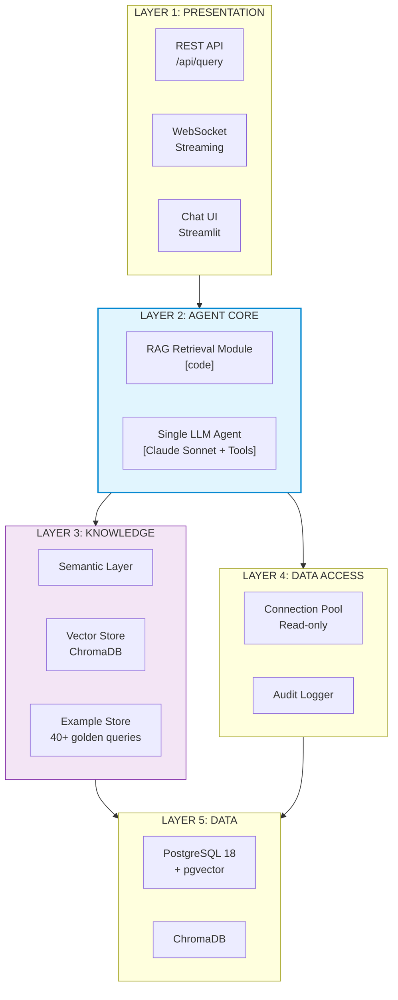

# Các Components Chính — RAG-Enhanced Single Agent

## Tổng Quan Kiến Trúc Phân Tầng

Pattern 2 giữ nguyên **5 layers** như Pattern 1 nhưng với số lượng components ít hơn đáng kể. Sự đơn giản này đến từ việc **một LLM agent duy nhất** thay thế toàn bộ processing pipeline (Router, Linker, Generator, Validator, Insight).



---

## LAYER 1: PRESENTATION — Giao Tiếp Người Dùng

Layer này đơn giản hơn Pattern 1 vì không cần expose trạng thái pipeline (không có step-by-step progress).

| Component | Vai trò | Bắt buộc? | Ghi chú |
|-----------|---------|-----------|---------|
| **REST API** (`/api/query`) | Endpoint chính nhận câu hỏi, trả kết quả | **Bắt buộc** | Xương sống, mọi client đều gọi qua đây |
| **WebSocket** (streaming) | Stream response token-by-token từ LLM | **Nên có** | Giảm perceived latency từ ~5s xuống ~1s. Claude API hỗ trợ streaming native |
| **Chat UI** (Streamlit) | Giao diện web cho business user thử nghiệm | **POC only** | Streamlit cho prototype nhanh, không cần frontend expertise |

**Khác biệt với Pattern 1:**
- Không cần hiển thị "đang ở bước nào" (schema linking → SQL generation → validation) vì không có pipeline
- Response đơn giản hơn: LLM trả về một response duy nhất chứa SQL + kết quả + giải thích
- Streaming liền mạch hơn — không có "gap" giữa các bước pipeline

---

## LAYER 2: AGENT CORE — Trung Tâm Xử Lý

Đây là layer quan trọng nhất, chỉ gồm **2 components** thay vì 6 components của Pattern 1.

### 2.1 RAG Retrieval Module [code]

**Loại:** Deterministic code — không gọi LLM

**Vai trò:** Vector search để tìm schema chunks liên quan + few-shot examples trước khi đưa vào LLM.

Tương đương với Schema Linker của Pattern 1 nhưng **đơn giản hơn**:
- Pattern 1: Schema Linker build **Context Package** đầy đủ (tables + JOIN paths + resolved metrics + enums + sensitive columns)
- Pattern 2: RAG Retrieval chỉ trả về **context thô** (schema chunks + examples), LLM tự lọc và interpret

```python
# RAG Retrieval Module — Simplified Schema Linking
def retrieve_context(question: str) -> RAGContext:
    # 1. Embed câu hỏi
    embedding = embed_model.encode(question)

    # 2. Vector search — tìm schema chunks liên quan
    schema_chunks = vector_store.query(embedding, top_k=5)

    # 3. Vector search — tìm few-shot examples tương tự
    examples = example_store.query(embedding, top_k=3)

    # 4. Keyword matching — tìm metric definitions liên quan
    metrics = find_relevant_metrics(question)

    return RAGContext(
        schema_chunks=schema_chunks,   # raw schema text
        examples=examples,             # Q&A pairs
        metrics=metrics                # metric definitions (text)
    )
```

**Khác biệt với Pattern 1 Schema Linker:**

| Khía cạnh | Pattern 1: Schema Linker | Pattern 2: RAG Retrieval |
|-----------|-------------------------|-------------------------|
| Output | Context Package (structured JSON) | RAG Context (text chunks) |
| Metric resolution | Code resolve sẵn SQL expression | Đưa definition text, LLM tự resolve |
| JOIN path selection | Code chọn sẵn JOIN conditions | Schema chunk chứa relationships, LLM tự chọn |
| Column filtering | Lọc sensitive columns bằng code | Rules trong prompt, LLM tự filter |
| Enum lookup | Code query DISTINCT values sẵn | LLM gọi tool `get_column_values` nếu cần |

### 2.2 Single LLM Agent [LLM]

**Loại:** LLM — Claude Sonnet với tool use

**Vai trò:** **MỘT prompt xử lý TẤT CẢ** — hiểu câu hỏi, chọn bảng từ RAG context, resolve metrics, sinh SQL, tự validate, execute qua tool, giải thích kết quả.

**Cấu trúc prompt:**

```
┌─────────────────────────────────────────────────────┐
│ SYSTEM PROMPT                                        │
│                                                      │
│ 1. Role: Bạn là SQL Agent cho hệ thống Banking/POS  │
│ 2. Rules:                                            │
│    - Chỉ sinh SELECT (KHÔNG INSERT/UPDATE/DELETE)    │
│    - Luôn thêm LIMIT (max 1000)                     │
│    - KHÔNG truy cập: cvv, card_number, dob, email   │
│    - Dùng PostgreSQL syntax                          │
│    - Trả kết quả bằng ngôn ngữ của câu hỏi         │
│                                                      │
│ 3. Schema Context (từ RAG):                          │
│    [Retrieved schema chunks — 2-5 bảng liên quan]   │
│                                                      │
│ 4. Metric Definitions:                               │
│    "doanh thu" = SUM(sales.total_amount)             │
│                  WHERE status = 'completed'           │
│    "khách mới" = COUNT(*) FROM customers             │
│                  WHERE created_at IN period           │
│    ...                                               │
│                                                      │
│ 5. Few-shot Examples (từ RAG):                       │
│    Q: "Top 10 merchant doanh thu cao nhất?"          │
│    SQL: SELECT m.name, SUM(s.total_amount) ...       │
│    Q: "Phân bố KYC status?"                          │
│    SQL: SELECT kyc_status, COUNT(*) ...              │
│    ...                                               │
│                                                      │
│ 6. Output Format:                                    │
│    - Trả SQL trong code block                        │
│    - Giải thích ngắn gọn kết quả                     │
│    - Nếu không thể trả lời, nói rõ lý do            │
├─────────────────────────────────────────────────────┤
│ USER MESSAGE                                         │
│                                                      │
│ "Top 10 merchant có doanh thu cao nhất quý trước?"  │
├─────────────────────────────────────────────────────┤
│ TOOL DEFINITIONS                                     │
│                                                      │
│ - execute_sql(sql: str) -> ResultSet                 │
│ - search_schema(query: str) -> SchemaChunks          │
│ - get_metric_definition(metric: str) -> Definition   │
│ - get_column_values(table: str, column: str) -> List │
└─────────────────────────────────────────────────────┘
```

### 2.3 Tools Available

Agent có quyền truy cập 4 tools, gọi thông qua Claude's native tool use:

#### Tool 1: `execute_sql`

| Thuộc tính | Chi tiết |
|-----------|---------|
| **Mô tả** | Thực thi câu truy vấn SQL trên PostgreSQL |
| **Input** | `sql: str` — câu SQL cần thực thi |
| **Output** | `columns: List[str]`, `rows: List[List]`, `row_count: int` |
| **Ràng buộc** | Read-only connection, timeout 30s, auto LIMIT 1000 nếu thiếu |
| **Error handling** | Trả error message nếu SQL syntax sai hoặc timeout |

```python
def execute_sql(sql: str) -> dict:
    # Safety check tối thiểu (code-level, không phải LLM)
    if not sql.strip().upper().startswith("SELECT"):
        return {"error": "Only SELECT queries allowed"}

    conn = pool.getconn(readonly=True)
    conn.execute("SET statement_timeout = '30000'")  # 30s

    try:
        cursor = conn.execute(sql)
        return {
            "columns": [desc[0] for desc in cursor.description],
            "rows": cursor.fetchall(),
            "row_count": cursor.rowcount
        }
    except Exception as e:
        return {"error": str(e)}
    finally:
        pool.putconn(conn)
```

#### Tool 2: `search_schema`

| Thuộc tính | Chi tiết |
|-----------|---------|
| **Mô tả** | Tìm kiếm vector store cho tables/columns liên quan đến một truy vấn |
| **Input** | `query: str` — mô tả thông tin cần tìm |
| **Output** | Schema chunks (table definitions, relationships, column descriptions) |
| **Khi nào dùng** | Khi RAG context ban đầu chưa đủ, LLM cần thêm thông tin về schema |

#### Tool 3: `get_metric_definition`

| Thuộc tính | Chi tiết |
|-----------|---------|
| **Mô tả** | Tra cứu định nghĩa SQL của một business metric |
| **Input** | `metric_name: str` — tên metric (vd: "doanh thu", "refund rate") |
| **Output** | SQL expression + description + aliases |
| **Khi nào dùng** | Khi câu hỏi chứa business terms cần resolve sang SQL |

#### Tool 4: `get_column_values`

| Thuộc tính | Chi tiết |
|-----------|---------|
| **Mô tả** | Lấy danh sách giá trị DISTINCT của một column |
| **Input** | `table: str`, `column: str` |
| **Output** | `values: List[str]` (top 50 distinct values) |
| **Khi nào dùng** | Khi cần biết enum values hợp lệ (vd: kyc_status, payment_method) |

---

## LAYER 3: KNOWLEDGE — Nền Tảng Tri Thức

Giống Pattern 1 về mặt data, nhưng **cách sử dụng khác**:
- Pattern 1: Code (Schema Linker) truy cập trực tiếp, build Context Package có cấu trúc
- Pattern 2: RAG Retrieval đưa raw context vào prompt, LLM tự interpret

### 3.1 Semantic Layer

**Cùng định nghĩa metrics** như Pattern 1, nhưng agent phải **interpret từ prompt context** thay vì được code pre-resolve sẵn.

```yaml
# semantic_layer.yaml — Cùng file config, khác cách sử dụng

metrics:
  doanh_thu:
    sql: "SUM(sales.total_amount)"
    filter: "sales.status = 'completed'"
    aliases: ["doanh thu", "revenue", "tổng doanh thu"]
    description: "Tổng giá trị giao dịch thành công"

  refund_rate:
    sql: "COUNT(refunds.id)::FLOAT / NULLIF(COUNT(sales.id), 0)"
    aliases: ["tỷ lệ hoàn", "refund rate", "hoàn tiền"]
    description: "Tỷ lệ giao dịch bị hoàn trả"

  khach_moi:
    sql: "COUNT(*) FROM customers"
    filter: "customers.created_at >= {period_start}"
    aliases: ["khách mới", "new customers", "khách hàng mới"]

sensitive_columns:
  - cards.cvv
  - cards.card_number
  - customers.dob
  - customers.email
```

**Trong Pattern 2:** Nội dung metric definitions được đưa vào prompt dưới dạng text. LLM phải tự đọc và áp dụng đúng SQL expression. Không có code verify rằng LLM đã sử dụng đúng definition.

### 3.2 Vector Store — ChromaDB

| Thuộc tính | Chi tiết |
|-----------|---------|
| **Technology** | ChromaDB (dev) — đã setup, đủ cho POC |
| **Nội dung** | Schema embeddings (chunked theo domain cluster) |
| **Số documents** | <100 (14 bảng chunked thành ~30-50 documents) |
| **Embedding model** | bge-large-en-v1.5 (hiện tại) -> bge-m3 (upgrade multilingual) |
| **Retrieval** | Cosine similarity, top_k=5 |

**Cấu trúc document trong vector store:**

```
Document 1 (cluster: transaction_analytics):
  Tables: sales, merchants, terminals, products, cards
  Relationships:
    - sales.merchant_id -> merchants.id
    - sales.terminal_id -> terminals.id
    - sales.product_id -> products.id
    - sales.card_id -> cards.id
  Key columns: sales.total_amount, sales.sale_time, sales.status,
               merchants.name, merchants.city, products.product_name
  Use cases: revenue analysis, product performance, merchant analytics

Document 2 (cluster: customer_banking):
  Tables: customers, accounts, cards, branches
  ...
```

### 3.3 Example Store — Few-shot Golden Queries

| Thuộc tính | Chi tiết |
|-----------|---------|
| **Số lượng** | 40+ golden queries (hiện có từ query.json + query_samples.sql) |
| **Cách dùng** | Vector similarity search -> top 3 examples đưa vào prompt |
| **Format** | Question (NL) + SQL (golden) + Result description |

**Vai trò trong Pattern 2 quan trọng hơn Pattern 1:**
- Pattern 1: Few-shot bổ trợ (LLM đã nhận Context Package đầy đủ)
- Pattern 2: Few-shot là **guide chính** cho LLM — LLM học pattern SQL từ examples vì không có code pre-process context

---

## LAYER 4: DATA ACCESS — Truy Cập Dữ Liệu An Toàn

### 4.1 Connection Pool

| Thuộc tính | Chi tiết |
|-----------|---------|
| **Loại** | Read-only connections |
| **Config** | min=2, max=5 (đơn giản hơn Pattern 1 vì POC scale) |
| **Timeout** | statement_timeout=30s |

Đơn giản hơn Pattern 1: không cần Query Executor riêng vì logic execute nằm trong tool `execute_sql`.

### 4.2 Tool-based Execution

Khác biệt với Pattern 1 nơi Executor là một component riêng:
- **Pattern 1:** Pipeline gọi Executor component -> Executor chạy SQL -> trả result cho pipeline
- **Pattern 2:** LLM gọi tool `execute_sql` -> tool handle DB interaction -> trả result cho LLM

LLM quyết định **khi nào** gọi execute, **bao nhiêu lần** (retry nếu lỗi), và **làm gì** với kết quả.

### 4.3 Audit Logger

| Thuộc tính | Chi tiết |
|-----------|---------|
| **Bắt buộc** | Vẫn bắt buộc — compliance banking |
| **Log contents** | Câu hỏi gốc, SQL sinh ra, kết quả (row count), timestamp, user ID |
| **Implementation** | Logging trong tool `execute_sql` |

```python
# Mỗi lần execute_sql tool được gọi
audit_logger.log(
    question=original_question,
    generated_sql=sql,
    row_count=len(rows),
    status="success" | "error",
    timestamp=datetime.utcnow(),
    latency_ms=elapsed
)
```

---

## LAYER 5: DATA — Hạ Tầng Dữ Liệu

### 5.1 PostgreSQL 18 + pgvector

| Thuộc tính | Chi tiết |
|-----------|---------|
| **Database** | PostgreSQL 18 (đã có, chứa business data) |
| **Extension** | pgvector (đã có, vector similarity search) |
| **Vai trò** | Chứa 14 bảng business data + có thể chứa embeddings (consolidate từ ChromaDB) |

### 5.2 ChromaDB

| Thuộc tính | Chi tiết |
|-----------|---------|
| **Vai trò** | Vector store cho dev/POC — lưu schema embeddings + example embeddings |
| **Tại sao dùng riêng** | Đã setup sẵn, API đơn giản, đủ cho POC scale (<100 docs) |
| **Khi nào consolidate** | Phase 2 — chuyển sang pgvector để giảm infra complexity |

---

## Tổng Kết So Sánh Components: Pattern 2 vs Pattern 1

| Layer | Pattern 1 Components | Pattern 2 Components | Khác biệt |
|-------|---------------------|---------------------|-----------|
| **Presentation** | REST API, WebSocket, Chat UI, CLI/SDK | REST API, WebSocket, Chat UI | Ít hơn 1 component |
| **Processing** | Router, Schema Linker, SQL Generator, Validator, Executor, Insight, Self-Correction Loop | RAG Retrieval Module, Single LLM Agent | **6 components -> 2** |
| **Knowledge** | Semantic Layer, Vector Store (pgvector), Example Store | Semantic Layer, Vector Store (ChromaDB), Example Store | Tương tự, ChromaDB thay pgvector |
| **Data Access** | Connection Pool, Query Executor, Audit Logger | Connection Pool, Audit Logger | Executor nằm trong tool |
| **Data** | PostgreSQL 18 + pgvector | PostgreSQL 18 + pgvector + ChromaDB | Thêm ChromaDB cho dev |
| **Tổng** | ~12 components | **~8 components** | Giảm ~33% complexity |
