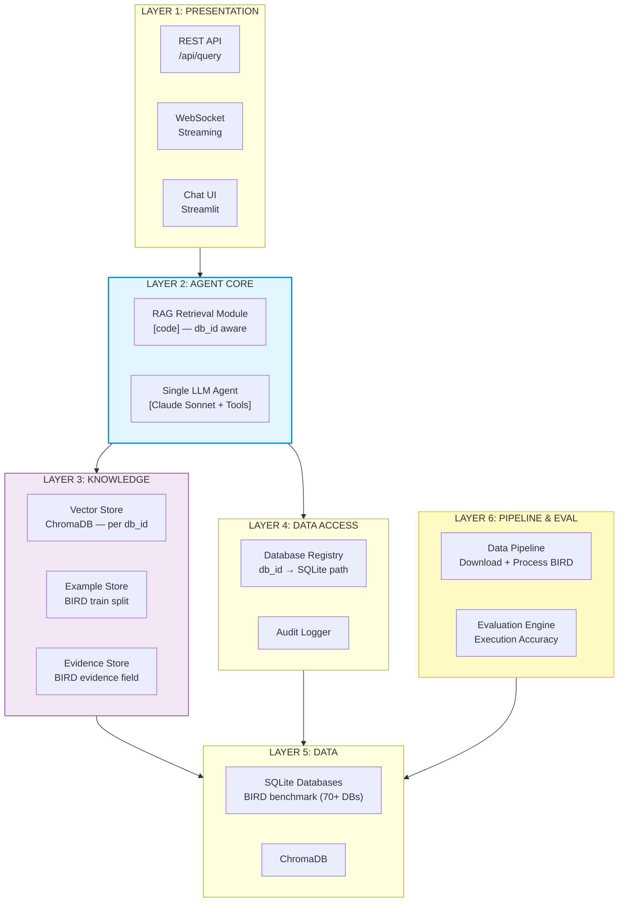

# Các Components Chính — RAG-Enhanced Single Agent (BIRD Multi-Database)

## Tổng Quan Kiến Trúc Phân Tầng

Pattern 2 giữ nguyên **5 layers** với số lượng components ít. Sự đơn giản đến từ việc **một LLM agent duy nhất** thay thế toàn bộ processing pipeline. Phiên bản này mở rộng cho **multi-database** sử dụng BIRD-SQL benchmark với SQLite.

**Thay đổi chính so với phiên bản single-database banking:**
- **Multi-database**: Hỗ trợ 70+ databases từ BIRD benchmark thay vì 1 database banking cố định
- **SQLite**: Thay thế PostgreSQL cho phase evaluation (match BIRD ground truth)
- **Dynamic schema**: Schema chunking động per database thay vì 7 clusters cố định
- **BIRD Evidence**: Thay thế Semantic Layer banking-specific
- **Evaluation Engine**: Component mới để benchmark accuracy
- **Data Pipeline**: Component mới để download/process BIRD dataset



---

## LAYER 1: PRESENTATION — Giao Tiếp Người Dùng

Thay đổi chính: API endpoint nhận thêm parameter `db_id` để xác định database target.

| Component | Vai trò | Bắt buộc? | Ghi chú |
|-----------|---------|-----------|---------|
| **REST API** (`/api/query`) | Endpoint chính nhận câu hỏi + db_id | **Bắt buộc** | Thêm `db_id` parameter |
| **WebSocket** (streaming) | Stream response token-by-token | **Nên có** | Không thay đổi |
| **Chat UI** (Streamlit) | Giao diện web với database selector | **POC only** | Thêm dropdown chọn database |

**API contract mới:**

```
POST /api/query
{
  "question": "List publishers with sales less than 10000",
  "db_id": "video_games"
}
```

---

## LAYER 2: AGENT CORE — Trung Tâm Xử Lý

Vẫn chỉ gồm **2 components chính**, nhưng cả hai đều được mở rộng cho multi-database.

### 2.1 RAG Retrieval Module [code] — db_id aware

**Loại:** Deterministic code — không gọi LLM

**Vai trò:** Vector search để tìm schema chunks + few-shot examples **của đúng database** trước khi đưa vào LLM.

**Thay đổi chính:**
- Nhận `db_id` parameter
- Filter vector search theo `db_id` metadata
- Schema chunking **động** per database (không hardcode clusters)
- Examples lấy từ **BIRD train split** (strict exclusion từ test set)

```python
# RAG Retrieval Module — Multi-database aware
def retrieve_context(question: str, db_id: str) -> RAGContext:
    # 1. Embed câu hỏi
    embedding = embed_model.encode(question)

    # 2. Vector search — schema chunks CỦA database cụ thể
    schema_chunks = vector_store.query(
        embedding, top_k=5,
        where={"db_id": db_id}  # Filter by database
    )

    # 3. Vector search — examples CỦA database (CHỈ từ train split)
    examples = vector_store.query(
        embedding, top_k=3,
        collection="examples",
        where={"db_id": db_id, "split": "train"}
    )

    # 4. Lookup evidence — BIRD evidence cho database này
    evidence = evidence_store.get(db_id)

    return RAGContext(
        schema_chunks=schema_chunks,   # schema text của db_id
        examples=examples,             # Q&A pairs từ train split
        evidence=evidence              # BIRD evidence (domain hints)
    )
```

**So sánh với phiên bản single-database:**

| Khía cạnh | Single-DB (banking) | Multi-DB (BIRD) |
|-----------|-------------------|-----------------|
| Schema source | `data/schema.json` (14 bảng cố định) | BIRD DDL per database (dynamic) |
| Chunking | 7 hardcoded domain clusters | Dynamic — chunk theo table groups per DB |
| Vector search | Không filter | Filter by `db_id` metadata |
| Examples | 40 golden queries cố định | BIRD train split per database |
| Metrics | Semantic Layer (banking-specific) | BIRD evidence field (per question) |

### 2.2 Single LLM Agent [LLM] — Database-agnostic

**Loại:** LLM — Claude Sonnet với tool use

**Vai trò:** Nhận schema context của một database cụ thể, sinh SQL, execute, giải thích. Agent **không cần biết** tên database — chỉ làm việc với schema được cung cấp.

**Thay đổi chính:**
- System prompt **không còn banking-specific** — generic Text-to-SQL agent
- SQL syntax: **SQLite** thay vì PostgreSQL (match BIRD ground truth)
- Không có sensitive columns (BIRD không có concept này)
- Evidence từ BIRD thay thế metric definitions

**Cấu trúc prompt mới:**

```
┌─────────────────────────────────────────────────────┐
│ SYSTEM PROMPT                                        │
│                                                      │
│ 1. Role: You are a SQL Agent. Generate SQLite SQL    │
│    to answer questions about the given database.     │
│ 2. Rules:                                            │
│    - Chỉ sinh SELECT (KHÔNG INSERT/UPDATE/DELETE)    │
│    - Luôn thêm LIMIT (max 1000)                     │
│    - Dùng SQLite syntax                              │
│    - Trả kết quả bằng ngôn ngữ của câu hỏi         │
│                                                      │
│ 3. Database Schema (từ RAG — specific to db_id):     │
│    [CREATE TABLE statements cho database này]        │
│                                                      │
│ 4. Evidence (từ BIRD — domain knowledge hints):      │
│    "num_sales < 0.1 means less than 10000"           │
│    "publisher refers to publisher_name"              │
│                                                      │
│ 5. Few-shot Examples (từ BIRD train split):          │
│    Q: "How many games were released in 2012?"        │
│    SQL: SELECT COUNT(*) FROM game WHERE ...          │
│    ...                                               │
│                                                      │
│ 6. Output Format:                                    │
│    - SQL trong code block                            │
│    - Giải thích ngắn gọn                             │
├─────────────────────────────────────────────────────┤
│ USER MESSAGE                                         │
│                                                      │
│ "List publishers with number of sales < 10000"       │
├─────────────────────────────────────────────────────┤
│ TOOL DEFINITIONS                                     │
│                                                      │
│ - execute_sql(sql: str) -> ResultSet                 │
│ - search_schema(query: str) -> SchemaChunks          │
│ - get_column_values(table: str, column: str) -> List │
└─────────────────────────────────────────────────────┘
```

### 2.3 Tools Available

Agent có **3 tools** (giảm từ 4 — bỏ `get_metric_definition`):

#### Tool 1: `execute_sql`

| Thuộc tính | Chi tiết |
|-----------|---------|
| **Mô tả** | Thực thi câu truy vấn SQL trên SQLite database |
| **Input** | `sql: str` — câu SQL cần thực thi |
| **Output** | `columns: List[str]`, `rows: List[List]`, `row_count: int` |
| **Ràng buộc** | Read-only (SQLite open readonly), auto LIMIT 1000, block non-SELECT |
| **Routing** | Agent không truyền db_id — application code route tới đúng SQLite file dựa trên session context |

```python
def execute_sql(sql: str, db_path: str) -> dict:
    """db_path được inject bởi application, không phải LLM."""
    if not sql.strip().upper().startswith("SELECT"):
        return {"error": "Only SELECT queries allowed"}

    conn = sqlite3.connect(f"file:{db_path}?mode=ro", uri=True)
    try:
        cursor = conn.execute(sql)
        return {
            "columns": [desc[0] for desc in cursor.description],
            "rows": cursor.fetchall(),
            "row_count": cursor.rowcount
        }
    except Exception as e:
        return {"error": str(e)}
    finally:
        conn.close()
```

#### Tool 2: `search_schema`

| Thuộc tính | Chi tiết |
|-----------|---------|
| **Mô tả** | Tìm kiếm thêm schema chunks cho database hiện tại |
| **Input** | `query: str` — mô tả thông tin cần tìm |
| **Output** | Schema chunks (table definitions, relationships) |
| **Filter** | Tự động filter theo `db_id` của session hiện tại |

#### Tool 3: `get_column_values`

| Thuộc tính | Chi tiết |
|-----------|---------|
| **Mô tả** | Lấy DISTINCT values của một column trong database hiện tại |
| **Input** | `table: str`, `column: str` |
| **Output** | `values: List[str]` (top 50 distinct values) |
| **Routing** | Tự động query SQLite database của session |

#### Tool đã loại bỏ: `get_metric_definition`

Không còn cần thiết vì:
- Banking semantic layer (metric definitions) không áp dụng cho BIRD
- BIRD cung cấp `evidence` field thay thế — được inject trực tiếp vào prompt
- Evidence cụ thể cho từng câu hỏi, không phải lookup table

---

## LAYER 3: KNOWLEDGE — Nền Tảng Tri Thức

Thay đổi lớn nhất ở layer này: từ knowledge cố định (banking) sang knowledge động (per database).

### 3.1 Vector Store — ChromaDB (Multi-database)

| Thuộc tính | Chi tiết |
|-----------|---------|
| **Technology** | ChromaDB |
| **Collections** | `schema_chunks` (tất cả DB), `examples` (train split) |
| **Metadata filter** | `db_id` — filter per database khi query |
| **Số documents** | ~500-2000 (70+ DB × ~10-30 chunks mỗi DB) |
| **Embedding model** | bge-large-en-v1.5 |
| **Retrieval** | Cosine similarity + db_id filter, top_k=5 |

**Cấu trúc document:**

```
Document (collection: schema_chunks):
  id: "video_games_table_game"
  text: "CREATE TABLE game (id INTEGER primary key, genre_id INTEGER,
         game_name TEXT, FOREIGN KEY (genre_id) REFERENCES genre(id))"
  metadata: {
    db_id: "video_games",
    tables: ["game"],
    relationships: ["game.genre_id -> genre.id"]
  }

Document (collection: examples):
  id: "video_games_train_001"
  text: "Q: How many games in each genre?
         SQL: SELECT g.genre_name, COUNT(*) FROM game ga JOIN genre g ON ..."
  metadata: {
    db_id: "video_games",
    split: "train"  // CRITICAL: chỉ train, KHÔNG BAO GIỜ test
  }
```

### 3.2 Example Store — BIRD Train Split

| Thuộc tính | Chi tiết |
|-----------|---------|
| **Source** | BIRD-SQL dataset (9,430+ examples) |
| **Train/Test split** | Configurable ratio per database (default: ~10% train, ~90% test) |
| **Train set** | Dùng làm few-shot examples trong RAG retrieval |
| **Test set** | CHỈ dùng cho evaluation — **TUYỆT ĐỐI không được index vào vector store** |
| **Format** | Question (NL) + SQL (ground truth) + Evidence (domain hints) |

**Quy tắc train/test split nghiêm ngặt:**

```
BIRD Dataset (9,430 examples)
    │
    ├── Train Split (~10%) ─── Index vào ChromaDB ─── Few-shot examples
    │                          (collection: examples)
    │
    └── Test Split (~90%) ──── CHỈ dùng cho Evaluation Engine
                               KHÔNG index, KHÔNG đưa vào prompt
                               KHÔNG dùng bất kỳ cách nào khác
```

### 3.3 Evidence Store — Thay thế Semantic Layer

BIRD dataset cung cấp `evidence` field cho mỗi câu hỏi — đây là domain knowledge hints giúp hiểu đúng ngữ nghĩa.

| Thuộc tính | Chi tiết |
|-----------|---------|
| **Source** | BIRD `evidence` field per question |
| **Vai trò** | Thay thế banking Semantic Layer (metric definitions, aliases, business rules) |
| **Cách dùng** | Inject vào prompt context cùng với schema chunks |
| **Ví dụ** | `"num_sales < 0.1 means less than 10000"`, `"publisher refers to publisher_name"` |

**So sánh với Semantic Layer cũ:**

| Khía cạnh | Banking Semantic Layer | BIRD Evidence |
|-----------|----------------------|---------------|
| Scope | Global cho 14 bảng | Per question |
| Nội dung | Metric SQL, aliases, business rules, sensitive columns, enums | Domain hints, terminology clarification |
| Format | Structured YAML | Free text |
| Khi nào dùng | Mọi query | Chỉ khi question có evidence |

---

## LAYER 4: DATA ACCESS — Truy Cập Dữ Liệu

### 4.1 Database Registry [NEW]

Component mới — quản lý mapping từ `db_id` tới SQLite database file.

| Thuộc tính | Chi tiết |
|-----------|---------|
| **Vai trò** | Registry trung tâm: db_id → SQLite file path + schema DDL |
| **Input** | `db_id: str` |
| **Output** | `DatabaseInfo { path, schema_ddl, table_count, description }` |
| **Source** | Scan thư mục BIRD databases, build registry từ SQLite files |

```python
class DatabaseRegistry:
    """Maps db_id to SQLite database info."""

    def __init__(self, bird_db_dir: str):
        self._databases: dict[str, DatabaseInfo] = {}
        self._scan_databases(bird_db_dir)

    def get(self, db_id: str) -> DatabaseInfo:
        """Get database info by db_id."""
        return self._databases[db_id]

    def list_databases(self) -> list[str]:
        """List all available db_ids."""
        return list(self._databases.keys())

    def get_connection(self, db_id: str) -> sqlite3.Connection:
        """Get read-only SQLite connection for db_id."""
        info = self.get(db_id)
        return sqlite3.connect(f"file:{info.path}?mode=ro", uri=True)
```

### 4.2 Audit Logger

Mở rộng cho evaluation tracking:

```python
audit_logger.log(
    question=original_question,
    db_id=db_id,
    generated_sql=sql,
    ground_truth_sql=ground_truth,  # None nếu không phải eval mode
    execution_match=True/False,     # None nếu không phải eval mode
    row_count=len(rows),
    status="success" | "error",
    latency_ms=elapsed
)
```

---

## LAYER 5: DATA — Hạ Tầng Dữ Liệu

### 5.1 BIRD SQLite Databases

| Thuộc tính | Chi tiết |
|-----------|---------|
| **Engine** | SQLite (thay thế PostgreSQL cho evaluation) |
| **Số databases** | 70+ databases từ BIRD benchmark |
| **Mỗi database** | 1 file `.sqlite` chứa schema + data thực |
| **Access mode** | Read-only |
| **Vị trí** | `data/bird/databases/{db_id}/{db_id}.sqlite` |

**Ví dụ cấu trúc thư mục:**

```
data/bird/
├── databases/
│   ├── video_games/
│   │   └── video_games.sqlite
│   ├── retail_complains/
│   │   └── retail_complains.sqlite
│   ├── car_retails/
│   │   └── car_retails.sqlite
│   └── ... (70+ databases)
├── train.json          # BIRD questions + SQL + evidence
├── train_split.json    # Few-shot subset (indexed)
└── test_split.json     # Evaluation subset (NEVER indexed)
```

### 5.2 ChromaDB

| Thuộc tính | Chi tiết |
|-----------|---------|
| **Vai trò** | Vector store cho schema embeddings + example embeddings |
| **Collections** | `schema_chunks`, `examples` |
| **Metadata** | `db_id`, `split` (train/test) |
| **Persist** | `./chroma_db` |

**Tại sao SQLite thay vì PostgreSQL cho BIRD:**
- BIRD ground truth SQL dùng SQLite syntax — match chính xác khi evaluate
- BIRD database files là SQLite native — không cần convert
- Loại bỏ syntax mismatch: `GROUP_CONCAT` vs `STRING_AGG`, `IFNULL` vs `COALESCE`, `SUBSTR` vs `SUBSTRING`
- PostgreSQL vẫn là target cho production (Phase 2+)

---

## LAYER 6: PIPELINE & EVALUATION — Components Mới

### 6.1 Data Pipeline [NEW]

Component xử lý download, process, và index BIRD dataset.

| Thuộc tính | Chi tiết |
|-----------|---------|
| **Vai trò** | ETL pipeline: BIRD dataset → indexed knowledge base |
| **Input** | BIRD dataset (HuggingFace) + SQLite database files |
| **Output** | ChromaDB indexed, train/test split files, Database Registry |
| **Chạy khi nào** | Một lần khi setup, hoặc khi cần re-index |

**Pipeline steps:**

```
[1] Download BIRD dataset
    ├── HuggingFace: xu3kev/BIRD-SQL-data-train (questions, SQL, evidence, schema DDL)
    └── BIRD databases: SQLite files (actual data)

[2] Process & Split
    ├── Parse questions per db_id
    ├── Split per database: train (~10%) / test (~90%)
    ├── Đảm bảo train/test không overlap
    └── Save: train_split.json, test_split.json

[3] Extract & Chunk Schemas
    ├── Cho mỗi database: extract DDL từ schema field hoặc sqlite_master
    ├── Chunk schema thành logical groups (tables + relationships)
    └── Mỗi chunk kèm metadata: {db_id, tables, relationships}

[4] Index vào ChromaDB
    ├── Index schema chunks (collection: schema_chunks, metadata: db_id)
    ├── Index train examples CHỈ (collection: examples, metadata: db_id + split=train)
    └── Verify: test examples KHÔNG được index

[5] Build Database Registry
    ├── Scan thư mục databases/
    ├── Map db_id → SQLite path
    └── Validate: mỗi db_id trong dataset phải có SQLite file tương ứng
```

### 6.2 Evaluation Engine [NEW]

Component benchmark accuracy của hệ thống Text-to-SQL.

| Thuộc tính | Chi tiết |
|-----------|---------|
| **Vai trò** | Đánh giá execution accuracy trên BIRD test set |
| **Metric chính** | Execution Accuracy (EX) — kết quả generated SQL = kết quả ground truth SQL? |
| **Input** | Test split (questions + ground truth SQL + db_id) |
| **Output** | Accuracy report per database + overall |

**Evaluation flow:**

```
For each (question, ground_truth_sql, db_id) in test_split:
    │
    ├── [1] Run question qua Agent pipeline (db_id context)
    │       → generated_sql
    │
    ├── [2] Execute generated_sql trên SQLite database
    │       → generated_result
    │
    ├── [3] Execute ground_truth_sql trên SQLite database
    │       → expected_result
    │
    ├── [4] Compare results
    │       → match = (set(generated_result) == set(expected_result))
    │
    └── [5] Log result
            → {question, db_id, generated_sql, ground_truth_sql, match, error}
```

**Metrics báo cáo:**

| Metric | Mô tả |
|--------|--------|
| **Execution Accuracy (EX)** | % questions mà generated SQL trả về kết quả giống ground truth |
| **Per-DB Accuracy** | EX breakdown theo từng database |
| **Error Rate** | % questions mà generated SQL bị lỗi syntax/runtime |
| **Avg Latency** | Thời gian trung bình per question |
| **Tool Call Count** | Trung bình số tool calls per question |

```python
class EvaluationEngine:
    def evaluate(self, test_split: list[dict]) -> EvalReport:
        results = []
        for item in test_split:
            # Run through agent (KHÔNG inject evidence vào prompt
            # nếu muốn test "without evidence" mode)
            agent_response = await self.agent.run(
                question=item["question"],
                db_id=item["db_id"],
                evidence=item.get("evidence")  # Optional
            )

            # Execute ground truth
            expected = self.db_registry.execute(
                item["db_id"], item["SQL"]
            )

            # Compare
            match = self._compare_results(
                agent_response.results, expected
            )

            results.append(EvalResult(
                db_id=item["db_id"],
                question=item["question"],
                generated_sql=agent_response.sql,
                ground_truth_sql=item["SQL"],
                match=match,
                error=agent_response.error
            ))

        return self._build_report(results)
```

**Evaluation modes:**

| Mode | Evidence | Mô tả |
|------|----------|--------|
| **With evidence** | Inject BIRD evidence vào prompt | Baseline — đánh giá SQL generation accuracy khi có domain hints |
| **Without evidence** | Không inject evidence | Harder — đánh giá khả năng tự suy luận domain knowledge |

---

## Tổng Kết Components

| Layer | Component | Loại | db_id aware? | Mới/Sửa? |
|-------|-----------|------|-------------|----------|
| **Presentation** | REST API | Code | Nhận db_id parameter | Sửa |
| **Presentation** | Chat UI (Streamlit) | Code | Database selector dropdown | Sửa |
| **Agent Core** | RAG Retrieval Module | Code | Filter by db_id | Sửa |
| **Agent Core** | Single LLM Agent | LLM | Nhận db-specific context | Sửa |
| **Knowledge** | Vector Store (ChromaDB) | Data | Metadata: db_id, split | Sửa |
| **Knowledge** | Example Store | Data | Per-db train split | Sửa |
| **Knowledge** | Evidence Store | Data | Per-question evidence | **Mới** (thay Semantic Layer) |
| **Data Access** | Database Registry | Code | Core: db_id → SQLite | **Mới** |
| **Data Access** | Audit Logger | Code | Log db_id + eval metrics | Sửa |
| **Data** | SQLite Databases | Data | 70+ databases | **Mới** (thay PostgreSQL) |
| **Pipeline** | Data Pipeline | Code | Process all databases | **Mới** |
| **Pipeline** | Evaluation Engine | Code | Evaluate per database | **Mới** |
