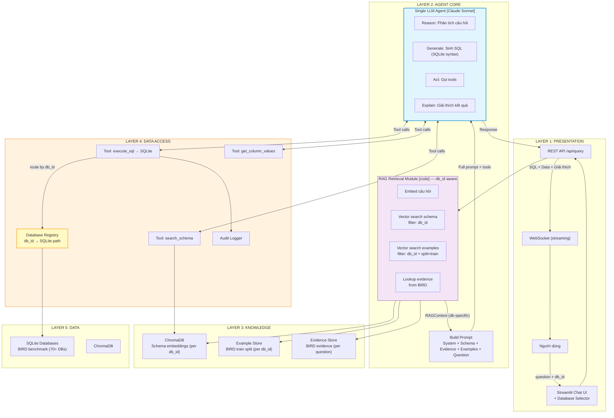
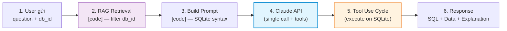
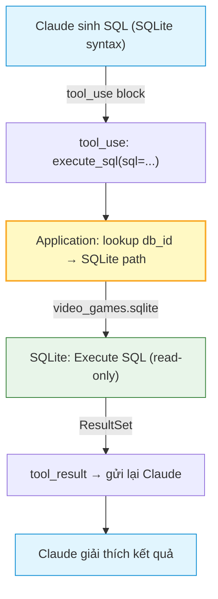
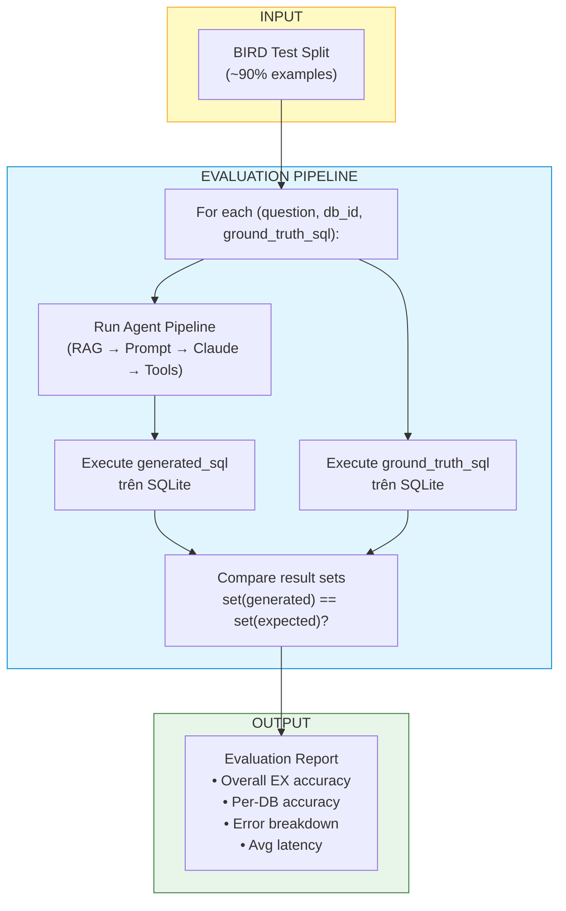
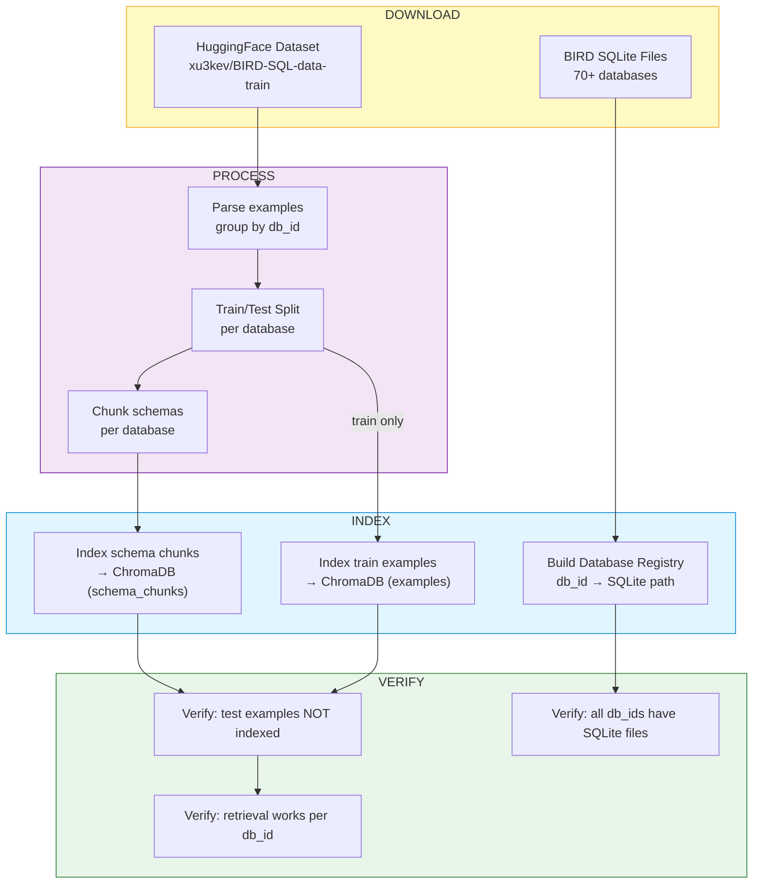
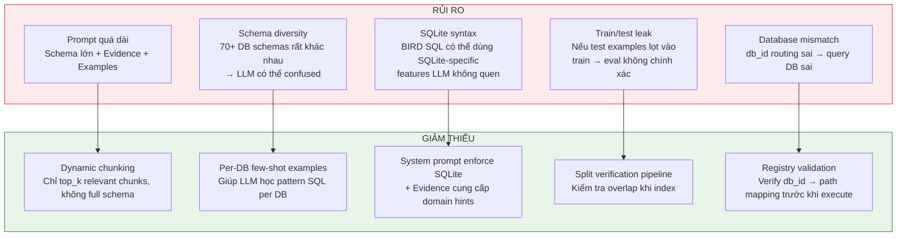

# Luồng Architecture Tổng Thể — RAG-Enhanced Single Agent (BIRD Multi-Database)

## 1. Kiến Trúc Tổng Thể

Pattern 2 giữ kiến trúc **đơn giản** với 2 components chính (RAG Retrieval + Single LLM Agent), mở rộng cho **multi-database** sử dụng BIRD-SQL benchmark. Điểm khác biệt chính: mọi luồng xử lý đều **db_id aware** — từ RAG retrieval đến tool execution.



---

## 2. Luồng Xử Lý Chính — 6 Bước



### Bước 1: User gửi câu hỏi + db_id

```
POST /api/query
{
  "question": "List publishers with sales less than 10000",
  "db_id": "video_games"
}
```

`db_id` xác định database target. Trong evaluation mode, `db_id` lấy từ BIRD dataset. Trong interactive mode, user chọn từ dropdown.

### Bước 2: RAG Retrieval Module [code] — db_id filtered

Code thực hiện vector search **có filter theo db_id**:

```
Input:  question="List publishers with sales less than 10000"
        db_id="video_games"
        ↓
        embed(question) → vector [0.12, -0.45, 0.78, ...]
        ↓
Output: {
  schema_chunks: [
    "CREATE TABLE publisher (id INTEGER pk, publisher_name TEXT ...)",
    "CREATE TABLE game_publisher (id INTEGER pk, game_id INTEGER FK, publisher_id INTEGER FK ...)",
    "CREATE TABLE game_platform (id INTEGER pk, game_publisher_id INTEGER FK, platform_id INTEGER FK, release_year INTEGER ...)",
    "CREATE TABLE region_sales (region_id INTEGER, game_platform_id INTEGER FK, num_sales REAL ...)"
  ],
  examples: [
    {q: "How many games in each genre?", sql: "SELECT g.genre_name, COUNT(*) ..."},
    {q: "What are the top 5 platforms by number of games?", sql: "SELECT p.platform_name ..."}
  ],
  evidence: "num_sales < 0.1 means less than 10000; publisher refers to publisher_name"
}
```

**Điểm khác biệt:** Tất cả results đều thuộc `db_id="video_games"`. Không trộn lẫn schema/examples từ databases khác.

### Bước 3: Build Prompt [code]

Ghép context thành prompt, **SQLite syntax** thay vì PostgreSQL:

```
System Prompt = [
  System Rules (SELECT only, LIMIT, SQLite syntax, output format),
  Database Schema (từ bước 2 — CREATE TABLE statements),
  Evidence (từ BIRD — domain hints),
  Few-shot Examples (từ bước 2 — BIRD train split)
]

User Message = "List publishers with sales less than 10000"

Tool Definitions = [execute_sql, search_schema, get_column_values]
```

### Bước 4: Gửi tới Claude API (single call, với tool definitions)

Một API call duy nhất tới Claude:
- System prompt chứa schema của `video_games` database
- User message là câu hỏi
- Tool definitions (3 tools)

Claude xử lý tất cả trong call này: phân tích câu hỏi, chọn bảng, sinh SQL.

### Bước 5: Tool Use Cycle — Execute trên SQLite

Claude gọi tools, application route tới đúng SQLite file:



**Routing logic:**
1. Claude gọi `execute_sql(sql="SELECT ...")`
2. Application code (không phải LLM) lookup `db_id` từ session context
3. Database Registry trả về path: `data/bird/databases/video_games/video_games.sqlite`
4. SQL executed trên SQLite file đó (read-only mode)
5. Result gửi lại cho Claude

### Bước 6: Response

```json
{
  "db_id": "video_games",
  "sql": "SELECT T.publisher_name FROM (SELECT DISTINCT T5.publisher_name FROM region AS T1 INNER JOIN game_platform AS T2 ON T1.id = T2.id INNER JOIN game_publisher AS T3 ON T2.game_publisher_id = T3.id INNER JOIN publisher AS T5 ON T3.publisher_id = T5.id WHERE T1.num_sales < 0.1) T LIMIT 5",
  "results": {
    "columns": ["publisher_name"],
    "rows": [["Acclaim Entertainment"], ["Activision"], ...],
    "row_count": 5
  },
  "explanation": "Here are 5 publishers whose games had sales numbers less than 10,000 (num_sales < 0.1)..."
}
```

---

## 3. Luồng Evaluation — Đánh Giá Accuracy

Flow bổ sung chạy song song hoặc sau khi hệ thống hoạt động:



**Evaluation flow chi tiết:**

```
[1] Load test_split.json
    └── Filter: examples KHÔNG có trong train split

[2] For each test example:
    ├── Input: {question, db_id, ground_truth_sql, evidence (optional)}
    │
    ├── [2a] Run qua Agent pipeline
    │   ├── RAG Retrieval (db_id filtered, train examples only)
    │   ├── Build Prompt (SQLite, with/without evidence)
    │   ├── Claude generates SQL
    │   └── Output: generated_sql
    │
    ├── [2b] Execute generated_sql trên db_id.sqlite
    │   └── generated_result (or error)
    │
    ├── [2c] Execute ground_truth_sql trên db_id.sqlite
    │   └── expected_result
    │
    └── [2d] Compare
        ├── MATCH: set(generated_result) == set(expected_result)
        ├── MISMATCH: results khác nhau
        └── ERROR: generated_sql syntax/runtime error

[3] Aggregate results → EvalReport
```

---

## 4. Luồng Data Pipeline — Setup Ban Đầu

Chạy một lần để chuẩn bị knowledge base:



---

## 5. Rủi Ro Kiến Trúc

Giữ nguyên rủi ro từ Pattern 2 single-agent, thêm rủi ro mới từ multi-database:



---

## 6. So Sánh: Single-DB Banking vs Multi-DB BIRD

| Khía cạnh | Single-DB (Banking) | Multi-DB (BIRD) |
|-----------|-------------------|-----------------|
| **Database engine** | PostgreSQL | SQLite |
| **Số databases** | 1 | 70+ |
| **Schema source** | `data/schema.json` (cố định) | BIRD DDL per database (dynamic) |
| **Chunking** | 7 hardcoded domain clusters | Dynamic per database |
| **Examples** | 40 golden queries cố định | 9,430+ từ BIRD (train/test split) |
| **Domain knowledge** | Semantic Layer (metrics, aliases) | BIRD Evidence (per question) |
| **SQL syntax** | PostgreSQL | SQLite |
| **API contract** | `{question}` | `{question, db_id}` |
| **Tool routing** | Fixed connection pool | Database Registry → SQLite |
| **Evaluation** | Không có | Execution Accuracy framework |
| **Mục tiêu** | Demo Banking/POS | Benchmark Text-to-SQL accuracy |
