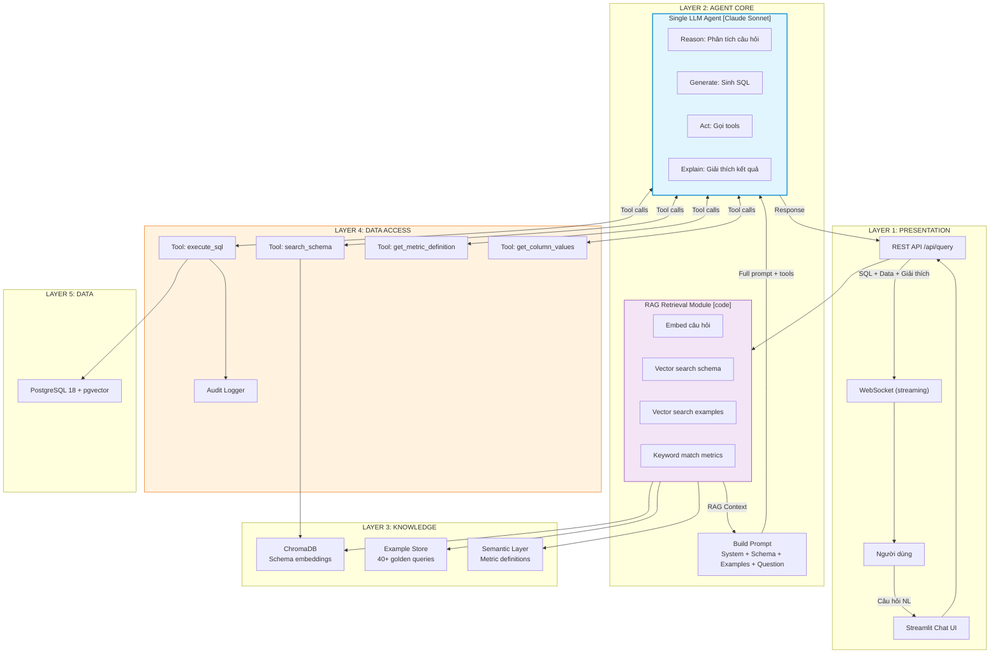
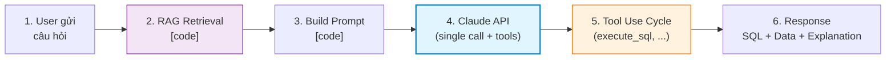
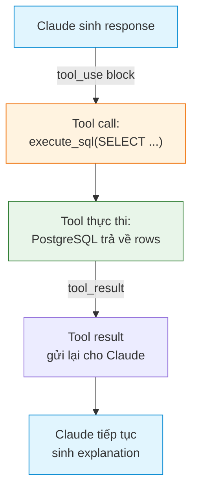
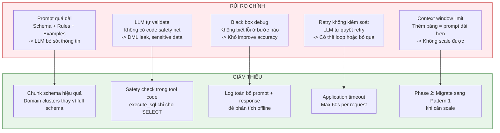

# Luồng Architecture Tổng Thể — RAG-Enhanced Single Agent

## 1. Kiến Trúc Tổng Thể

So với Pattern 1 (LLM-in-the-middle Pipeline) có 6 bước tuần tự với nhiều components, Pattern 2 có kiến trúc **đơn giản hơn đáng kể** — luồng xử lý gần như tuyến tính với chỉ 2 components chính (RAG Retrieval + Single LLM Agent).



---

## 2. Luồng Xử Lý Chính — 6 Bước



### Bước 1: User gửi câu hỏi qua API

```
POST /api/query
{
  "question": "Top 10 merchant có doanh thu cao nhất quý trước?"
}
```

Không có Router riêng — LLM sẽ tự xác định intent (SQL query / chitchat / out-of-scope) trong cùng prompt.

### Bước 2: RAG Retrieval Module [code]

Code thực hiện vector search để tìm context liên quan:

```
Input:  "Top 10 merchant có doanh thu cao nhất quý trước?"
        ↓
        embed(question) → vector [0.12, -0.45, 0.78, ...]
        ↓
Output: {
  schema_chunks: [
    "cluster transaction_analytics: tables sales, merchants, terminals...",
    "cluster customer_banking: tables customers, accounts, cards..."
  ],
  examples: [
    {q: "Top 5 sản phẩm bán chạy nhất?", sql: "SELECT p.product_name..."},
    {q: "Doanh thu theo merchant tháng trước?", sql: "SELECT m.name..."}
  ],
  metrics: [
    {name: "doanh thu", sql: "SUM(sales.total_amount)", filter: "status='completed'"}
  ]
}
```

### Bước 3: Build Prompt [code]

Ghép tất cả thành một prompt hoàn chỉnh:

```
System Prompt = [
  System Rules (SELECT only, LIMIT, sensitive columns, output format),
  Retrieved Schema Context (từ bước 2),
  Metric Definitions (từ bước 2),
  Few-shot Examples (từ bước 2)
]

User Message = "Top 10 merchant có doanh thu cao nhất quý trước?"

Tool Definitions = [execute_sql, search_schema, get_metric_definition, get_column_values]
```

### Bước 4: Gửi tới Claude API (single call, với tool definitions)

Một API call duy nhất tới Claude, bao gồm:
- System prompt (dài, chứa toàn bộ context)
- User message (câu hỏi)
- Tool definitions (4 tools)

Claude **xử lý tất cả trong call này**: phân tích câu hỏi, chọn bảng, resolve metric, sinh SQL.

### Bước 5: Tool Use Cycle

Claude có thể gọi tools trong response. Mỗi tool call tạo ra một vòng lặp:



**Chi tiết vòng lặp tool use (Claude native):**

1. Claude sinh response, bao gồm `tool_use` block:
   ```json
   {"type": "tool_use", "name": "execute_sql",
    "input": {"sql": "SELECT m.name, SUM(s.total_amount) AS revenue ..."}}
   ```
2. Application code intercept tool call, thực thi `execute_sql` trên PostgreSQL
3. Kết quả tool được gửi lại cho Claude dưới dạng `tool_result`:
   ```json
   {"type": "tool_result", "content": {"columns": ["name", "revenue"],
    "rows": [["Merchant A", 50000000], ...], "row_count": 10}}
   ```
4. Claude nhận result, tiếp tục sinh explanation cho user

Claude có thể gọi **nhiều tools liên tiếp** trong một turn (ví dụ: search_schema → get_metric_definition → execute_sql).

### Bước 6: Response

Claude trả về response cuối cùng chứa:
- SQL đã sinh
- Kết quả truy vấn (dạng bảng)
- Giải thích bằng ngôn ngữ tự nhiên

```json
{
  "sql": "SELECT m.name, SUM(s.total_amount) AS revenue FROM sales s JOIN merchants m ON s.merchant_id = m.id WHERE s.status = 'completed' AND s.sale_time >= DATE_TRUNC('quarter', CURRENT_DATE - INTERVAL '1 quarter') AND s.sale_time < DATE_TRUNC('quarter', CURRENT_DATE) GROUP BY m.name ORDER BY revenue DESC LIMIT 10;",
  "results": {
    "columns": ["name", "revenue"],
    "rows": [["Merchant A", 50000000], ["Merchant B", 42000000], ...],
    "row_count": 10
  },
  "explanation": "Top 10 merchant có doanh thu cao nhất trong quý trước. Merchant A dẫn đầu với 50 triệu đồng, tiếp theo là Merchant B với 42 triệu đồng..."
}
```

---

## 3. Những Gì KHÔNG Có (So Với Pattern 1)

Pattern 2 đơn giản hơn bằng cách **loại bỏ** nhiều components:

### Không có Router riêng

- **Pattern 1:** Router (code) phân loại intent bằng keyword matching + regex trước khi vào pipeline
- **Pattern 2:** LLM tự phân loại trong cùng prompt. System prompt chứa rule: "Nếu câu hỏi không liên quan đến dữ liệu, từ chối lịch sự"
- **Rủi ro:** LLM có thể cố gắng trả lời câu hỏi out-of-scope thay vì từ chối

### Không có Validator riêng

- **Pattern 1:** Validator (code) check SQL syntax, DML type, table/column existence, sensitive columns, LIMIT, EXPLAIN cost — **trước khi** execute
- **Pattern 2:** Safety rules nằm trong prompt. LLM **tự validate** SQL trước khi gọi `execute_sql`
- **Rủi ro:** LLM có thể "quên" rules trong prompt, đặc biệt với prompt dài. Tool `execute_sql` chỉ có safety check tối thiểu (block non-SELECT)

### Không có Self-Correction Loop (code-based)

- **Pattern 1:** Khi Validator fail → error feedback gửi lại cho Generator → retry (max 3 lần) — toàn bộ bằng code
- **Pattern 2:** Khi `execute_sql` trả error → Claude **tự đọc error** → **tự sửa SQL** → gọi lại `execute_sql` — xử lý trong conversation context của LLM
- **Rủi ro:** LLM có thể không retry, hoặc retry sai hướng. Không có hard limit retry bằng code (cần set `max_tokens` hoặc application-level timeout)

### Không có Insight Analyzer riêng

- **Pattern 1:** Insight Analyzer là optional LLM call riêng, có thể tắt/bật
- **Pattern 2:** Giải thích kết quả là một phần trong response của cùng LLM agent — không tách riêng được

---

## 4. Rủi Ro Kiến Trúc

Toàn bộ pattern phụ thuộc vào **prompt quality** và **LLM capability**:



---

## 5. So Sánh Luồng: Pattern 2 vs Pattern 1

| Khía cạnh | Pattern 1 (LLM-in-the-middle) | Pattern 2 (Single Agent) |
|-----------|-------------------------------|-------------------------|
| **Số bước** | 6 bước tuần tự (Router → Linker → Generator → Validator → Executor → Insight) | **3 bước** (RAG → Build Prompt → LLM Agent) |
| **Số LLM calls** | 1-2 (Generator + optional Insight) | **1** (Single Agent, có thể nhiều tool calls) |
| **Decision making** | Code quyết định luồng (which step next, retry?) | **LLM quyết định** (call tool nào? retry? xong chưa?) |
| **Error handling** | Code-based: validator catch → retry loop → max 3 attempts | **LLM-based**: đọc error → tự sửa → tự retry |
| **Latency** | 5-8s (nhiều bước, overhead giữa các bước) | **3-6s** (1 LLM call, ít overhead) |
| **Accuracy** | 85-92% (code bọc LLM) | **75-85%** (LLM tự xử) |
| **Debuggability** | Cao — log mỗi bước, biết chính xác lỗi ở đâu | **Thấp** — black box, chỉ thấy input/output |
