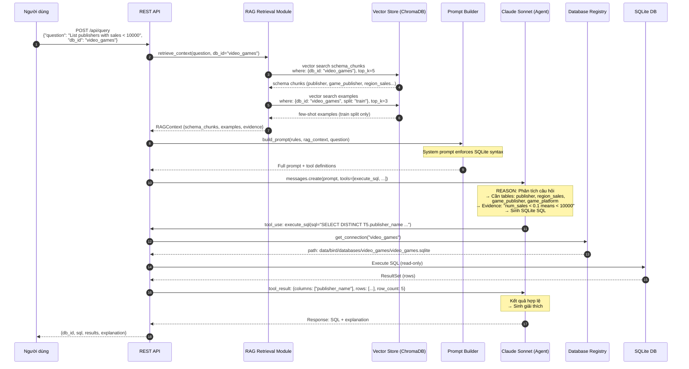
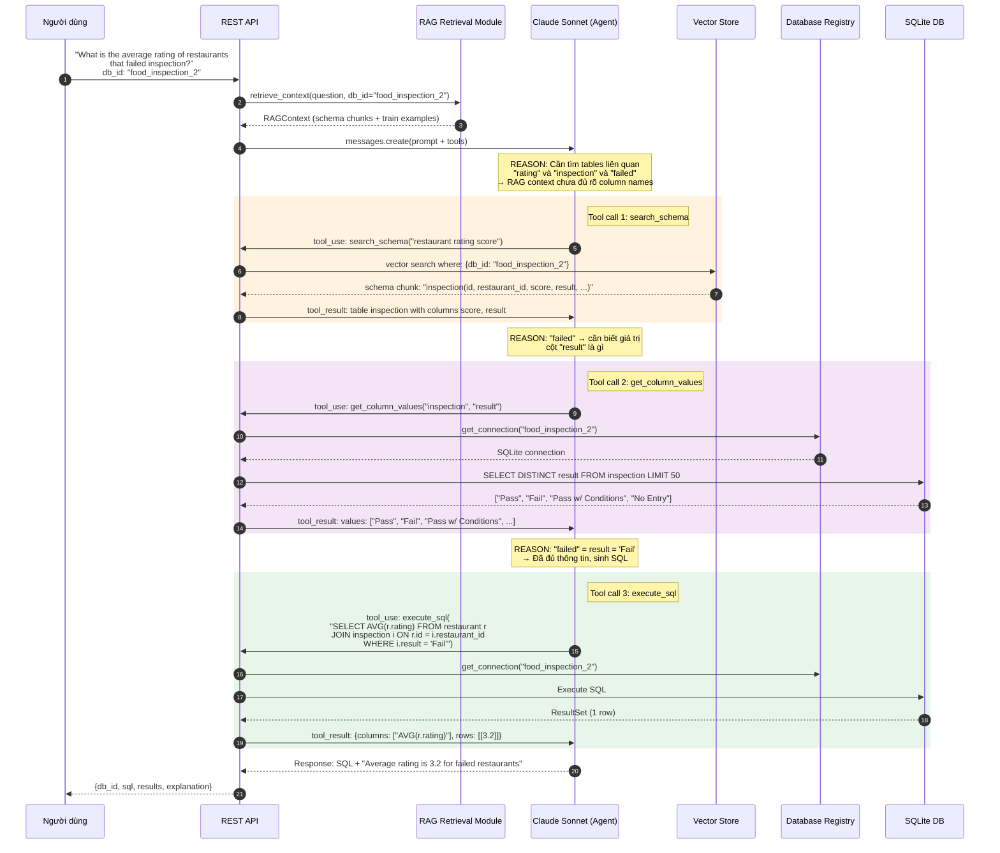
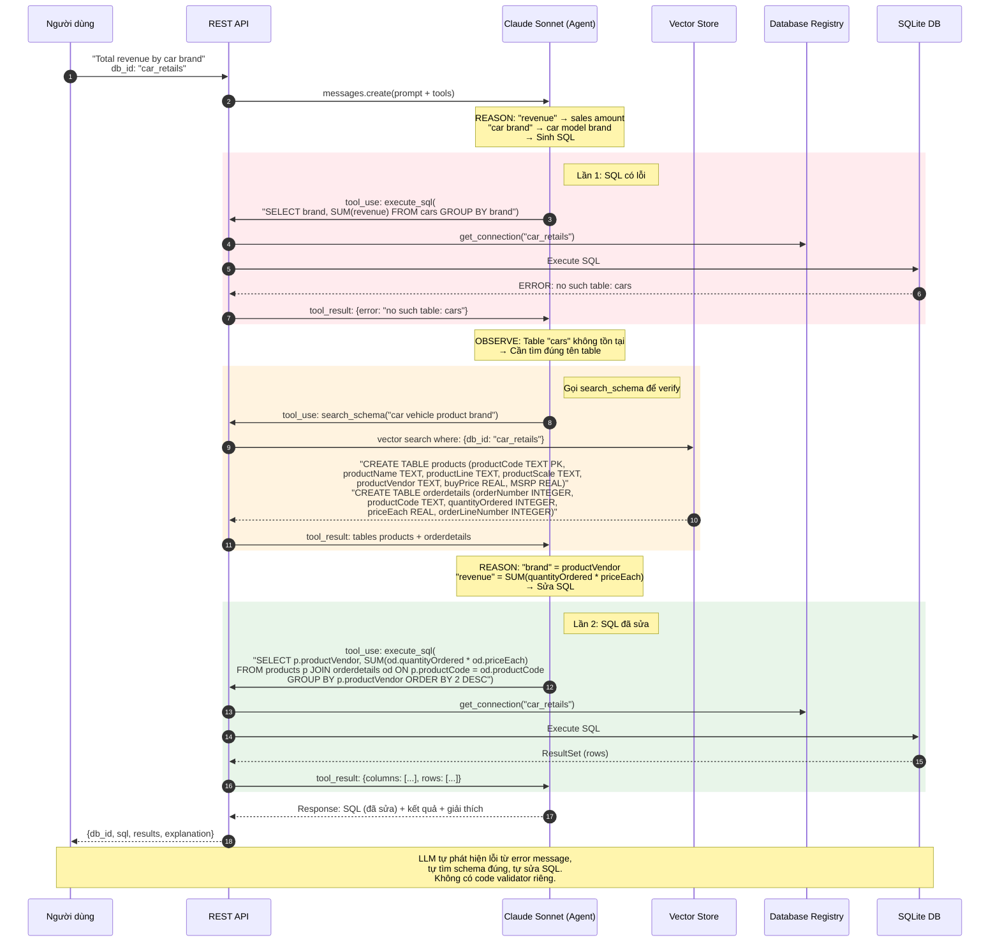
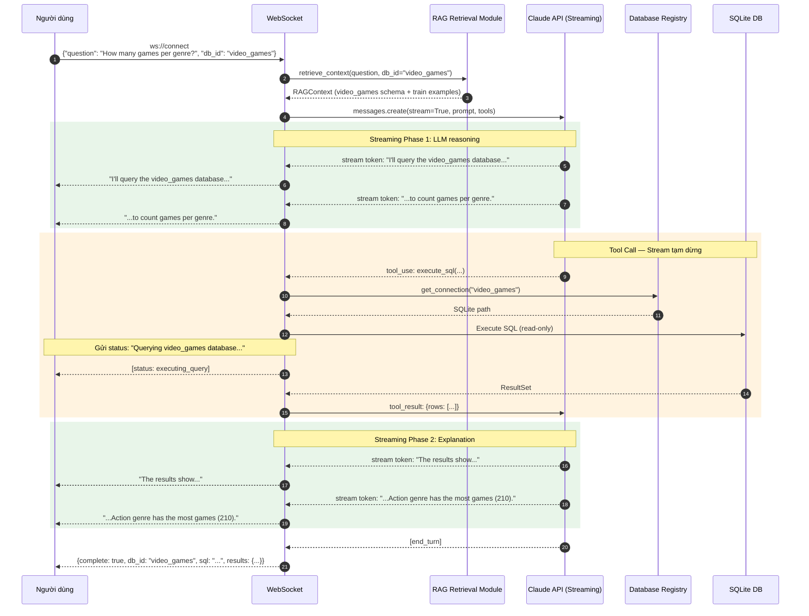
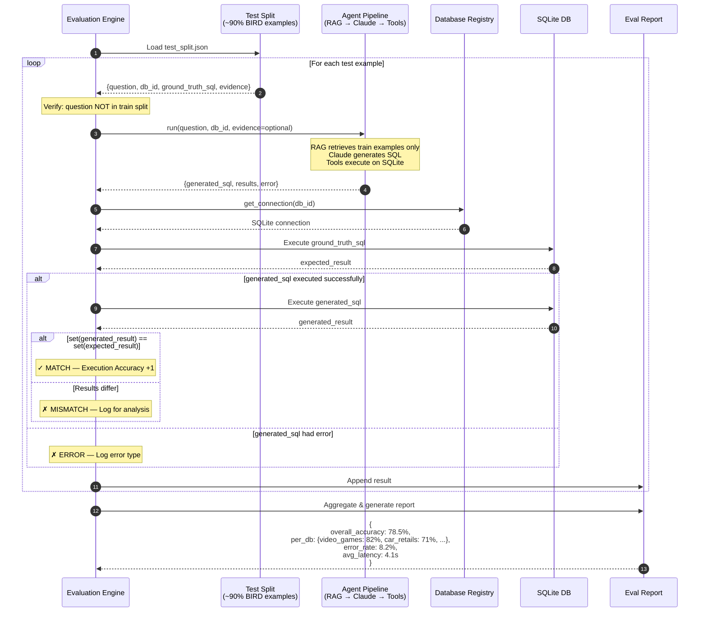
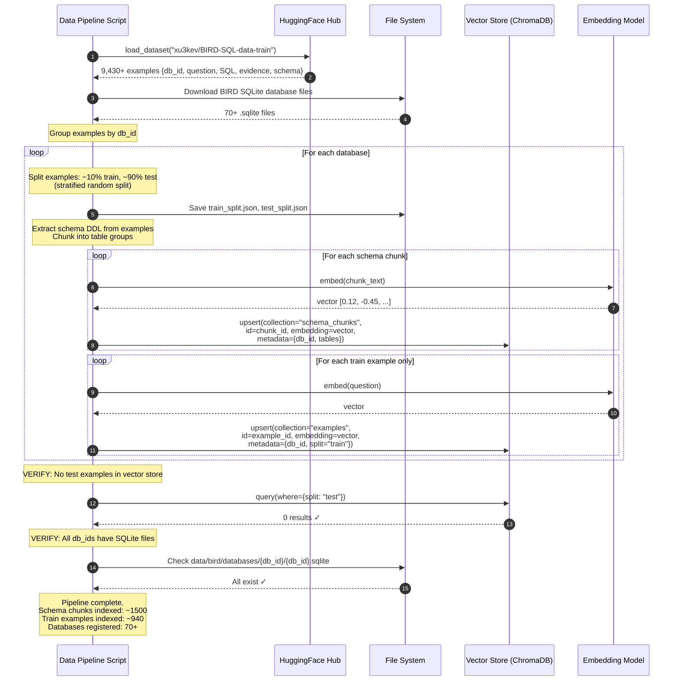

# Sequence Diagrams — RAG-Enhanced Single Agent (BIRD Multi-Database)

## Diagram 1: E2E Happy Path — Multi-Database Query

User hỏi về một database cụ thể (thông qua `db_id`), agent sinh SQL SQLite, execute trên đúng database.

---

## Diagram 2: Multi-Tool Interaction — Schema Discovery

Câu hỏi phức tạp trên database không quen. Claude cần gọi nhiều tools để tìm hiểu schema trước khi sinh SQL.

---

## Diagram 3: Error Recovery — LLM Self-Correction

SQL bị lỗi do schema phức tạp. Claude đọc error, tìm hiểu thêm schema, sửa SQL.

---

## Diagram 4: Streaming Flow

Streaming qua WebSocket với db_id context.

---

## Diagram 5: Evaluation Flow

Chạy evaluation trên BIRD test split. Strict isolation: test examples **không bao giờ** xuất hiện trong few-shot.

---

## Diagram 6: Data Pipeline — One-time Setup

Setup flow chạy một lần để index BIRD data.

---

## Tổng Kết: So Sánh Actors

| Diagram | Actors | Mới/Thay đổi |
|---------|--------|-------------|
| **Happy Path** | User, API, RAG, VS, PB, Claude, **DB Registry**, **SQLite** | DB Registry + SQLite thay PostgreSQL |
| **Multi-Tool** | User, API, RAG, Claude, VS, **DB Registry**, **SQLite** | Tất cả tool calls route qua DB Registry |
| **Error Recovery** | User, API, Claude, VS, **DB Registry**, **SQLite** | SQLite error messages thay PostgreSQL |
| **Streaming** | User, WS, RAG, Claude, **DB Registry**, **SQLite** | db_id trong stream context |
| **Evaluation** | **Eval Engine**, **Test Set**, Agent, **DB Registry**, **SQLite**, **Report** | Hoàn toàn mới |
| **Data Pipeline** | **Pipeline Script**, **HF**, FS, VS, Embed | Hoàn toàn mới |
