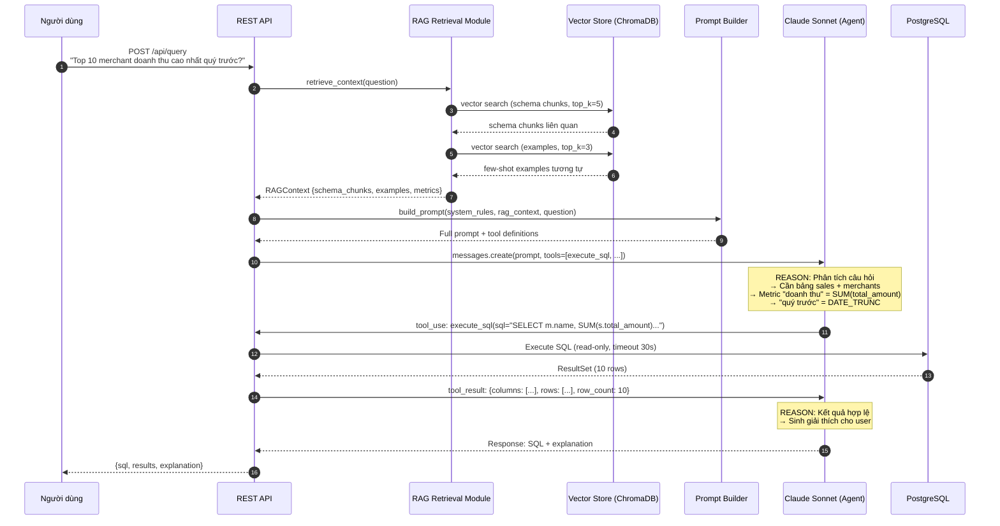
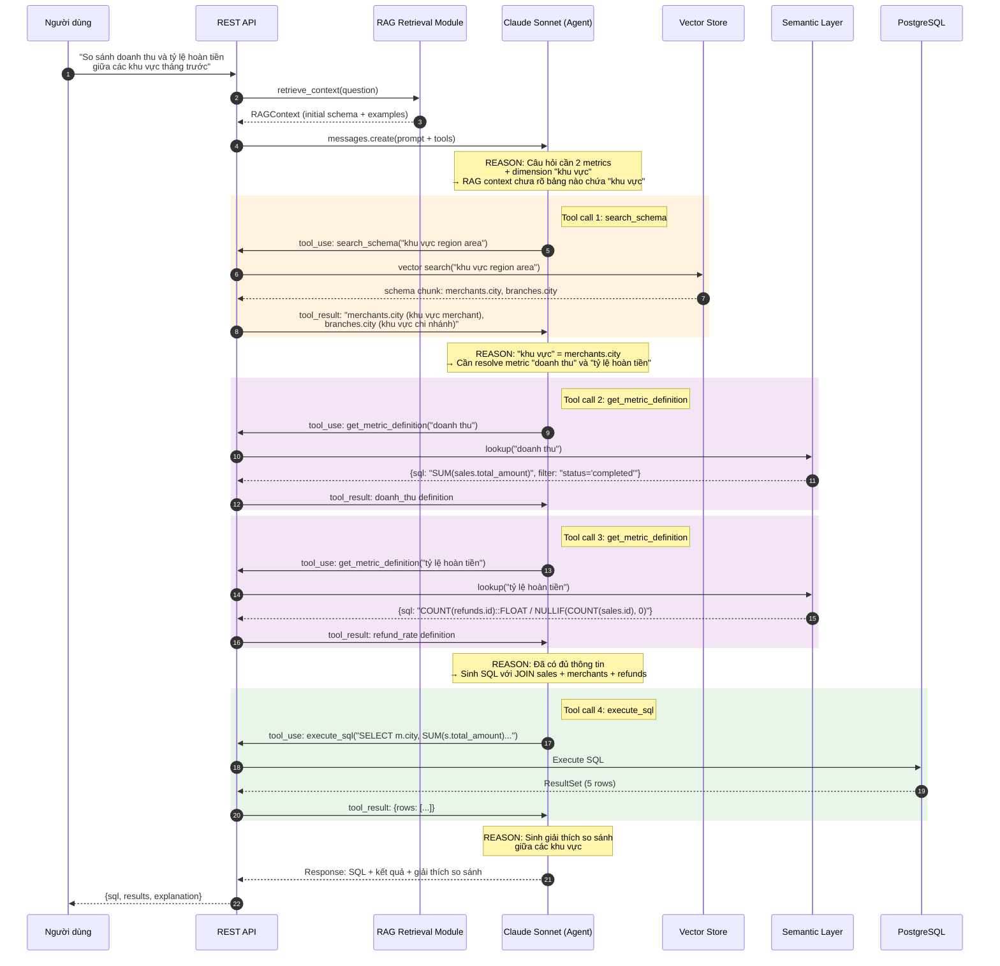
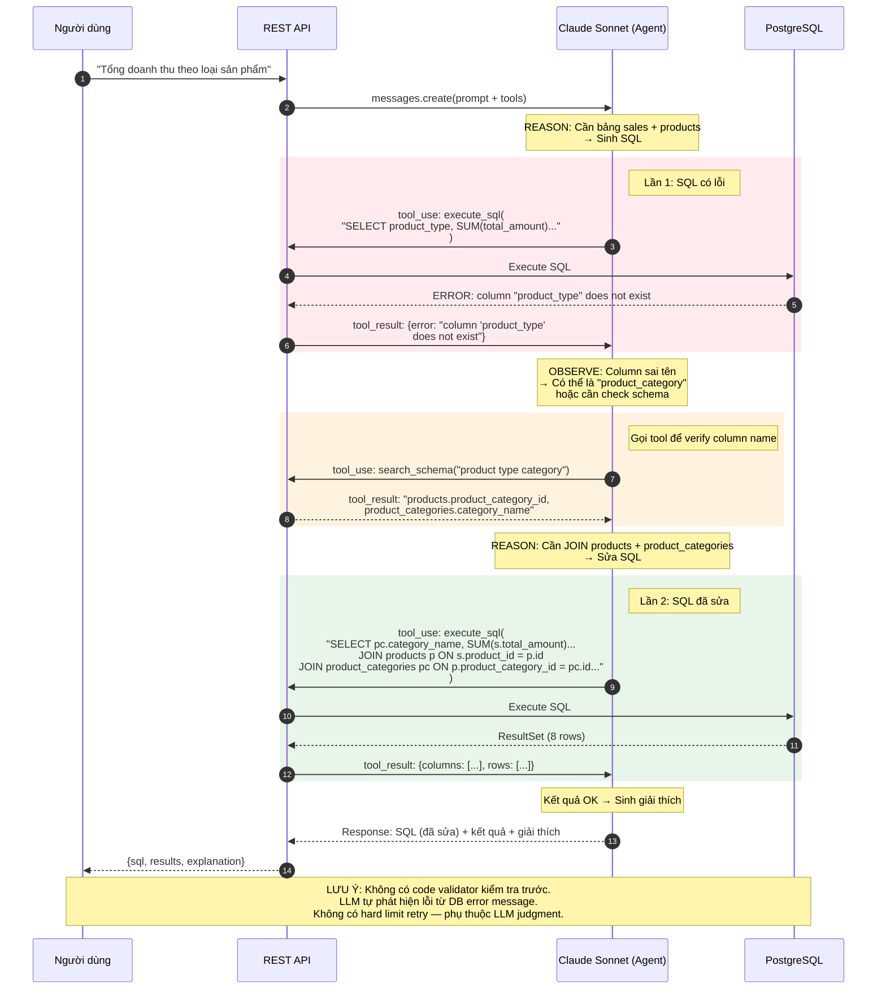
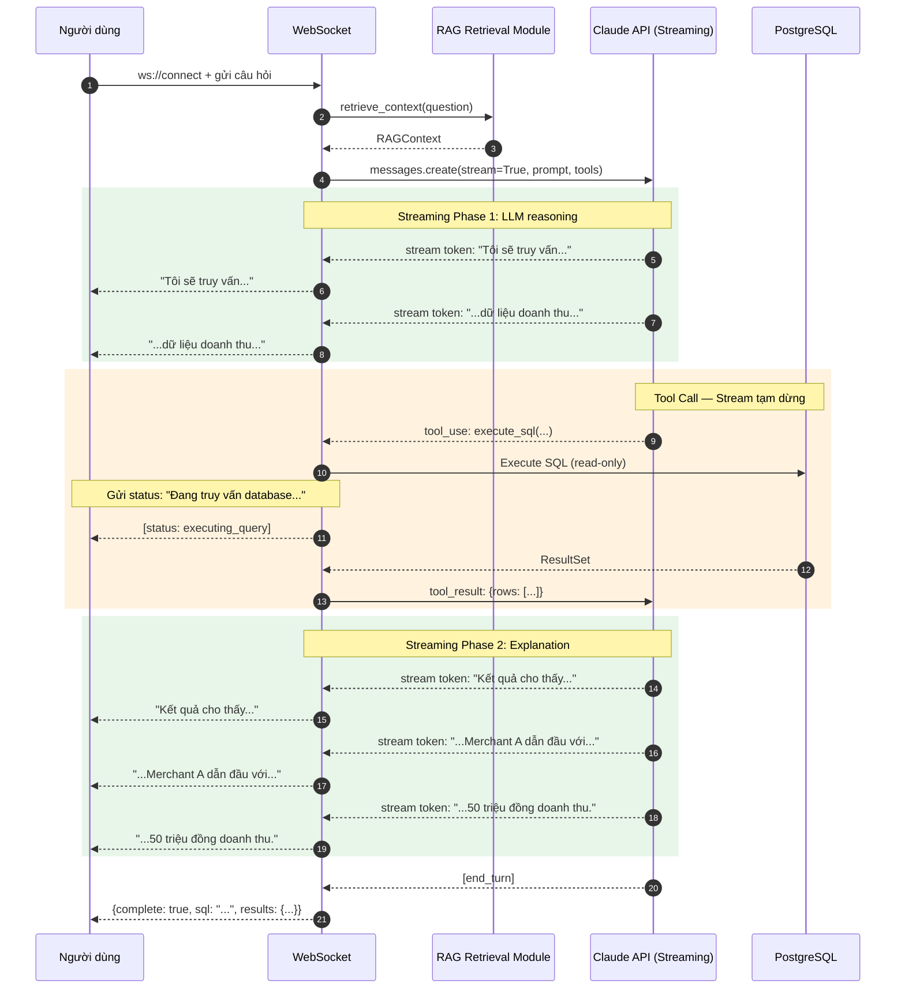
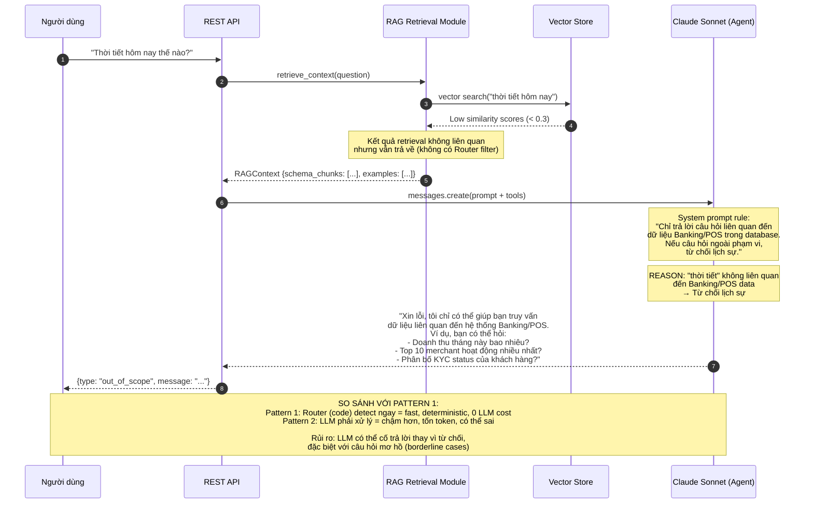

# Sequence Diagrams — RAG-Enhanced Single Agent

## Diagram 1: E2E Happy Path

Luồng đơn giản nhất — user hỏi, agent sinh SQL, execute, trả kết quả. So với Pattern 1, ít actors hơn (không có Router, Validator, Executor riêng).

---

## Diagram 2: Multi-Tool Interaction

Khi câu hỏi phức tạp, Claude có thể gọi **nhiều tools liên tiếp** trước khi sinh SQL cuối cùng.

---

## Diagram 3: Error Recovery (LLM Self-Correction)

Khi SQL bị lỗi, Claude **tự đọc error message** và **tự sửa SQL** — không có code-based validator.

---

## Diagram 4: Streaming Flow

Streaming qua WebSocket — token được stream realtime, tạm dừng khi tool call, tiếp tục sau khi tool trả kết quả.

**Lưu ý về streaming:**
- **Phase 1 (reasoning):** Tokens stream liên tục cho user thấy "agent đang suy nghĩ"
- **Tool call:** Stream tạm dừng. Application gửi status message ("đang truy vấn database...")
- **Phase 2 (explanation):** Stream tiếp tục với giải thích kết quả
- Perceived latency giảm đáng kể: user thấy response sau ~1s thay vì đợi 5-6s

---

## Diagram 5: Out-of-scope Handling

Không có Router riêng — LLM tự xác định câu hỏi nằm ngoài phạm vi dựa trên system prompt rules.

---

## Tổng Kết: So Sánh Actors Giữa Các Diagram

| Diagram | Pattern 1 Actors | Pattern 2 Actors | Giảm |
|---------|-----------------|-----------------|------|
| **Happy Path** | User, API, Router, Schema Linker, Vector Store, SQL Generator, Claude, Validator, Executor, PostgreSQL, Insight | User, API, RAG Module, Vector Store, Prompt Builder, Claude, PostgreSQL | **11 → 7** |
| **Error Recovery** | Generator, Validator (code loop, max 3 retries) | Claude tự retry (không giới hạn bằng code) | Code-controlled → LLM-controlled |
| **Out-of-scope** | Router (code) detect ngay, 0 LLM cost | Claude (LLM) phải xử lý, tốn 1 API call | Deterministic → Probabilistic |
