# Tech Stack Đề Xuất — RAG-Enhanced Single Agent (BIRD Multi-Database)

## Định Hướng

Đây là **Phase 1 (R&D)** — mục tiêu là validate Text-to-SQL accuracy trên **BIRD benchmark** với multi-database support. Stack tối giản, ưu tiên **evaluation accuracy** và **iteration speed**.

**Thay đổi chính so với phiên bản banking:**
- **SQLite** thay PostgreSQL (match BIRD ground truth)
- **HuggingFace Datasets** để download/process BIRD data
- Bỏ banking-specific dependencies (semantic layer, custom gen_data)

---

## Tech Stack Tổng Hợp

| Layer | Component | Technology | Ghi chú |
|-------|-----------|-----------|---------|
| **LLM** | Primary | **Claude Sonnet 4.6** | Tool use native, accuracy cao trên SQL |
| **Embedding** | Model | **bge-large-en-v1.5** (hiện tại) → **bge-m3** (upgrade) | bge-m3 hỗ trợ multilingual |
| **Framework** | Agent | **Claude Tool Use (native)** | Không cần framework cho single-agent |
| **API** | Web Server | **FastAPI** | Async native, WebSocket support |
| **Vector DB** | Dev | **ChromaDB** | Multi-collection, metadata filtering |
| **Database** | Evaluation | **SQLite** (BIRD native) | Match ground truth SQL syntax |
| **Database** | Future Prod | **PostgreSQL 18** | Giữ cho production migration |
| **Data** | Dataset | **HuggingFace Datasets** | Download & process BIRD-SQL |
| **UI** | POC | **Streamlit** | Database selector dropdown |
| **Language** | Runtime | **Python 3.11+** | ML/AI ecosystem |

---

## Chi Tiết Lựa Chọn

### 1. LLM: Claude Sonnet 4.6

Giữ nguyên lựa chọn — lý do vẫn đúng:

| Tiêu chí | Claude Sonnet 4.6 | GPT-4o | DeepSeek V3 |
|----------|-------------------|--------|-------------|
| SQL Accuracy (ước lượng) | ~87% | ~85% | ~80% |
| Tool Use | Native, structured | Tốt | Khá |
| Cost (1M tokens) | $3 / $15 | $2.5 / $10 | $0.27 / $1.1 |
| **Verdict** | **Best balance** | Rẻ hơn | Rất rẻ |

**Lưu ý cho BIRD evaluation:** Accuracy trên BIRD benchmark thường thấp hơn single-domain benchmarks do schema diversity. Expect 60-80% EX accuracy thay vì 85-92% trên single domain.

### 2. Database: SQLite (Evaluation) + PostgreSQL (Future Production)

**Đây là thay đổi lớn nhất** so với phiên bản banking.

| Tiêu chí | SQLite (BIRD eval) | PostgreSQL (production) |
|----------|-------------------|----------------------|
| **Mục đích** | Evaluation accuracy trên BIRD | Production deployment |
| **Khi nào dùng** | Phase 1 (R&D) | Phase 2+ |
| **Lý do** | Match BIRD ground truth SQL syntax | Enterprise standard |
| **Data** | BIRD database files (có sẵn) | Business data |
| **SQL syntax** | SQLite-specific | PostgreSQL-specific |

**Tại sao SQLite cho BIRD evaluation:**

```
Nếu dùng PostgreSQL cho BIRD:
  1. Convert 70+ SQLite databases → PostgreSQL (DDL + data)
  2. Convert 9,430+ ground truth SQL: SQLite syntax → PG syntax
     - GROUP_CONCAT → STRING_AGG
     - IFNULL → COALESCE
     - SUBSTR → SUBSTRING
     - Không có :: casting trong SQLite
     - DATE functions hoàn toàn khác
  3. Risk: conversion errors → evaluation không chính xác
  4. Effort: rất cao

Nếu dùng SQLite:
  1. Dùng trực tiếp BIRD databases (zero conversion)
  2. Ground truth SQL chạy as-is
  3. System sinh SQLite SQL → so sánh trực tiếp
  4. Evaluation 100% chính xác
  → LỰA CHỌN NÀY ✓
```

**SQLite Python integration:**

```python
import sqlite3

# Read-only connection — không thể modify BIRD data
conn = sqlite3.connect("file:video_games.sqlite?mode=ro", uri=True)
cursor = conn.execute("SELECT * FROM game LIMIT 10")
rows = cursor.fetchall()
columns = [desc[0] for desc in cursor.description]
```

- Không cần server (embedded database)
- Không cần connection pool (mỗi request mở/đóng connection)
- Read-only mode native (`?mode=ro`)
- Python standard library — zero extra dependencies

### 3. Data: HuggingFace Datasets [NEW]

| Thuộc tính | Chi tiết |
|-----------|---------|
| **Library** | `datasets` (HuggingFace) |
| **Dataset** | `xu3kev/BIRD-SQL-data-train` |
| **Kích thước** | 9,430+ examples, 70+ databases |
| **Format** | Parquet (auto-converted by HF) |

```python
from datasets import load_dataset

# Download BIRD training data
dataset = load_dataset("xu3kev/BIRD-SQL-data-train")
train_data = dataset["train"]

# Each example:
# {
#   "db_id": "video_games",
#   "question": "List publishers with sales < 10000",
#   "SQL": "SELECT DISTINCT T5.publisher_name ...",
#   "evidence": "num_sales < 0.1 means less than 10000",
#   "schema": "CREATE TABLE genre (...); CREATE TABLE game (...); ..."
# }
```

**BIRD SQLite database files:**
- Cần download riêng (không có trên HuggingFace dataset này)
- Source: BIRD benchmark official (bird-bench.github.io)
- Chứa actual data để execute SQL queries
- Bắt buộc cho execution-based evaluation

### 4. Vector DB: ChromaDB (Multi-database)

Giữ ChromaDB nhưng mở rộng cho multi-database:

| Khía cạnh | Single-DB (banking) | Multi-DB (BIRD) |
|-----------|-------------------|-----------------|
| **Collections** | 2 (schema_chunks, examples) | 2 (cùng, nhưng lớn hơn) |
| **Metadata** | Không filter | Filter by `db_id`, `split` |
| **Số documents** | ~50 | ~500-2000 |
| **Query pattern** | Simple similarity | Similarity + metadata filter |

```python
# Multi-database query with metadata filter
results = collection.query(
    query_embeddings=[question_embedding],
    n_results=5,
    where={"db_id": "video_games"}  # Filter by database
)
```

ChromaDB vẫn đủ cho quy mô này (~2000 docs). Chuyển sang pgvector ở Phase 2 khi consolidate infrastructure.

### 5. Framework: Claude Tool Use (Native)

Không thay đổi — single agent + 3 tools vẫn đủ đơn giản cho native tool use.

Giảm từ 4 tools xuống 3 (bỏ `get_metric_definition`):
- `execute_sql` — execute trên SQLite (thay PostgreSQL)
- `search_schema` — vector search filtered by db_id
- `get_column_values` — DISTINCT values từ SQLite

### 6. API: FastAPI + UI: Streamlit

Không thay đổi stack, chỉ thêm features:
- **FastAPI:** Thêm `db_id` parameter vào API contract
- **Streamlit:** Thêm database selector dropdown, evaluation dashboard

---

## Dependencies Mới

```
# requirements.txt — additions
datasets>=2.16.0        # HuggingFace datasets (download BIRD)
# sqlite3               # Python standard library — no install needed
```

**Dependencies đã loại bỏ (so với banking version):**

```
# Không còn cần:
# asyncpg              # PostgreSQL async driver (thay bằng sqlite3)
# psycopg2             # PostgreSQL driver
# Faker                # Data generation (dùng BIRD data thay vì gen)
```

---

## Những Gì KHÔNG Có Trong Phase 1

| Component | Có trong Phase 1? | Khi nào cần? | Lý do không cần |
|-----------|-------------------|-------------|----------------|
| **PostgreSQL** | Không (dùng SQLite) | Phase 2 production | BIRD = SQLite native |
| **LangGraph** | Không | Phase 2 multi-component | Single agent đủ |
| **Redis** | Không | Phase 2 caching | R&D không cần cache |
| **Langfuse** | Không | Phase 2 monitoring | Eval Engine log đủ |
| **Claude Opus** | Không | Phase 2 complex queries | Sonnet đủ cho benchmark |
| **Claude Haiku** | Không | Phase 3 router | Không có router |
| **React** | Không | Phase 3 production UI | Streamlit đủ POC |
| **Nginx/Prometheus** | Không | Phase 3 production | Không cần infra monitoring |

---

## Lộ Trình Tiến Hoá Tech Stack

```mermaid
graph LR
    subgraph Phase1["Phase 1: R&D — BIRD Evaluation"]
        P1_LLM["Claude Sonnet"]
        P1_FW["Claude Tool Use<br/>(native)"]
        P1_DB["SQLite<br/>(BIRD databases)"]
        P1_VDB["ChromaDB<br/>(multi-db metadata)"]
        P1_UI["Streamlit<br/>+ DB selector"]
        P1_EMB["bge-large-en"]
        P1_DATA["HuggingFace Datasets"]
        P1_EVAL["Evaluation Engine"]
    end

    subgraph Phase2["Phase 2: POC — Production DB"]
        P2_LLM["+ Claude Opus<br/>(complex queries)"]
        P2_FW["LangGraph<br/>(orchestration)"]
        P2_DB["PostgreSQL 18<br/>(production data)"]
        P2_VDB["pgvector<br/>(consolidate)"]
        P2_MON["+ Langfuse<br/>+ Redis"]
    end

    subgraph Phase3["Phase 3: Production"]
        P3_LLM["+ Claude Haiku<br/>(router)"]
        P3_FW["LangGraph<br/>(multi-tier)"]
        P3_UI["React + Tailwind"]
        P3_MON["+ Prometheus<br/>+ Grafana<br/>+ Nginx"]
    end

    Phase1 -->|"Migrate DB<br/>SQLite → PG"| Phase2
    Phase2 -->|"Scale"| Phase3

    style Phase1 fill:#fff9c4,stroke:#f9a825,stroke-width:2px
    style Phase2 fill:#e8f5e9,stroke:#2e7d32
    style Phase3 fill:#e3f2fd,stroke:#1565c0
```



**Lộ trình migration SQLite → PostgreSQL (Phase 1 → Phase 2):**

```
Phase 1 (BIRD eval):
  - SQLite databases (BIRD benchmark)
  - SQLite SQL syntax
  - Execution accuracy evaluation

Phase 2 (Production):
  - Migrate sang PostgreSQL (business data)
  - Thay đổi system prompt: SQLite syntax → PG syntax
  - Thay đổi execute_sql tool: sqlite3 → asyncpg
  - Thay đổi schema chunking: từ BIRD DDL → production schema
  - Giữ nguyên: agent architecture, RAG pipeline, evaluation framework

Code cần thay đổi khi migrate:
  - src/tools/execute_sql.py (sqlite3 → asyncpg)
  - src/config.py (thêm PG connection settings)
  - config/prompts/system_prompt.txt (SQLite → PG syntax rules)
  - scripts/index_schema.py (schema source)
  Phần còn lại (agent, RAG, evaluation) giữ nguyên.
```

---

## Ước Lượng Infrastructure Cost (Phase 1 — BIRD Eval)

| Resource | Cost/tháng | Ghi chú |
|----------|-----------|---------|
| **Claude API** | ~$100-300 | BIRD eval: 9,430 questions × ~$0.03/query (1 lần eval ~$280). Iterative testing thêm |
| **SQLite** | $0 | Embedded, no server needed |
| **ChromaDB** | $0 | Local/in-process |
| **HuggingFace** | $0 | Free dataset download |
| **Streamlit** | $0 | Local development |
| **Server** | $0-50 | Local dev hoặc 1 small VM |
| **Tổng** | **~$100-350/tháng** | Chủ yếu là Claude API cost cho evaluation runs |

**Lưu ý:** Mỗi lần chạy full BIRD evaluation (9,430 questions) tốn ~$280 Claude API. Nên test trên subset nhỏ trước khi chạy full benchmark.
