# Tech Stack Đề Xuất — RAG-Enhanced Single Agent

## Định Hướng

Đây là **Phase 1 (R&D)** — mục tiêu là **minimal stack** để validate feasibility nhanh nhất có thể trong 2-3 tuần. Không cần orchestration framework, không cần monitoring phức tạp, không cần production-grade infrastructure.

---

## Tech Stack Tổng Hợp

| Layer | Component | Technology | Ghi chú |
|-------|-----------|-----------|---------|
| **LLM** | Primary | **Claude Sonnet 4.6** | Tool use native tốt nhất, accuracy cao trên SQL, hỗ trợ tiếng Việt |
| **Embedding** | Model | **bge-large-en-v1.5** (hiện tại) → **bge-m3** (upgrade) | bge-m3 hỗ trợ multilingual (tiếng Việt), dense + sparse retrieval |
| **Framework** | Agent | **Claude Tool Use (native)** — không cần framework | Claude API hỗ trợ tool calling trực tiếp, đủ cho single-agent |
| **API** | Web Server | **FastAPI** | Async native, WebSocket support, auto OpenAPI docs |
| **Vector DB** | Dev | **ChromaDB** | Đã setup, đủ cho <100 documents, API đơn giản |
| **Database** | Primary | **PostgreSQL 18 + pgvector** (existing) | Chứa business data + có thể chứa embeddings |
| **UI** | POC | **Streamlit** | Rapid POC UI bằng Python, không cần frontend expertise |
| **Language** | Runtime | **Python 3.11+** | Ecosystem ML/AI lớn nhất, team đã quen |

---

## Chi Tiết Lựa Chọn

### 1. LLM: Claude Sonnet 4.6

| Tiêu chí | Claude Sonnet 4.6 | GPT-4o | DeepSeek V3 |
|----------|-------------------|--------|-------------|
| SQL Accuracy (ước lượng) | ~87% | ~85% | ~80% |
| Tool Use | Native, structured | Tốt | Khá |
| Tiếng Việt | Tốt | Tốt | Trung bình |
| Cost (1M tokens) | $3 / $15 | $2.5 / $10 | $0.27 / $1.1 |
| **Verdict** | **Best balance** | Rẻ hơn, tool use kém hơn | Rất rẻ, accuracy thấp hơn |

**Lý do chọn Claude Sonnet:**
- Tool use native tốt nhất thị trường — quan trọng vì Pattern 2 phụ thuộc hoàn toàn vào tool calling
- Accuracy cao trên SQL generation benchmarks
- Hỗ trợ tiếng Việt đủ tốt cho bilingual input
- Cost hợp lý cho R&D phase (~$3 input / $15 output per 1M tokens)

### 2. Framework: Claude Tool Use (Native) — Không Cần Framework

**Điểm then chốt: KHÔNG cần orchestration framework** cho Pattern 2.

| Framework | Cần cho Pattern 2? | Lý do |
|-----------|-------------------|-------|
| **Claude Tool Use (native)** | **Dùng cái này** | Claude API hỗ trợ tool definitions + tool results trực tiếp. Không cần abstraction layer |
| LangGraph | Không | LangGraph dành cho graph-based workflows (multi-step pipeline). Single agent không cần |
| LangChain | Không | Over-abstraction. Single agent + 4 tools = vài chục dòng code Python |
| CrewAI | Không | Multi-agent framework. Pattern 2 chỉ có 1 agent |
| AutoGen | Không | Research-oriented, quá nặng |

**Tại sao native tool use đủ?**

```python
# Toàn bộ agent logic chỉ cần ~50 dòng code:

import anthropic

client = anthropic.Anthropic()

tools = [
    {
        "name": "execute_sql",
        "description": "Execute a SELECT SQL query on PostgreSQL",
        "input_schema": {
            "type": "object",
            "properties": {
                "sql": {"type": "string", "description": "SQL query to execute"}
            },
            "required": ["sql"]
        }
    },
    # ... search_schema, get_metric_definition, get_column_values
]

def run_agent(question: str, rag_context: str):
    messages = [{"role": "user", "content": question}]

    while True:
        response = client.messages.create(
            model="claude-sonnet-4-6-20250514",
            system=build_system_prompt(rag_context),
            messages=messages,
            tools=tools,
            max_tokens=4096
        )

        # Nếu có tool calls, execute và gửi results lại
        if response.stop_reason == "tool_use":
            tool_results = execute_tool_calls(response)
            messages.append({"role": "assistant", "content": response.content})
            messages.append({"role": "user", "content": tool_results})
        else:
            # Agent đã hoàn thành — trả response cho user
            return extract_response(response)
```

**Lợi ích:**
- Giảm dependency (không phụ thuộc framework bên ngoài)
- Code đơn giản, dễ hiểu, dễ debug
- Đủ cho single-agent pattern
- Dễ migrate sang LangGraph ở Phase 2 khi cần pipeline phức tạp hơn

### 3. Vector DB: ChromaDB (Dev)

| Tiêu chí | ChromaDB | pgvector | Pinecone |
|----------|----------|----------|----------|
| Setup complexity | Rất thấp | Trung bình | Cao (SaaS) |
| Phù hợp cho <100 docs | Tốt | Tốt | Overkill |
| Python API | Đơn giản | Cần psycopg2 | SDK riêng |
| Cost | Free (local) | Free (đã có) | Trả phí |
| **Verdict** | **Dùng cho POC** | Phase 2 consolidate | Không cần |

**Tại sao ChromaDB cho dev:**
- Đã setup sẵn trong project
- API cực đơn giản: `collection.query(query_embeddings=[...], n_results=5)`
- Đủ performance cho <100 documents (14 bảng chunked thành ~30-50 docs)
- Không cần server riêng — chạy in-process hoặc local server

**Khi nào chuyển sang pgvector:**
- Phase 2 — khi migrate sang Pattern 1
- Lý do: giảm infra complexity (1 DB cho tất cả), pgvector đủ cho <10K embeddings

### 4. API: FastAPI

| Lý do chọn | Chi tiết |
|-----------|---------|
| **Async native** | Phù hợp cho LLM API calls (I/O bound, cần non-blocking) |
| **WebSocket support** | Built-in, cần cho streaming response |
| **Auto OpenAPI docs** | `/docs` endpoint tự động generate — tiện cho POC demo |
| **Python ecosystem** | Team đã quen, tích hợp tốt với ML libraries |

### 5. UI: Streamlit (POC)

| Lý do chọn | Chi tiết |
|-----------|---------|
| **Rapid prototyping** | Build chat UI trong 1-2 ngày |
| **Python native** | Không cần frontend expertise (React, Vue, ...) |
| **Built-in chat** | `st.chat_message`, `st.chat_input` — chat UI sẵn |
| **Streaming support** | `st.write_stream()` cho streaming response |
| **Limitation** | Không phù hợp production — chuyển sang React ở Phase 3 |

### 6. Embedding: bge-large-en-v1.5 → bge-m3

| Model | Multilingual | Retrieval mode | Dimension | Phù hợp |
|-------|-------------|---------------|-----------|---------|
| **bge-large-en-v1.5** (hiện tại) | Chỉ English | Dense only | 1024 | POC ban đầu |
| **bge-m3** (upgrade) | 100+ ngôn ngữ (Vietnamese) | Dense + Sparse + ColBERT | 1024 | Khi cần hỗ trợ tiếng Việt tốt hơn |

**Lộ trình upgrade:**
- Phase 1 ban đầu: giữ bge-large-en-v1.5 (đã setup)
- Phase 1 giữa/cuối: upgrade sang bge-m3 khi thấy retrieval accuracy thấp cho câu hỏi tiếng Việt

---

## Những Gì KHÔNG Có Trong Phase 1

So với Phase 2 (Pattern 1) và Phase 3 (Pattern 3), stack Phase 1 thiếu:

| Component | Phase 1 (Pattern 2) | Phase 2+ (Pattern 1/3) | Lý do không cần |
|-----------|---------------------|----------------------|----------------|
| **LangGraph** | Không | Có | Single agent không cần orchestration |
| **Redis** | Không | Có | Chưa cần caching cho R&D |
| **Langfuse** | Không | Có | Chưa cần LLM monitoring phức tạp. Print logs đủ |
| **Claude Opus** | Không | Có (fallback) | Sonnet đủ cho R&D. Opus chỉ cần cho L3-L4 queries |
| **Claude Haiku** | Không | Có (router) | Không có router riêng |
| **Nginx** | Không | Có (Phase 3) | Không cần reverse proxy cho dev |
| **React** | Không | Có (Phase 3) | Streamlit đủ cho POC |
| **Prometheus + Grafana** | Không | Có (Phase 3) | Chưa cần system monitoring |

---

## Lộ Trình Tiến Hoá Tech Stack

```mermaid
graph LR
    subgraph Phase1["Phase 1: R&D (Pattern 2)"]
        P1_LLM["Claude Sonnet"]
        P1_FW["Claude Tool Use<br/>(native)"]
        P1_VDB["ChromaDB"]
        P1_UI["Streamlit"]
        P1_EMB["bge-large-en"]
        P1_API["FastAPI"]
    end

    subgraph Phase2["Phase 2: POC (Pattern 1)"]
        P2_LLM["+ Claude Opus<br/>(complex queries)"]
        P2_FW["LangGraph<br/>(orchestration)"]
        P2_VDB["pgvector<br/>(consolidate)"]
        P2_UI["Streamlit<br/>(enhanced)"]
        P2_EMB["bge-m3<br/>(multilingual)"]
        P2_MON["+ Langfuse<br/>+ Redis"]
    end

    subgraph Phase3["Phase 3: Prod (Pattern 3)"]
        P3_LLM["+ Claude Haiku<br/>(router)"]
        P3_FW["LangGraph<br/>(multi-tier)"]
        P3_UI["React + Tailwind<br/>(production)"]
        P3_MON["+ Prometheus<br/>+ Grafana<br/>+ Nginx"]
    end

    Phase1 -->|"Refactor"| Phase2
    Phase2 -->|"Scale"| Phase3

    style Phase1 fill:#fff9c4,stroke:#f9a825,stroke-width:2px
    style Phase2 fill:#e8f5e9,stroke:#2e7d32
    style Phase3 fill:#e3f2fd,stroke:#1565c0
```



**Nguyên tắc tiến hoá:**
- Phase 1 code **không bỏ đi** — RAG retrieval module trở thành Schema Linker, agent prompt trở thành SQL Generator prompt
- Thêm components mới (LangGraph, Redis, Langfuse) thay vì rewrite
- Vector store consolidate (ChromaDB → pgvector) để giảm infra
- UI rewrite (Streamlit → React) là thay đổi lớn nhất — nhưng chỉ ở Phase 3 production

---

## Ước Lượng Infrastructure Cost (Phase 1)

| Resource | Cost/tháng | Ghi chú |
|----------|-----------|---------|
| **Claude API** | ~$50-150 | 50-100 queries/ngày × 30 ngày × ~$0.03/query |
| **PostgreSQL** | $0 | Đã có (existing infrastructure) |
| **ChromaDB** | $0 | Local/in-process |
| **Streamlit** | $0 | Local development |
| **Server** | $0-50 | Local dev hoặc 1 small VM |
| **Tổng** | **~$50-200/tháng** | Minimal cost cho R&D |

So với Phase 2+ cần thêm Redis, Langfuse, larger VM → cost tăng lên ~$300-500/tháng.
