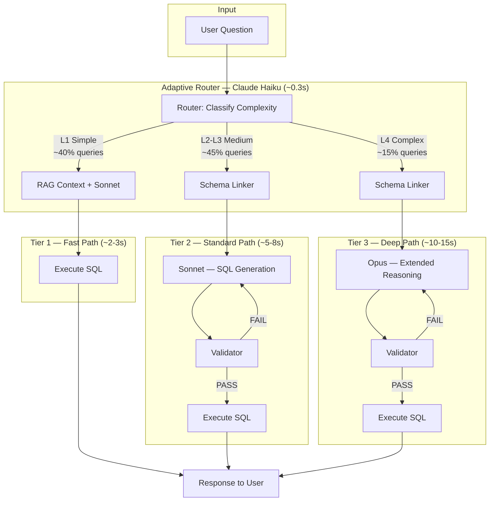
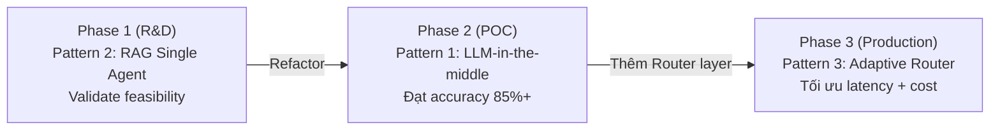

# Design Pattern — Adaptive Router + Tiered Agents

### Pattern 3 | Phase 3 — Production

---

## 1. TÊN PATTERN

**Strategy Pattern** kết hợp **Tiered Architecture** và **Adaptive Routing**

Đây là sự kết hợp của 3 design pattern kinh điển, được áp dụng vào bài toán Text-to-SQL để tối ưu đồng thời latency, cost và accuracy trong môi trường production.

---

## 2. TẠI SAO CÁC PATTERN NÀY PHÙ HỢP?

### 2.1 Strategy Pattern — Nhiều chiến lược cho cùng một bài toán

**Bản chất:** Một interface chung (`process_query`) với nhiều implementation khác nhau (Fast Path, Standard Path, Deep Path). Router đóng vai trò "context" chọn strategy phù hợp tại runtime.

**Tại sao phù hợp cho Text-to-SQL?**

Không phải mọi câu hỏi đều cần cùng một mức xử lý:

| Câu hỏi | Độ phức tạp | Strategy phù hợp |
|----------|-------------|-------------------|
| "Có bao nhiêu khách hàng?" | Rất thấp — `SELECT COUNT(*)` | Fast Path (2-3s) |
| "Top 10 merchant theo doanh thu quý trước" | Trung bình — JOIN + GROUP BY + date filter | Standard Path (5-8s) |
| "So sánh doanh thu tháng này vs tháng trước cho từng merchant" | Cao — CTE + window function + self-join | Deep Path (10-15s) |

Mỗi tier là một **strategy** với trade-off riêng về cost/accuracy/latency. Router chọn strategy tối ưu dựa trên đặc điểm câu hỏi.

### 2.2 Tiered Architecture — 3 tầng năng lực tăng dần

**Bản chất:** Phân chia hệ thống thành nhiều tầng (tier), mỗi tầng có năng lực xử lý và chi phí khác nhau. Tầng thấp xử lý nhanh + rẻ, tầng cao xử lý chính xác + đắt.

**3 tầng trong hệ thống:**

| Tier | Tên | Tỷ lệ queries | LLM Model | Latency | Đặc điểm |
|------|-----|----------------|-----------|---------|-----------|
| Tier 1 | Fast Path | ~40% | Sonnet | ~2-3s | Single LLM call, không validation |
| Tier 2 | Standard Path | ~45% | Sonnet | ~5-8s | Full pipeline + validation |
| Tier 3 | Deep Path | ~15% | Opus | ~10-15s | Full pipeline + extended reasoning |

**Tại sao phù hợp?** Trong thực tế production, phân bố câu hỏi tuân theo quy luật Pareto: ~40% câu hỏi đơn giản chiếm phần lớn traffic. Tiered Architecture cho phép xử lý phần lớn traffic nhanh + rẻ, chỉ dùng resource đắt cho phần nhỏ thực sự cần.

### 2.3 Adaptive Routing — Phân loại thông minh tại runtime

**Bản chất:** Router phân loại độ phức tạp của câu hỏi tại runtime và dispatch đến tier phù hợp. Sử dụng lightweight LLM (Claude Haiku) để classification nhanh (~0.3s).

**Tại sao dùng LLM cho routing thay vì rule-based?**

| Approach | Ưu điểm | Nhược điểm |
|----------|---------|------------|
| Rule-based (keyword matching) | Nhanh, deterministic | Không hiểu ngữ nghĩa, dễ classify sai câu hỏi phức tạp viết đơn giản |
| Lightweight LLM (Haiku) | Hiểu ngữ nghĩa, classify chính xác hơn | Tốn thêm ~0.3s + cost nhỏ |

Ví dụ: câu hỏi "Merchant nào có doanh thu giảm so với tháng trước?" — keyword matching có thể classify là L1 (chỉ thấy "merchant" + "doanh thu"), nhưng thực tế cần window function → L3/L4. LLM hiểu được ngữ nghĩa "giảm so với tháng trước" → cần so sánh temporal → classify đúng.

---

## 3. KIẾN TRÚC TỔNG QUAN



---

## 4. CHI TIẾT 3 TIERS

### 4.1 Tier 1 — Fast Path (L1 Simple, ~40% queries)

**Đặc điểm câu hỏi:** `SELECT`, `WHERE`, `GROUP BY`, aggregate đơn giản (COUNT, SUM). Chỉ liên quan 1-2 bảng, không cần JOIN phức tạp.

**Luồng xử lý:**
1. RAG retrieve context (semantic layer + schema liên quan)
2. Một lần gọi Claude Sonnet với context đầy đủ
3. Execute SQL trực tiếp — **không qua Validator**
4. Trả kết quả

**Tại sao không cần Validator?**
- Câu hỏi L1 đơn giản → SQL sinh ra gần như luôn đúng cú pháp
- Bỏ Validator tiết kiệm ~1-2s latency
- Nếu SQL sai → PostgreSQL trả error → hệ thống escalate lên Standard Path

**Tương tự Pattern 2** (RAG Single Agent) nhưng với context tốt hơn từ semantic layer đã được xây dựng ở Phase 2.

**Latency:** ~2-3s | **Cost:** Thấp (1 Sonnet call)

### 4.2 Tier 2 — Standard Path (L2-L3, ~45% queries)

**Đặc điểm câu hỏi:**
- L2: JOIN giữa 2-3 bảng, aggregate có GROUP BY + HAVING
- L3: CTE đơn giản, window function cơ bản, subquery

**Luồng xử lý:**
1. Schema Linker: Vector search → tìm bảng liên quan → build Context Package
2. SQL Generator (Claude Sonnet): Nhận Context Package → sinh SQL
3. Validator: Parse SQL + rule checking → PASS/FAIL
4. Nếu FAIL → feedback cho SQL Generator retry (tối đa 3 lần)
5. Execute SQL → trả kết quả

**Giống hệt Pattern 1** (LLM-in-the-middle Pipeline). Đây là pipeline đã được chứng minh accuracy 85-92% ở Phase 2.

**Latency:** ~5-8s | **Cost:** Trung bình (1-3 Sonnet calls + Schema Linker)

### 4.3 Tier 3 — Deep Path (L4 Complex, ~15% queries)

**Đặc điểm câu hỏi:** Self-join, INTERSECT/EXCEPT, correlated subquery, nhiều CTE lồng nhau, window function phức tạp kết hợp PARTITION BY + ORDER BY + frame specification.

**Luồng xử lý:**
1. Schema Linker: Giống Standard nhưng retrieve nhiều context hơn (top_k cao hơn)
2. SQL Generator (**Claude Opus** — extended reasoning): Chain-of-thought prompting cho multi-step reasoning
3. Validator: Kiểm tra kỹ hơn (additional rules cho complex SQL patterns)
4. Self-Correction Loop với feedback chi tiết hơn
5. Execute SQL → trả kết quả

**Tại sao cần Opus?**
- Sonnet accuracy giảm đáng kể với complex SQL (self-join, correlated subquery)
- Opus có khả năng reasoning tốt hơn → ít lỗi logic ở SQL phức tạp
- Chain-of-thought giúp Opus "nghĩ từng bước" trước khi viết SQL cuối cùng

**Latency:** ~10-15s | **Cost:** Cao (1-3 Opus calls — nhưng chỉ 15% queries)

---

## 5. BEST OF BOTH WORLDS

Pattern 3 kết hợp ưu điểm của cả Pattern 1 và Pattern 2:

```
Pattern 2 (Single Agent):     Nhanh (3-6s) nhưng accuracy giới hạn (75-85%)
Pattern 1 (LLM-in-the-middle): Chính xác (85-92%) nhưng chậm đều (5-8s)
Pattern 3 (Adaptive Router):   Nhanh KHI CẦN nhanh, chính xác KHI CẦN chính xác
```

| Metric | Pattern 2 | Pattern 1 | Pattern 3 |
|--------|-----------|-----------|-----------|
| Latency (simple query) | ~3-6s | ~5-8s | **~2-3s** |
| Latency (complex query) | ~3-6s | ~5-8s | ~10-15s |
| Accuracy (simple query) | 75-85% | 85-92% | 85-90% |
| Accuracy (complex query) | 60-70% | 85-92% | **88-95%** |
| Weighted avg latency | ~4.5s | ~6.5s | **~4.8s** |
| LLM cost per query (avg) | Thấp | Trung bình | **Thấp-Trung bình** |

**Tối ưu cost:**
- 40% queries đi Fast Path → chỉ 1 Sonnet call (rẻ)
- 45% queries đi Standard Path → 1-3 Sonnet calls (trung bình)
- 15% queries đi Deep Path → 1-3 Opus calls (đắt, nhưng ít)
- Thêm Router cost: mỗi query +1 Haiku call (~$0.0003/query — gần như miễn phí)

---

## 6. TRADE-OFFS VÀ RỦI RO

### 6.1 Nhược điểm

| Nhược điểm | Mức độ | Giải pháp giảm thiểu |
|------------|--------|----------------------|
| **Phức tạp nhất để build/maintain** | Cao | Modular design — mỗi tier là module độc lập. Tier 2 = Pattern 1 (đã có sẵn) |
| **Router accuracy là single point of failure** | Trung bình | Fallback: nếu Router không chắc → default Standard Path. Escalation: nếu Fast Path fail → tự động chuyển Standard |
| **3 paths = 3x testing effort** | Trung bình | Shared components (Schema Linker, Validator, Executor) giảm duplication. Chỉ cần test riêng routing logic + Fast Path |
| **Cần data để tune Router** | Thấp | Bắt đầu với rule-based fallback, thu thập data từ production để train Router dần |

### 6.2 Router Classification Sai — Hậu quả

| Classify sai | Hậu quả | Mức độ nghiêm trọng |
|-------------|---------|---------------------|
| L4 → L1 (downgrade) | SQL sai, query fail → phải escalate → tốn thêm thời gian | **Nghiêm trọng** — user chờ lâu hơn |
| L1 → L4 (upgrade) | SQL đúng nhưng dùng Opus cho query đơn giản → tốn cost + chậm | **Không nghiêm trọng** — chỉ tốn tiền |
| L1 → L2 (minor upgrade) | Chạy Validator không cần thiết → chậm thêm 1-2s | **Nhẹ** — không ảnh hưởng accuracy |

**Nguyên tắc an toàn:** Khi Router không chắc chắn (confidence < 0.7) → **luôn chọn tier cao hơn** (safe choice). Tốn thêm cost + latency vẫn tốt hơn trả kết quả sai.

---

## 7. VỊ TRÍ TRONG LỘ TRÌNH

Pattern 3 là **Phase 3 (Production)** — chỉ triển khai sau khi Pattern 1 đã chứng minh accuracy đạt target 85%+.



**Tại sao không bắt đầu với Pattern 3?**
- Pattern 3 cần Pattern 1 hoạt động tốt trước (Standard Path = Pattern 1)
- Router cần data thực tế để classify đúng → phải có production traffic trước
- Phức tạp quá cao cho giai đoạn R&D — dễ over-engineer
- Pattern 1 → Pattern 3 chỉ cần **thêm** Router + Fast Path, không cần rewrite

---

## 8. TÓM TẮT

| Đặc điểm | Giá trị |
|-----------|---------|
| **Pattern** | Strategy + Tiered Architecture + Adaptive Routing |
| **Phase** | Phase 3 — Production |
| **Accuracy** | 85-92% (tương đương Pattern 1, cao hơn ở complex queries nhờ Opus) |
| **Avg Latency** | ~4.8s (weighted average, giảm ~26% so với Pattern 1) |
| **Cost** | Tối ưu — 40% queries chỉ dùng 1 Sonnet call |
| **Complexity** | Cao nhất trong 3 patterns |
| **Tiên quyết** | Pattern 1 hoạt động ổn định, có production traffic data |
