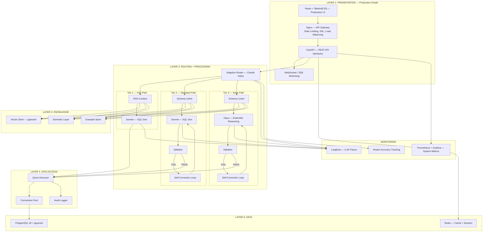
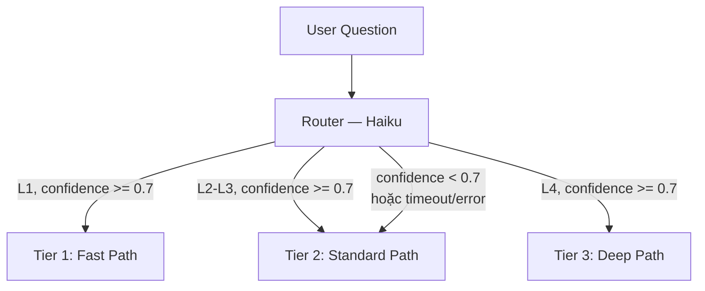
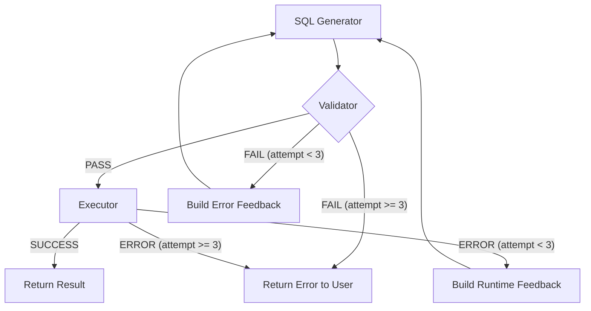
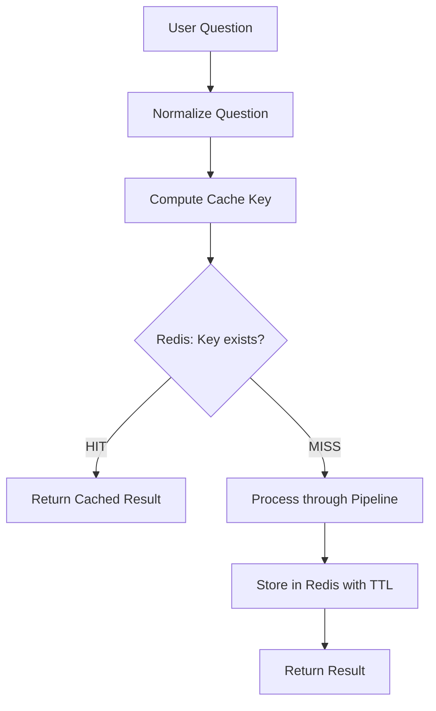
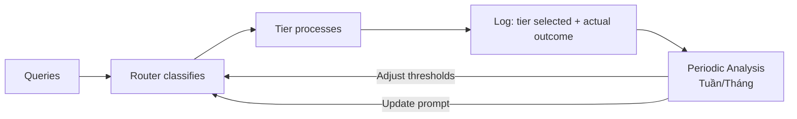

# Các Components Chính — Adaptive Router + Tiered Agents

### Pattern 3 | Phase 3 — Production

---

## MỤC LỤC

1. [Tổng quan kiến trúc phân tầng](#1-tổng-quan-kiến-trúc-phân-tầng)
2. [Layer 1: Presentation](#2-layer-1-presentation)
3. [Layer 2: Routing + Processing](#3-layer-2-routing--processing)
4. [Layer 3: Knowledge](#4-layer-3-knowledge)
5. [Layer 4: Data Access](#5-layer-4-data-access)
6. [Layer 5: Data](#6-layer-5-data)
7. [Monitoring](#7-monitoring)

---

## 1. TỔNG QUAN KIẾN TRÚC PHÂN TẦNG



---

## 2. LAYER 1: PRESENTATION (Production-Grade)

Layer này được nâng cấp đáng kể so với Phase 1-2, phục vụ cho môi trường production thực tế.

### 2.1 REST API

| Thuộc tính | Chi tiết |
|------------|----------|
| **Endpoint chính** | `POST /api/query` — nhận câu hỏi, trả kết quả |
| **Framework** | FastAPI (Python 3.11+) |
| **Authentication** | API key / JWT token |
| **Rate Limiting** | Qua Nginx — giới hạn requests/phút để bảo vệ LLM API costs |
| **Response format** | JSON: `{sql, data, explanation, metadata}` |
| **Streaming** | SSE (Server-Sent Events) cho real-time response |

### 2.2 API Gateway — Nginx

| Chức năng | Mô tả |
|-----------|-------|
| **Reverse Proxy** | Forward requests đến FastAPI backend |
| **Rate Limiting** | Giới hạn 60 req/phút/user (bảo vệ chi phí LLM) |
| **SSL Termination** | HTTPS → HTTP nội bộ |
| **Load Balancing** | Round-robin nếu chạy nhiều FastAPI instances |
| **Static Files** | Serve React build files |

**Tại sao cần Nginx ở Phase 3?**
- Phase 1-2: FastAPI trực tiếp nhận request, đủ cho dev/POC
- Phase 3: Cần rate limiting để kiểm soát LLM cost, SSL cho security, load balancing cho scale

### 2.3 WebSocket / SSE Streaming

Cho phép stream response token-by-token thay vì chờ full response 5-15s:

```
Không streaming: [████████████████] 8s → hiển thị kết quả
Có streaming:    [█] 0.5s "Đang phân tích..."
                 [██] 1s "Tìm bảng: sales, merchants..."
                 [████] 3s "SQL: SELECT m.name, SUM(s.total_amount)..."
                 [████████] 8s "Kết quả: 10 rows..."
```

### 2.4 UI — React + TailwindCSS

| Đặc điểm | Streamlit (Phase 1-2) | React (Phase 3) |
|-----------|----------------------|-----------------|
| Setup time | 30 phút | 2-3 ngày |
| Component reuse | Hạn chế | Tốt |
| SSE/WebSocket | Khó implement | Native support |
| Mobile responsive | Không | Có (TailwindCSS) |
| Custom UX | Hạn chế | Tùy biến hoàn toàn |
| Performance | Chậm (re-render toàn page) | Nhanh (Virtual DOM) |

---

## 3. LAYER 2: ROUTING + PROCESSING

Đây là layer cốt lõi của Pattern 3, chứa Adaptive Router và 3 tiers xử lý.

### 3.1 Adaptive Router [LLM — Claude Haiku]

**Vai trò:** Phân loại độ phức tạp câu hỏi và dispatch đến tier phù hợp.

| Thuộc tính | Chi tiết |
|------------|----------|
| **LLM Model** | Claude Haiku 4.5 |
| **Latency** | ~0.3s |
| **Cost** | $0.25 / 1M input tokens, $1.25 / 1M output tokens |
| **Input** | User question + classification prompt |
| **Output** | `{level: "L1/L2/L3/L4", confidence: 0.0-1.0, reason: "..."}` |

**Tiêu chí phân loại:**

| Level | Số bảng | SQL Features | Aggregation | Ví dụ |
|-------|---------|--------------|-------------|-------|
| **L1 Simple** | 1-2 | SELECT, WHERE, GROUP BY | COUNT, SUM, AVG đơn giản | "Có bao nhiêu khách hàng active?" |
| **L2 Join** | 2-3 | JOIN, subquery đơn giản | GROUP BY + HAVING | "Top 10 merchant theo doanh thu" |
| **L3 Advanced** | 3-4 | CTE, window function cơ bản | Multi-level aggregation | "Doanh thu trung bình theo tháng, theo merchant" |
| **L4 Complex** | 4+ | Self-join, INTERSECT, correlated subquery | Nested aggregation + window | "Merchant có doanh thu tăng liên tục 3 tháng" |

**Cơ chế Fallback:**
- Nếu Router confidence < 0.7 → **default Standard Path** (safe choice)
- Nếu Router timeout (> 1s) → **default Standard Path**
- Nếu Router error → **default Standard Path**



### 3.2 Tier 1 — Fast Path [LLM — Sonnet]

**Dành cho:** L1 queries (~40% tổng traffic)

| Component | Loại | Mô tả |
|-----------|------|-------|
| **RAG Context Retrieval** | code | Retrieve schema + semantic layer + few-shot examples từ Vector Store |
| **SQL Generator** | LLM (Sonnet) | Một lần gọi duy nhất với đầy đủ context |

**Đặc điểm khác biệt so với các tier khác:**
- **Không có Validator** — câu hỏi đơn giản, SQL gần như luôn đúng
- **Không có Self-Correction Loop** — nếu fail, escalate lên Standard Path
- **Một lần gọi LLM duy nhất** — tối ưu latency

**Latency:** ~2-3s | **Cost:** Thấp (1 Sonnet call)

**Tương tự Pattern 2** nhưng với context tốt hơn nhờ:
- Semantic layer đã mature (từ Phase 2)
- Few-shot examples được curate từ production data
- Schema descriptions đã được refine qua feedback loop

### 3.3 Tier 2 — Standard Path [Full Pipeline]

**Dành cho:** L2-L3 queries (~45% tổng traffic)

| Component | Loại | Mô tả |
|-----------|------|-------|
| **Schema Linker** | code | Vector search → domain cluster → tables + JOIN paths + metrics |
| **SQL Generator** | LLM (Sonnet) | Nhận Context Package → sinh SQL |
| **Validator** | code | SQL parsing + rule checking → PASS/FAIL |
| **Self-Correction Loop** | code | Nếu FAIL → feedback error cho SQL Generator retry (tối đa 3 lần) |
| **Query Executor** | code | Execute SQL read-only với timeout + row limit |

**Giống hệt Pattern 1** (LLM-in-the-middle Pipeline). Đây là pipeline core đã được chứng minh ở Phase 2 với accuracy 85-92%.

**Latency:** ~5-8s | **Cost:** Trung bình (1-3 Sonnet calls)

### 3.4 Tier 3 — Deep Path [Pipeline + Extended Reasoning]

**Dành cho:** L4 queries (~15% tổng traffic)

| Component | Loại | Mô tả |
|-----------|------|-------|
| **Schema Linker** | code | Giống Standard nhưng `top_k` cao hơn — retrieve nhiều context hơn |
| **SQL Generator** | LLM (**Opus**) | Extended reasoning + chain-of-thought cho multi-step SQL |
| **Validator** | code | Giống Standard + additional rules cho complex patterns |
| **Self-Correction Loop** | code | Feedback chi tiết hơn — bao gồm reasoning trace |
| **Query Executor** | code | Giống Standard nhưng timeout dài hơn (complex queries chạy lâu hơn) |

**Tại sao cần Opus thay vì Sonnet?**

Ví dụ câu hỏi L4: *"Tìm merchant có doanh thu tăng liên tục trong 3 tháng gần nhất"*

SQL cần sinh ra:
```sql
WITH monthly_revenue AS (
    SELECT merchant_id,
           DATE_TRUNC('month', sale_date) AS month,
           SUM(total_amount) AS revenue
    FROM sales WHERE status = 'completed'
    GROUP BY merchant_id, DATE_TRUNC('month', sale_date)
),
revenue_with_lag AS (
    SELECT *,
           LAG(revenue) OVER (PARTITION BY merchant_id ORDER BY month) AS prev_revenue
    FROM monthly_revenue
)
SELECT m.name, ...
FROM revenue_with_lag r
JOIN merchants m ON r.merchant_id = m.id
WHERE r.revenue > r.prev_revenue
GROUP BY m.name
HAVING COUNT(*) >= 2  -- tăng liên tục 3 tháng = 2 lần tăng liên tiếp
```

Sonnet có thể struggle với logic "tăng liên tục 3 tháng" → cần reasoning nhiều bước. Opus có khả năng chain-of-thought reasoning mạnh hơn → sinh SQL chính xác hơn cho trường hợp này.

**Chain-of-thought prompting:**
- Prompt Opus "suy nghĩ từng bước" trước khi viết SQL
- Bước 1: Xác định metric cần tính (doanh thu theo tháng)
- Bước 2: Xác định cách so sánh (LAG window function)
- Bước 3: Xác định điều kiện (tăng liên tục = tất cả các tháng đều tăng)
- Bước 4: Viết SQL hoàn chỉnh

**Latency:** ~10-15s | **Cost:** Cao (1-3 Opus calls, nhưng chỉ 15% queries)

### 3.5 Common Components (Shared Across Tiers)

Các component sau được chia sẻ giữa các tiers, giảm duplication code:

#### Schema Linker [code]

Giống hệt Pattern 1. Xử lý hoàn toàn bằng code, không gọi LLM.

| Bước | Mô tả | Input → Output |
|------|-------|----------------|
| Vector search | Tìm domain cluster liên quan | Question embedding → Top-k clusters |
| Dict lookup | Extract tables + JOIN paths | Cluster → Tables, JOINs |
| Metric resolution | Map business terms → SQL | "doanh thu" → `SUM(sales.total_amount)` |
| Few-shot retrieval | Tìm ví dụ tương tự | Question → Similar Q&A pairs |
| Context Package build | Đóng gói toàn bộ thành JSON | → `{tables, joins, metrics, examples}` |

**Khác biệt giữa các tiers:**
- Fast Path: Chỉ dùng bước 1 + 3 + 4 (vector search + metric + examples)
- Standard Path: Đầy đủ 5 bước
- Deep Path: Đầy đủ 5 bước + `top_k` cao hơn để retrieve nhiều context hơn

#### Validator [code]

Sử dụng trong Standard + Deep tiers. Không dùng trong Fast Path.

| Rule | Mô tả | Ví dụ lỗi bắt được |
|------|-------|---------------------|
| SQL parsing | Parse SQL bằng `sqlglot` → kiểm tra syntax | `SELCT * FROM` → syntax error |
| Table existence | Kiểm tra bảng có tồn tại trong schema | `FROM transactions` → bảng không tồn tại |
| Column existence | Kiểm tra column thuộc đúng bảng | `sales.merchant_name` → column không tồn tại |
| JOIN validity | Kiểm tra FK relationship | `sales JOIN cards ON sales.id = cards.id` → sai FK |
| Safety check | Không cho `UPDATE`, `DELETE`, `DROP` | `DROP TABLE sales` → blocked |

#### Query Executor [code]

| Thuộc tính | Giá trị |
|------------|---------|
| Mode | READ-ONLY (chỉ SELECT) |
| Timeout | 30s (Standard), 60s (Deep) |
| Row limit | 1000 rows |
| Connection | Pool-based (pgbouncer pattern) |

#### Self-Correction Loop [code]

Sử dụng trong Standard + Deep tiers. Khi Validator FAIL hoặc Executor ERROR:



---

## 4. LAYER 3: KNOWLEDGE

Giống hệt Pattern 1. Đã được xây dựng và mature qua Phase 2.

### 4.1 Semantic Layer

| Component | Mô tả |
|-----------|-------|
| **Business Glossary** | Mapping thuật ngữ nghiệp vụ → SQL: "doanh thu" → `SUM(sales.total_amount) WHERE status='completed'` |
| **Domain Clusters** | Nhóm bảng theo domain: `transaction_analytics`, `customer_management`, `card_operations` |
| **Metric Definitions** | Định nghĩa chuẩn cho các chỉ số: revenue, refund_rate, churn_rate... |
| **Temporal Aliases** | Mapping thời gian: "quý trước" → `DATE_TRUNC('quarter', CURRENT_DATE) - INTERVAL '1 quarter'` |

### 4.2 Vector Store — pgvector

| Thuộc tính | Chi tiết |
|------------|----------|
| **Engine** | PostgreSQL pgvector extension |
| **Embedding model** | bge-m3 (multilingual, hỗ trợ tiếng Việt) |
| **Nội dung indexed** | Table descriptions, column descriptions, domain clusters, few-shot examples |
| **Search method** | Cosine similarity + metadata filtering |

### 4.3 Example Store

| Thuộc tính | Chi tiết |
|------------|----------|
| **Nội dung** | Các cặp (question, SQL) đã được kiểm chứng là đúng |
| **Nguồn** | `data/query.json` (20 golden examples) + examples thu thập từ production |
| **Sử dụng** | Few-shot prompting — chèn vào prompt của SQL Generator |

---

## 5. LAYER 4: DATA ACCESS

Giống hệt Pattern 1.

### 5.1 Connection Pool

| Thuộc tính | Chi tiết |
|------------|----------|
| **Library** | `asyncpg` (async PostgreSQL driver) |
| **Pool size** | Min 5, Max 20 connections |
| **Timeout** | Connection timeout: 5s, Query timeout: 30-60s (tùy tier) |
| **Mode** | Read-only transactions |

### 5.2 Query Executor

Thực thi SQL với các safeguard:
- **Read-only mode:** Chỉ cho phép SELECT
- **Row limit:** Tối đa 1000 rows trả về
- **Timeout:** Tự động cancel query nếu vượt timeout
- **Parameterized:** Chống SQL injection

### 5.3 Audit Logger

| Event | Dữ liệu ghi | Mục đích |
|-------|-------------|----------|
| Query submitted | User, question, timestamp | Tracking usage |
| Tier selected | Level, confidence, tier | Router accuracy analysis |
| SQL generated | SQL text, attempt count | Debug + improvement |
| SQL executed | Result row count, execution time | Performance monitoring |
| Error occurred | Error type, error message | Incident response |

---

## 6. LAYER 5: DATA

### 6.1 PostgreSQL 18 + pgvector

| Vai trò | Mô tả |
|---------|-------|
| **Primary database** | Chứa business data (14 bảng, 200K+ records) |
| **Vector store** | pgvector extension cho semantic search |
| **Metadata store** | Lưu audit logs, query history, Router accuracy metrics |

### 6.2 Redis

| Vai trò | Mô tả |
|---------|-------|
| **Query result cache** | Cache kết quả SQL — tránh gọi LLM + DB cho câu hỏi trùng lặp |
| **Session state** | Lưu conversation context cho multi-turn queries |
| **TTL** | Query cache: 1 giờ (data thay đổi), Session: 24 giờ |
| **Cache key** | Hash của normalized question + relevant parameters |

**Cache strategy:**



---

## 7. MONITORING (Production-Grade)

Phase 3 cần monitoring toàn diện cho cả LLM operations và system infrastructure.

### 7.1 Langfuse — LLM Observability

| Chức năng | Mô tả |
|-----------|-------|
| **LLM Traces** | Track mỗi LLM call: model, prompt, response, latency, cost |
| **Cost Tracking** | Chi phí LLM theo ngày/tuần/tháng, breakdown theo tier |
| **Prompt Versioning** | Quản lý phiên bản prompt cho Router, SQL Generator |
| **Quality Scoring** | Track accuracy, user feedback cho mỗi query |

### 7.2 Prometheus + Grafana — Infrastructure Metrics

| Metric | Mô tả | Alert threshold |
|--------|-------|-----------------|
| **API latency (p50, p95, p99)** | Thời gian xử lý request | p95 > 15s |
| **Error rate** | % requests trả lỗi | > 5% |
| **Throughput** | Requests/second | Capacity planning |
| **PostgreSQL connections** | Active connections in pool | > 80% pool size |
| **Redis hit rate** | % cache hits | < 30% (cache ineffective) |
| **Memory / CPU usage** | Server resource utilization | > 85% |

### 7.3 Router Accuracy Tracking

Đây là metric đặc trưng của Pattern 3 — không có ở Pattern 1 và 2.

| Metric | Mô tả | Cách đo |
|--------|-------|---------|
| **Classification accuracy** | Router classify đúng tier | So sánh tier selected vs tier thực sự cần (retrospective) |
| **Escalation rate** | % queries phải escalate từ tier thấp lên tier cao | Escalation count / total queries |
| **Downgrade waste** | % queries bị classify quá cao (tốn cost không cần thiết) | Queries dùng Opus nhưng SQL đơn giản |
| **Confidence distribution** | Phân bố confidence score của Router | Histogram — nhiều low confidence = Router cần retune |

**Feedback loop:**



Ví dụ: Nếu phân tích cho thấy 20% L1 queries bị escalate → Router đang classify quá nhiều queries là "simple" → cần tăng ngưỡng hoặc update classification prompt.

---

## 8. TÓM TẮT COMPONENT MAP

| Layer | Component | Loại | Pattern 1 có? | Mới ở Pattern 3? |
|-------|-----------|------|---------------|-------------------|
| **Presentation** | Nginx | Infrastructure | Không | **Mới** |
| | React + TailwindCSS | UI | Không (dùng Streamlit) | **Mới** |
| | FastAPI + SSE | API | Có | Nâng cấp |
| **Routing** | Adaptive Router (Haiku) | LLM | Không | **Mới** |
| **Processing** | Fast Path (Sonnet) | LLM | Không | **Mới** |
| | Standard Path | Pipeline | Có (= Pattern 1 nguyên bản) | Giữ nguyên |
| | Deep Path (Opus) | LLM + Pipeline | Không | **Mới** |
| **Knowledge** | Semantic Layer | Data | Có | Giữ nguyên |
| | Vector Store (pgvector) | DB | Có | Giữ nguyên |
| | Example Store | Data | Có | Giữ nguyên |
| **Data Access** | Connection Pool | Code | Có | Giữ nguyên |
| | Query Executor | Code | Có | Giữ nguyên |
| | Audit Logger | Code | Có | Nâng cấp (thêm Router metrics) |
| **Data** | PostgreSQL 18 | DB | Có | Giữ nguyên |
| | Redis | Cache | Có | Giữ nguyên |
| **Monitoring** | Langfuse | SaaS | Có | Giữ nguyên |
| | Prometheus + Grafana | Infrastructure | Không | **Mới** |
| | Router Accuracy Tracking | Custom | Không | **Mới** |
