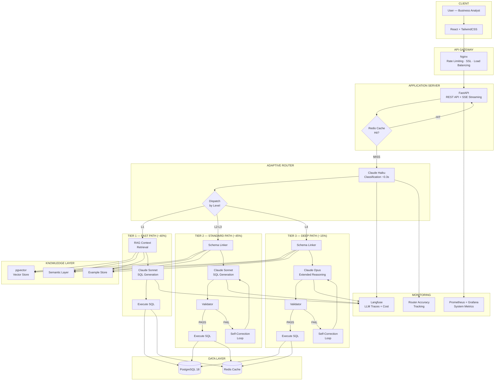
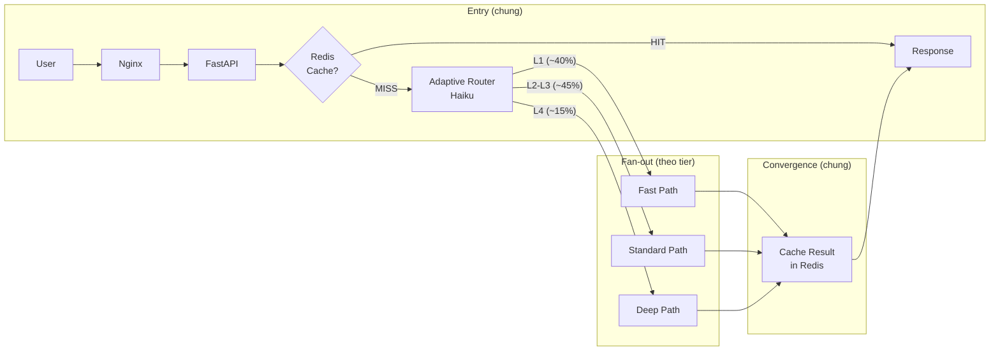
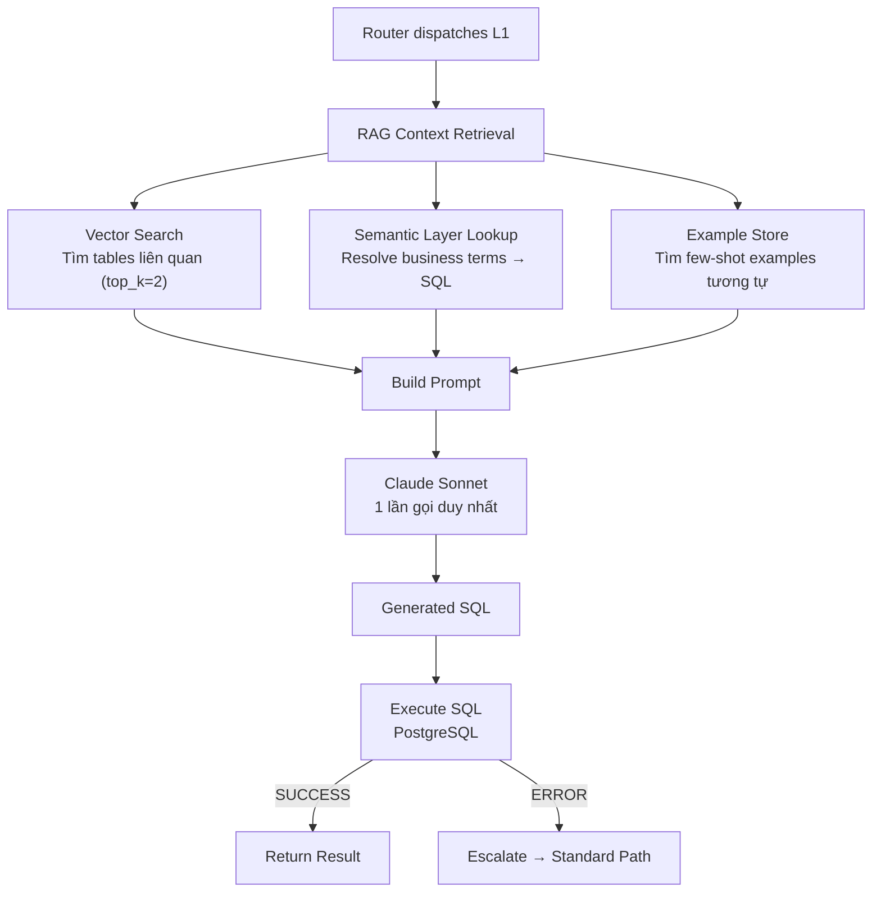
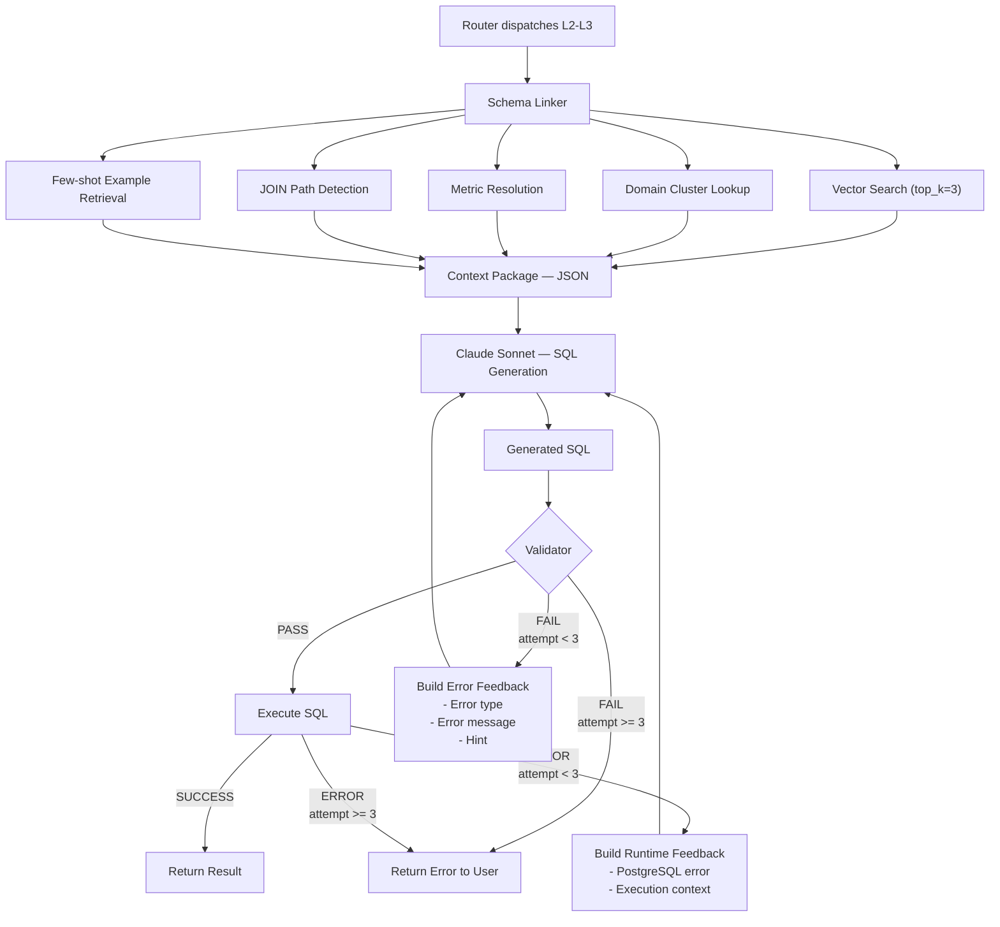
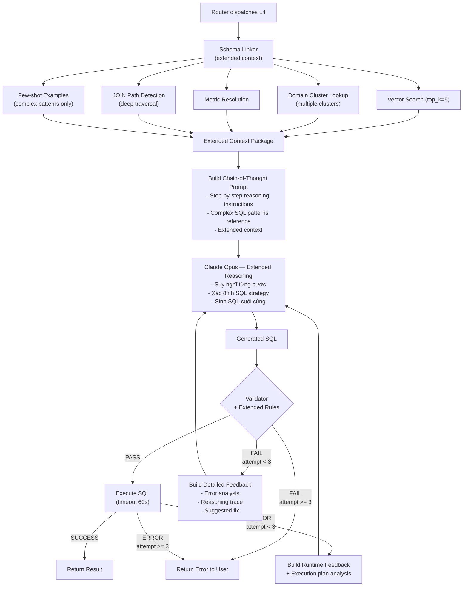
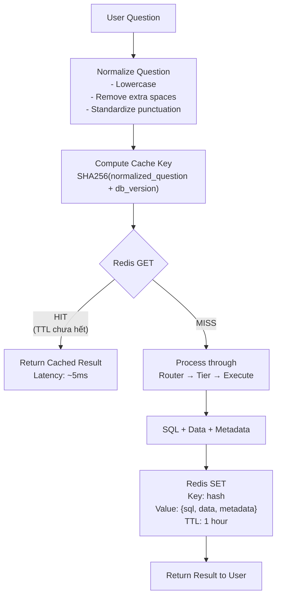
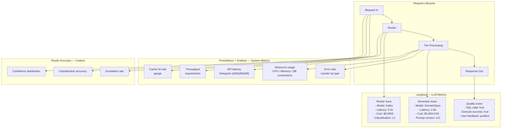
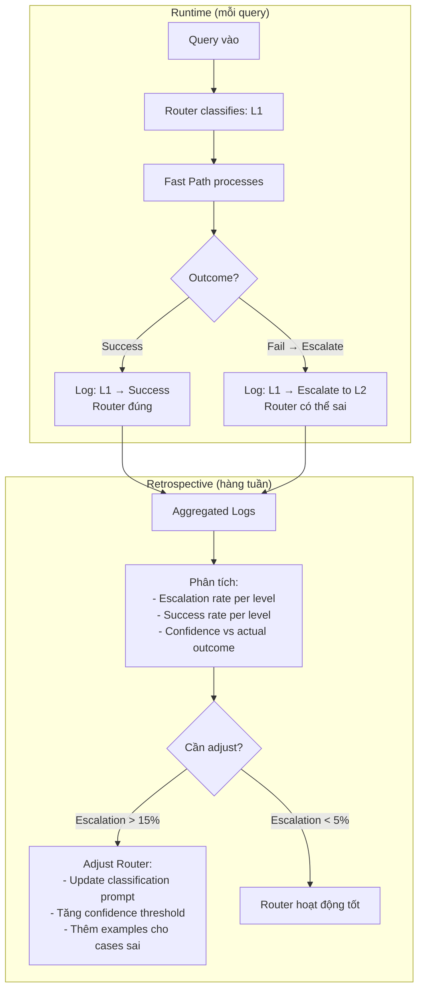
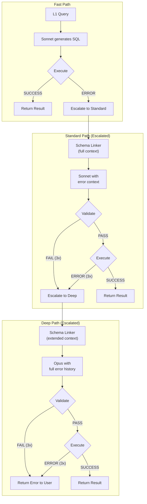

# Luồng Architecture Tổng Thể — Adaptive Router + Tiered Agents

### Pattern 3 | Phase 3 — Production

---

## MỤC LỤC

1. [Kiến trúc tổng thể](#1-kiến-trúc-tổng-thể)
2. [Luồng traffic tổng quan](#2-luồng-traffic-tổng-quan)
3. [Chi tiết luồng từng Tier](#3-chi-tiết-luồng-từng-tier)
4. [Caching Layer](#4-caching-layer)
5. [Monitoring Integration](#5-monitoring-integration)
6. [Router Feedback Loop](#6-router-feedback-loop)
7. [Tier Escalation](#7-tier-escalation)

---

## 1. KIẾN TRÚC TỔNG THỂ

---

## 2. LUỒNG TRAFFIC TỔNG QUAN

Mọi request đều đi qua cùng một entry point, sau đó fan-out theo classification của Router:

**Các bước chung cho mọi request:**

| Bước | Component | Mô tả | Latency |
|------|-----------|-------|---------|
| 1 | Nginx | Nhận request, rate limit check, forward đến FastAPI | ~1-5ms |
| 2 | FastAPI | Parse request, authenticate, extract question | ~1-5ms |
| 3 | Redis | Kiểm tra cache — nếu HIT, trả kết quả ngay | ~1-5ms |
| 4 | Router (Haiku) | Classify câu hỏi → dispatch đến tier | ~300ms |
| 5 | Tier processing | Xử lý theo tier tương ứng | 2-15s (tùy tier) |
| 6 | Redis | Cache kết quả với TTL | ~1-5ms |
| 7 | FastAPI | Format response, stream về client | ~1-5ms |

---

## 3. CHI TIẾT LUỒNG TỪNG TIER

### 3.1 Fast Path — Luồng nội bộ

**Đặc điểm:**
- Không có Validator → SQL đi thẳng vào Executor
- Nếu Executor trả error → **escalate lên Standard Path** (không retry trong Fast Path)
- Tổng latency: ~2-3s (RAG ~0.5s + Sonnet ~1.5-2s + Execute ~0.3s)

### 3.2 Standard Path — Luồng nội bộ

**Đặc điểm:**
- Full pipeline giống Pattern 1
- Validator bắt lỗi trước khi execute → tiết kiệm DB resources
- Self-Correction Loop tối đa 3 attempts
- Tổng latency: ~5-8s (Linker ~1s + Sonnet ~2-3s + Validate ~0.5s + Execute ~0.5s, x1-3 attempts)

### 3.3 Deep Path — Luồng nội bộ

**Đặc điểm khác biệt so với Standard Path:**
- Schema Linker retrieve nhiều context hơn (`top_k=5` thay vì 3)
- Multiple domain clusters (câu hỏi L4 thường span nhiều domains)
- Chain-of-thought prompting cho Opus — yêu cầu reasoning trước khi viết SQL
- Validator có thêm rules cho complex patterns (CTE nesting depth, window function syntax)
- Execute timeout dài hơn (60s thay vì 30s)
- Error feedback chi tiết hơn — bao gồm reasoning trace
- Tổng latency: ~10-15s

---

## 4. CACHING LAYER

Redis đóng vai trò cache layer quan trọng, giảm LLM calls và cải thiện latency cho repeated queries.

### 4.1 Cache Flow

### 4.2 Cache Key Design

| Thành phần | Mô tả | Ví dụ |
|-----------|-------|-------|
| **Normalized question** | Câu hỏi sau khi normalize | "top 10 merchant doanh thu cao nhất quý trước" |
| **DB version** | Version hash của data (thay đổi khi data update) | "v20260325" |
| **Cache key** | SHA256 hash | `SHA256("top 10 merchant...||v20260325")` |

**Tại sao cần DB version?** Khi data trong PostgreSQL thay đổi (ETL chạy hàng đêm), cache cũ sẽ invalidate tự động vì DB version thay đổi → cache key khác → cache miss.

### 4.3 Cache Hit Rate dự kiến

| Scenario | Cache hit rate | Lý do |
|----------|---------------|-------|
| Ngày đầu tiên | ~0% | Cache trống |
| Sau 1 tuần | ~20-30% | Các câu hỏi phổ biến bắt đầu lặp lại |
| Ổn định | ~30-40% | Business users hỏi lặp các báo cáo quen thuộc |

---

## 5. MONITORING INTEGRATION

Mọi bước trong pipeline đều được log để monitoring và debug.

### 5.1 Tổng quan Monitoring Flow

### 5.2 Điểm đo cụ thể tại mỗi bước

| Bước | Langfuse log | Prometheus metric |
|------|-------------|-------------------|
| **Nginx receive** | — | `http_requests_total`, `request_duration_seconds` |
| **Redis check** | — | `cache_hit_total`, `cache_miss_total` |
| **Router classify** | Model, latency, cost, classification result | `router_latency_seconds`, `router_classification_total{level}` |
| **Schema Linker** | — | `schema_linker_latency_seconds`, `tables_retrieved_count` |
| **SQL Generator** | Model, prompt, response, latency, cost | `llm_latency_seconds{model}`, `llm_cost_total{model}` |
| **Validator** | — | `validation_pass_total`, `validation_fail_total` |
| **Executor** | — | `sql_execution_seconds`, `sql_error_total{type}` |
| **Self-Correction** | Retry count, error feedback | `retry_count_total{tier}` |

---

## 6. ROUTER FEEDBACK LOOP

Router accuracy quyết định hiệu quả của toàn bộ Pattern 3. Feedback loop giúp cải thiện Router theo thời gian.

### 6.1 Cách đo Router accuracy

### 6.2 Metrics cho Feedback Loop

| Metric | Công thức | Target |
|--------|----------|--------|
| **Escalation rate** | Escalated queries / Total queries | < 10% |
| **Downgrade waste** | Queries dùng tier cao nhưng SQL đơn giản / Total queries | < 5% |
| **Router accuracy** | Correctly classified / Total queries | > 85% |
| **Average confidence** | Mean(confidence scores) | > 0.75 |

### 6.3 Cách cải thiện Router

| Vấn đề phát hiện | Hành động | Ví dụ |
|-------------------|----------|-------|
| Quá nhiều L1 escalate lên L2 | Tăng confidence threshold cho L1 (0.7 → 0.8) | Câu hỏi có "theo tháng" bị classify L1 nhưng cần GROUP BY + date |
| Quá nhiều L2 dùng Opus (waste) | Thêm examples cho L2 trong prompt | "Top merchant" bị classify L4 nhưng chỉ cần simple JOIN |
| Confidence thấp liên tục cho 1 loại câu hỏi | Thêm examples cho loại đó vào classification prompt | Câu hỏi so sánh temporal luôn bị low confidence |

---

## 7. TIER ESCALATION

Khi một tier không xử lý được query, hệ thống tự động escalate lên tier cao hơn.

### 7.1 Escalation Flow

### 7.2 Escalation Rules

| Trigger | Từ tier | Đến tier | Context truyền theo |
|---------|---------|----------|---------------------|
| Execute error ở Fast Path | Tier 1 | Tier 2 | Original question + failed SQL + error message |
| 3x validate/execute fail ở Standard | Tier 2 | Tier 3 | Original question + 3 failed SQLs + error history |
| 3x validate/execute fail ở Deep | Tier 3 | — | Return error to user |

**Nguyên tắc quan trọng:**
- Escalation **không quay lại** — chỉ đi lên (L1 → L2 → L3, không bao giờ L3 → L1)
- Mỗi lần escalate, tier mới nhận **toàn bộ error context** từ tier trước — giúp LLM tránh lặp lỗi
- Tối đa **2 lần escalate** cho 1 query (L1 → L2 → L3 → error nếu vẫn fail)
- Escalation được log cho Router feedback loop — Router sẽ học từ các case bị escalate

### 7.3 Tổng latency worst case

| Scenario | Flow | Tổng latency |
|----------|------|-------------|
| Best case (L1, cache hit) | Redis → Return | ~5ms |
| Normal (L1, no cache) | Router → Fast → Execute | ~2.5-3.5s |
| Normal (L2, no cache) | Router → Standard → Execute | ~5.5-8.5s |
| Normal (L4, no cache) | Router → Deep → Execute | ~10.5-15.5s |
| Worst case (L1 → escalate L2 → L3) | Router → Fast fail → Standard fail → Deep → Execute | ~25-30s |

**Worst case ~30s** là chấp nhận được vì:
- Xảy ra rất hiếm (< 1% queries)
- User vẫn nhận feedback qua SSE streaming ("Đang xử lý...", "Đang thử lại...")
- Tốt hơn trả kết quả sai
