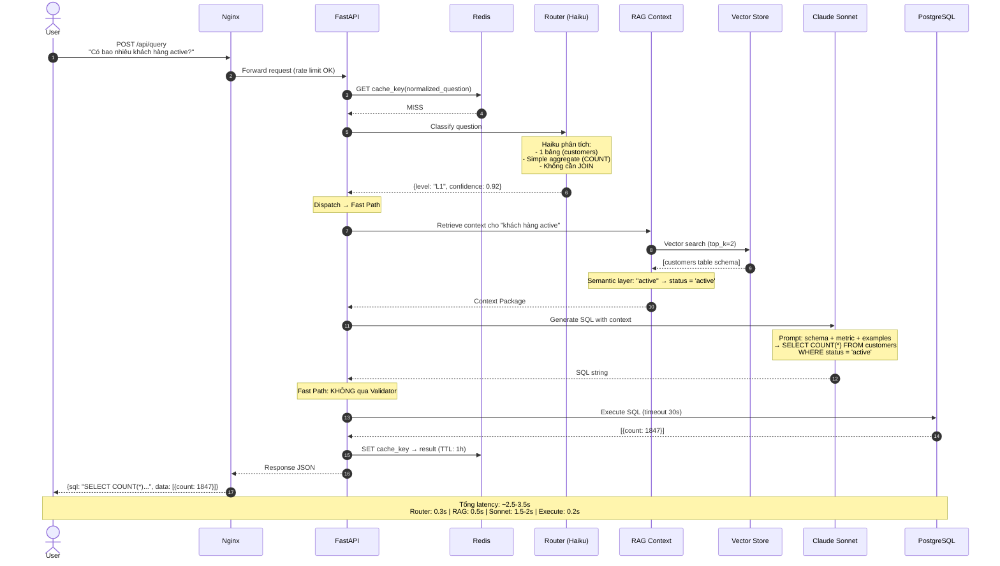
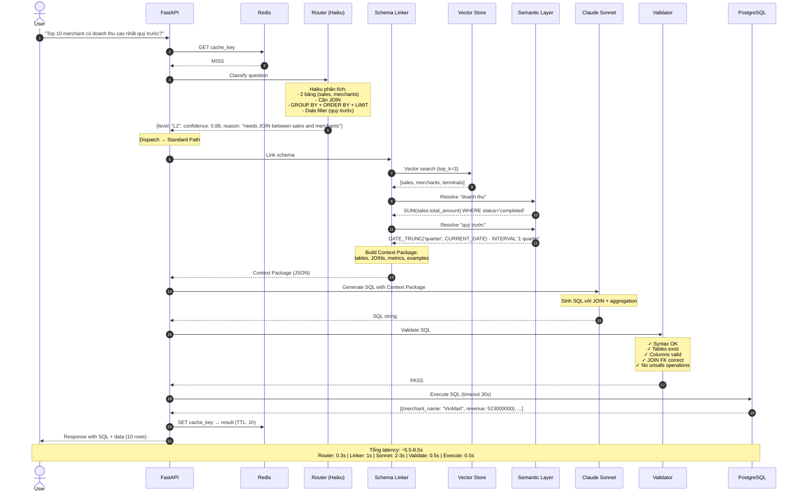
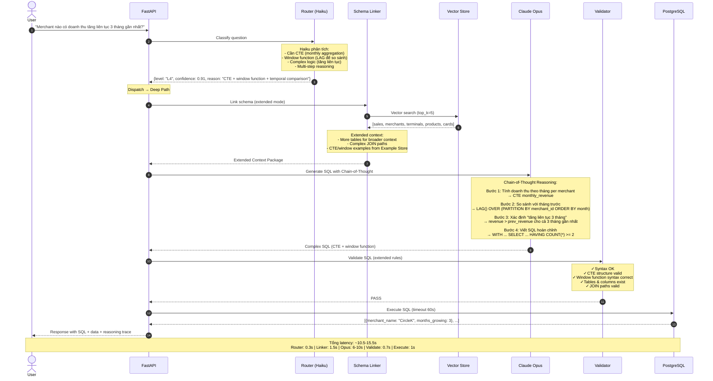
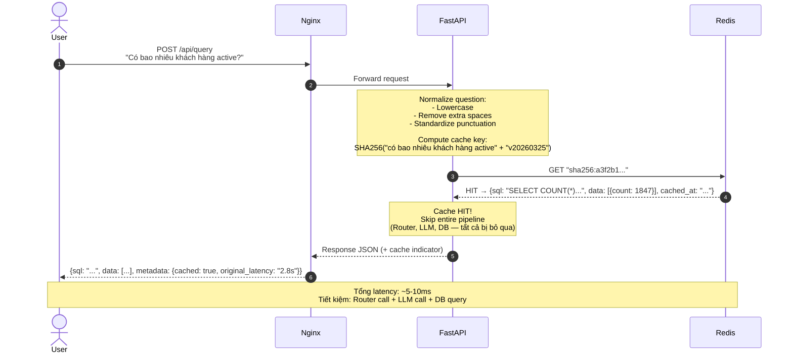
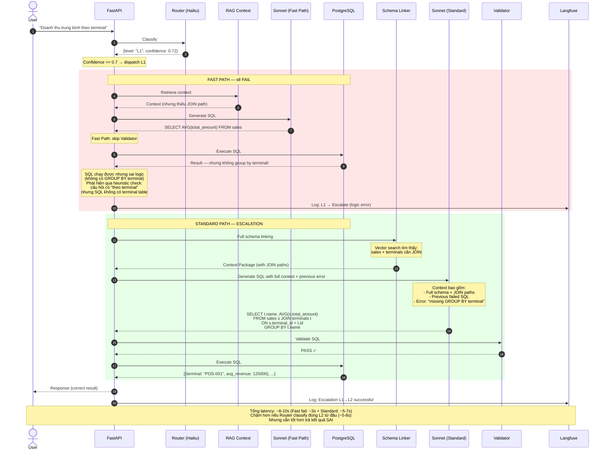
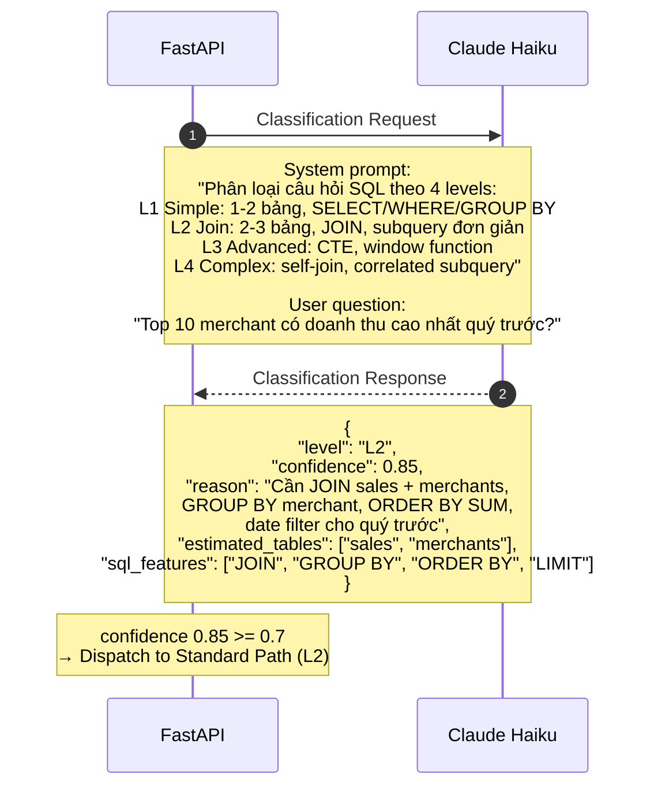
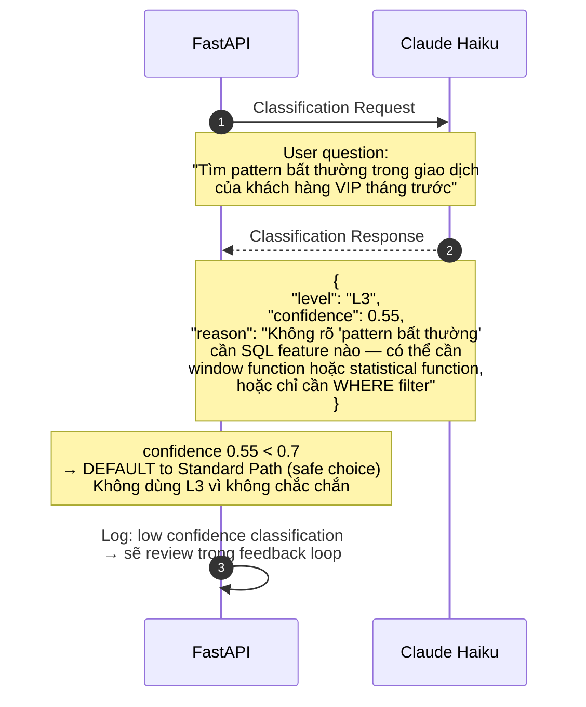
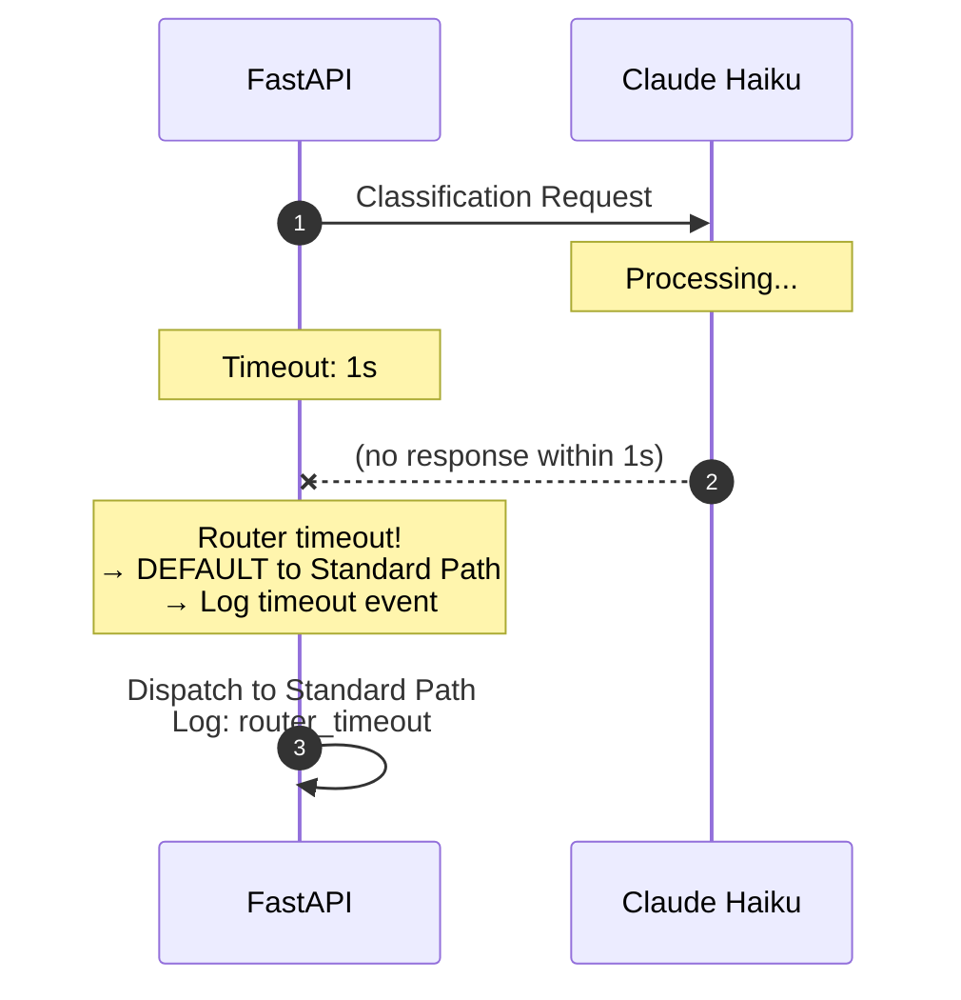
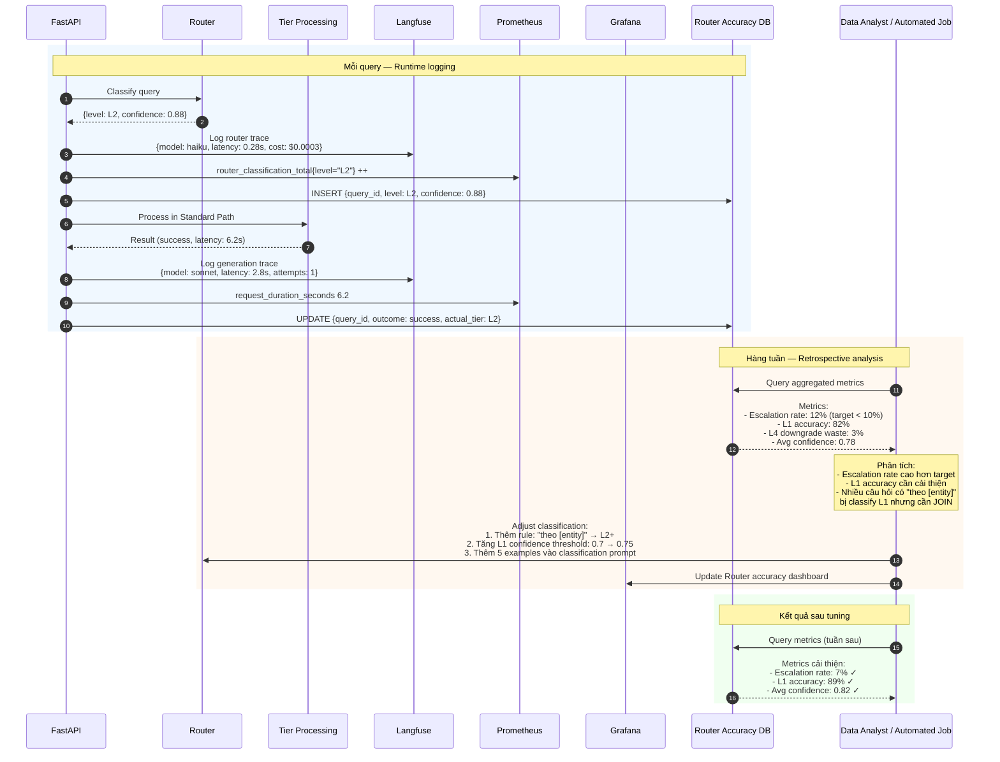

# Sequence Diagrams — Adaptive Router + Tiered Agents

### Pattern 3 | Phase 3 — Production

---

## MỤC LỤC

1. [E2E Happy Path — Fast Path (L1)](#1-e2e-happy-path--fast-path-l1)
2. [E2E Happy Path — Standard Path (L2-L3)](#2-e2e-happy-path--standard-path-l2-l3)
3. [E2E Happy Path — Deep Path (L4)](#3-e2e-happy-path--deep-path-l4)
4. [Cache Hit Flow](#4-cache-hit-flow)
5. [Tier Escalation (Fallback)](#5-tier-escalation-fallback)
6. [Router Classification Detail](#6-router-classification-detail)
7. [Monitoring & Feedback Loop](#7-monitoring--feedback-loop)

---

## 1. E2E HAPPY PATH — FAST PATH (L1)

**Scenario:** User hỏi "Có bao nhiêu khách hàng active?" — câu hỏi đơn giản, chỉ cần `SELECT COUNT(*) FROM customers WHERE status = 'active'`.

**Tổng latency:** ~2.5-3.5s

---

## 2. E2E HAPPY PATH — STANDARD PATH (L2-L3)

**Scenario:** User hỏi "Top 10 merchant có doanh thu cao nhất quý trước?" — cần JOIN sales + merchants, GROUP BY, ORDER BY, date filter.

**Tổng latency:** ~5.5-8.5s

---

## 3. E2E HAPPY PATH — DEEP PATH (L4)

**Scenario:** User hỏi "Merchant nào có doanh thu tăng liên tục trong 3 tháng gần nhất?" — cần CTE + window function (LAG) + complex logic.

**Tổng latency:** ~10.5-15.5s

---

## 4. CACHE HIT FLOW

**Scenario:** User hỏi câu hỏi đã được hỏi trước đó (hoặc câu hỏi tương đương sau normalize).

**Tổng latency:** ~5-10ms

**Cache key computation:**

| Bước | Input | Output |
|------|-------|--------|
| 1. Normalize | "Có Bao Nhiêu  khách hàng active? " | "có bao nhiêu khách hàng active" |
| 2. Append DB version | + "v20260325" | "có bao nhiêu khách hàng active\|\|v20260325" |
| 3. Hash | SHA256(...) | "sha256:a3f2b1c4d5e6..." |

**Cache invalidation:**
- TTL: 1 giờ (tự động expire)
- DB version thay đổi (ETL chạy) → tất cả cache key thay đổi → auto miss
- Manual flush khi cần (admin API)

---

## 5. TIER ESCALATION (FALLBACK)

**Scenario:** Router classify câu hỏi là L1, nhưng Fast Path generate SQL sai → Escalate lên Standard Path → xử lý thành công.

**Ví dụ:** "Doanh thu trung bình theo terminal" — Router nghĩ đơn giản (AVG), nhưng thực tế cần JOIN sales + terminals.

**Key takeaway:** Escalation tốn thêm latency nhưng đảm bảo accuracy. Router feedback loop sẽ học từ case này: câu hỏi có "theo [entity]" → có thể cần JOIN → nên classify L2+.

---

## 6. ROUTER CLASSIFICATION DETAIL

**Scenario:** Chi tiết cách Router (Haiku) classify một câu hỏi.

### 6.1 Normal Classification (High Confidence)

### 6.2 Low Confidence — Fallback to Standard

### 6.3 Router Timeout — Fallback

---

## 7. MONITORING & FEEDBACK LOOP

**Scenario:** Hệ thống thu thập dữ liệu từ mỗi query để phân tích và cải thiện Router.

**Dashboard metrics trên Grafana:**

| Panel | Metric | Visualization | Mục đích |
|-------|--------|--------------|----------|
| Router Accuracy | % correctly classified per level | Stacked bar chart (daily) | Track Router quality over time |
| Escalation Rate | % queries escalated per tier | Line chart (daily) | Phát hiện khi Router bắt đầu suy giảm |
| Latency by Tier | p50, p95 latency per tier | Heatmap | Phát hiện tier nào bị chậm |
| Cost Breakdown | LLM cost per tier per day | Stacked area chart | Tracking chi phí theo tier |
| Confidence Distribution | Histogram of Router confidence scores | Histogram | Nhiều low confidence = Router cần retune |
| Cache Hit Rate | % cache hits over time | Gauge | Theo dõi hiệu quả cache |
