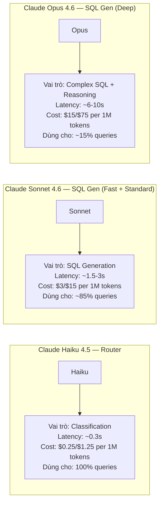
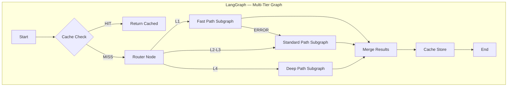
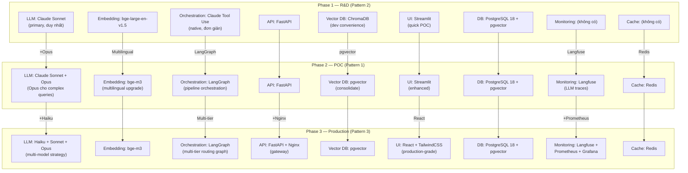

# Tech Stack Đề Xuất — Adaptive Router + Tiered Agents

### Pattern 3 | Phase 3 — Production

---

## MỤC LỤC

1. [Tổng quan Tech Stack](#1-tổng-quan-tech-stack)
2. [Multi-Model Strategy](#2-multi-model-strategy)
3. [Chi tiết lý do lựa chọn](#3-chi-tiết-lý-do-lựa-chọn)
4. [So sánh thay đổi từ Phase 2](#4-so-sánh-thay-đổi-từ-phase-2)
5. [Tech Stack Evolution](#5-tech-stack-evolution)
6. [Cost Analysis](#6-cost-analysis)

---

## 1. TỔNG QUAN TECH STACK

Pattern 3 (Phase 3 — Production) kế thừa toàn bộ tech stack từ Pattern 1 (Phase 2), bổ sung thêm các component cho routing, production UI, và monitoring.

| Layer | Component | Technology | Ghi chú |
|-------|-----------|-----------|---------|
| **LLM (Router)** | Classification | **Claude Haiku 4.5** (~0.3s, $0.25/$1.25 per 1M tokens) | Mới ở Phase 3 |
| **LLM (Fast + Standard)** | SQL Generation | **Claude Sonnet 4.6** | Kế thừa từ Phase 2 |
| **LLM (Deep)** | Complex SQL | **Claude Opus 4.6** | Kế thừa từ Phase 2 |
| **Embedding** | Multilingual | **bge-m3** | Kế thừa từ Phase 2 |
| **Framework** | Orchestration | **LangGraph** (multi-tier graph routing) | Nâng cấp: thêm routing graph |
| **API** | Web Server | **FastAPI** | Kế thừa từ Phase 2 |
| **API Gateway** | Reverse Proxy | **Nginx** (rate limiting, SSL, load balancing) | Mới ở Phase 3 |
| **Vector DB** | Production | **PostgreSQL pgvector** | Kế thừa từ Phase 2 |
| **Cache** | Query + Session | **Redis** | Kế thừa từ Phase 2 |
| **Database** | Primary | **PostgreSQL 18 + pgvector** | Kế thừa từ Phase 1 |
| **UI** | Production | **React + TailwindCSS** | Mới ở Phase 3 (thay Streamlit) |
| **Monitoring (LLM)** | Traces | **Langfuse** | Kế thừa từ Phase 2 |
| **Monitoring (Infra)** | Metrics | **Prometheus + Grafana** | Mới ở Phase 3 |
| **Language** | Runtime | **Python 3.11+** | Kế thừa từ Phase 1 |

---

## 2. MULTI-MODEL STRATEGY

Đặc trưng nổi bật nhất của Pattern 3 là sử dụng **3 LLM models khác nhau** cho 3 mục đích khác nhau, tối ưu trade-off giữa cost, latency và accuracy.

### 2.1 Phân bổ model theo vai trò

### 2.2 Tại sao 3 models thay vì 1?

| Approach | Cost/query (avg) | Latency (avg) | Accuracy |
|----------|-----------------|---------------|----------|
| **Chỉ dùng Opus cho tất cả** | $0.05-0.08 | ~8-12s | Cao nhất, nhưng overkill cho L1 |
| **Chỉ dùng Sonnet cho tất cả** | $0.003-0.01 | ~3-6s | Tốt cho L1-L3, struggle ở L4 |
| **Multi-model (Haiku + Sonnet + Opus)** | **$0.005-0.015** | **~4.8s** | **Tối ưu: đúng model cho đúng task** |

**Phân tích cost cho 1000 queries:**

| Model | Queries | Cost/query | Tổng cost |
|-------|---------|-----------|-----------|
| Haiku (Router) | 1000 (100%) | ~$0.0003 | $0.30 |
| Sonnet (Fast Path) | 400 (40%) | ~$0.003 | $1.20 |
| Sonnet (Standard Path) | 450 (45%) | ~$0.008 | $3.60 |
| Opus (Deep Path) | 150 (15%) | ~$0.05 | $7.50 |
| **Tổng** | **1000** | **~$0.013/query** | **$12.60** |

So sánh nếu dùng Opus cho tất cả: 1000 x $0.05 = **$50.00** → Pattern 3 tiết kiệm ~75% chi phí LLM.

---

## 3. CHI TIẾT LÝ DO LỰA CHỌN

### 3.1 Claude Haiku 4.5 — Router Classification

| Tiêu chí | Đánh giá |
|----------|----------|
| **Tại sao cần LLM cho routing?** | Rule-based classification không hiểu ngữ nghĩa → classify sai câu hỏi phức tạp viết đơn giản |
| **Tại sao Haiku?** | Nhanh nhất trong Claude family (~0.3s), rẻ nhất ($0.25/$1.25), đủ thông minh cho classification |
| **Tại sao không Sonnet?** | Sonnet chậm hơn (~1-2s) và đắt hơn 12x — overkill cho classification |
| **Tại sao không rule-based?** | Rule-based accuracy ~70-75%, Haiku classification accuracy ~85-90% |
| **Cost overhead** | ~$0.0003/query — gần như không đáng kể so với tổng pipeline cost |

### 3.2 Claude Sonnet 4.6 — SQL Generation (Fast + Standard)

| Tiêu chí | Đánh giá |
|----------|----------|
| **Tại sao Sonnet cho SQL?** | Balance tốt nhất giữa cost, speed, và accuracy cho SQL generation |
| **Accuracy trên SQL** | 85-90% cho L1-L3 queries khi có đủ context (semantic layer + few-shot) |
| **Tool use capability** | Native tool use — quan trọng cho structured output (SQL extraction) |
| **Tiếng Việt** | Hỗ trợ tốt — hiểu câu hỏi tiếng Việt, sinh SQL đúng |
| **Dùng ở Fast + Standard** | Fast Path: 1 call, Standard: 1-3 calls (retry) |

### 3.3 Claude Opus 4.6 — Complex SQL (Deep Path)

| Tiêu chí | Đánh giá |
|----------|----------|
| **Tại sao cần Opus?** | Sonnet accuracy giảm 10-15% ở L4 queries (self-join, correlated subquery, complex CTE) |
| **Extended reasoning** | Opus có chain-of-thought reasoning mạnh hơn → ít lỗi logic ở SQL phức tạp |
| **Cost cao nhưng ít dùng** | Chỉ 15% queries dùng Opus → chi phí trung bình vẫn hợp lý |
| **Khi nào dùng Opus?** | Self-join, INTERSECT/EXCEPT, correlated subquery, multi-CTE, complex window functions |

### 3.4 bge-m3 — Embedding Model

| Tiêu chí | Đánh giá |
|----------|----------|
| **Tại sao bge-m3?** | Multilingual — hỗ trợ tiếng Việt tốt (bge-large-en chỉ English) |
| **Dense + Sparse retrieval** | Hybrid search cho kết quả tốt hơn |
| **Kế thừa từ Phase 2** | Đã được tune và validate ở Phase 2 |

### 3.5 LangGraph — Orchestration Framework

| Tiêu chí | Đánh giá |
|----------|----------|
| **Tại sao LangGraph?** | Graph-based orchestration — tự nhiên cho multi-tier routing với conditional edges |
| **Multi-tier routing** | LangGraph hỗ trợ conditional branching — Router node → branch đến 3 tier subgraphs |
| **State management** | Built-in state management cho retry loop, escalation context |
| **Nâng cấp từ Phase 2** | Phase 2 dùng LangGraph cho linear pipeline → Phase 3 thêm routing graph |

### 3.6 React + TailwindCSS — Production UI

| Tiêu chí | Streamlit (Phase 1-2) | React + TailwindCSS (Phase 3) |
|-----------|----------------------|-------------------------------|
| **Setup effort** | 30 phút | 2-3 ngày |
| **Component reusability** | Thấp | Cao — component library |
| **SSE/WebSocket** | Khó, workaround | Native support |
| **Mobile responsive** | Không | Có (TailwindCSS responsive utilities) |
| **Performance** | Chậm (full page re-render) | Nhanh (Virtual DOM, selective re-render) |
| **Customization** | Hạn chế (widget-based) | Tùy biến hoàn toàn |
| **Production readiness** | Prototype only | Production-grade |

**Tại sao chuyển?** Phase 3 là production — cần UX tốt cho business users hàng ngày, không phải demo/POC. SSE streaming đặc biệt quan trọng khi latency Deep Path lên đến 15s.

### 3.7 Nginx — API Gateway

| Chức năng | Lý do cần ở Phase 3 |
|-----------|---------------------|
| **Rate limiting** | Bảo vệ LLM API costs — giới hạn requests/phút/user |
| **SSL termination** | HTTPS cho production security |
| **Load balancing** | Nhiều FastAPI instances khi scale |
| **Static file serving** | Serve React build files |
| **Gzip compression** | Giảm bandwidth cho API responses |

**Tại sao không cần ở Phase 1-2?** Dev/POC environment không cần rate limiting, SSL, hay load balancing. FastAPI trực tiếp đủ dùng.

### 3.8 Prometheus + Grafana — Infrastructure Monitoring

| | Langfuse | Prometheus + Grafana |
|---|---------|---------------------|
| **Chuyên môn** | LLM-specific metrics | System infrastructure metrics |
| **Metrics** | Token usage, cost, prompt versions, LLM latency | CPU, memory, DB connections, HTTP latency, error rates |
| **Alerting** | Không (chủ yếu analytics) | Có — AlertManager |
| **Dashboard** | LLM traces, cost analysis | System health, SLO/SLA tracking |
| **Cần cả hai?** | Có — Langfuse không track system metrics, Prometheus không hiểu LLM semantics |

**Tại sao cần ở Phase 3?**
- Phase 2: Langfuse đủ cho POC — chỉ cần track LLM quality
- Phase 3: Production cần system-level monitoring — CPU, memory, DB connections, error rates, SLA compliance

---

## 4. SO SÁNH THAY ĐỔI TỪ PHASE 2

| Component | Phase 2 (Pattern 1) | Phase 3 (Pattern 3) | Loại thay đổi |
|-----------|---------------------|---------------------|---------------|
| Claude Sonnet | Primary SQL Gen | Fast + Standard Path | Giữ nguyên |
| Claude Opus | Complex queries | Deep Path | Giữ nguyên |
| **Claude Haiku** | — | **Router classification** | **Mới** |
| bge-m3 | Embedding | Embedding | Giữ nguyên |
| LangGraph | Linear pipeline | **Multi-tier routing graph** | **Nâng cấp** |
| FastAPI | Web server | Web server | Giữ nguyên |
| **Nginx** | — | **API Gateway** | **Mới** |
| pgvector | Vector store | Vector store | Giữ nguyên |
| Redis | Cache | Cache + session | Giữ nguyên |
| PostgreSQL 18 | Primary DB | Primary DB | Giữ nguyên |
| Streamlit | POC UI | — | **Thay thế** |
| **React + TailwindCSS** | — | **Production UI** | **Mới** |
| Langfuse | LLM monitoring | LLM monitoring | Giữ nguyên |
| **Prometheus + Grafana** | — | **System monitoring** | **Mới** |

**Tóm tắt:** 5 components mới, 1 component nâng cấp, 1 component thay thế. Phần lớn tech stack kế thừa từ Phase 2 — giảm rủi ro migration.

---

## 5. TECH STACK EVOLUTION

### 5.1 Lộ trình phát triển qua 3 phases

### 5.2 Tóm tắt evolution theo layer

| Layer | Phase 1 (R&D) | Phase 2 (POC) | Phase 3 (Production) |
|-------|---------------|---------------|---------------------|
| **LLM** | Sonnet | Sonnet + Opus | **Haiku + Sonnet + Opus** |
| **Embedding** | bge-large-en | **bge-m3** | bge-m3 |
| **Orchestration** | Claude Tool Use | **LangGraph** | LangGraph (multi-tier) |
| **API** | FastAPI | FastAPI | FastAPI + **Nginx** |
| **Vector DB** | ChromaDB | **pgvector** | pgvector |
| **Cache** | — | **Redis** | Redis |
| **UI** | Streamlit | Streamlit | **React + TailwindCSS** |
| **Monitoring** | — | **Langfuse** | Langfuse + **Prometheus + Grafana** |
| **Database** | PostgreSQL 18 | PostgreSQL 18 | PostgreSQL 18 |
| **Language** | Python 3.11+ | Python 3.11+ | Python 3.11+ |

**Nguyên tắc evolution:** Mỗi phase chỉ thay đổi/thêm 3-5 components. Không bao giờ thay đổi tất cả cùng lúc → giảm rủi ro, dễ rollback nếu có vấn đề.

---

## 6. COST ANALYSIS

### 6.1 Chi phí LLM (ước tính cho 1000 queries/ngày)

| Component | Model | Queries/ngày | Cost/query (avg) | Cost/ngày |
|-----------|-------|-------------|-----------------|-----------|
| Router | Haiku | 1000 | $0.0003 | $0.30 |
| Fast Path | Sonnet | 400 | $0.003 | $1.20 |
| Standard Path | Sonnet | 450 | $0.008 | $3.60 |
| Deep Path | Opus | 150 | $0.05 | $7.50 |
| **Tổng** | | **1000** | **~$0.013** | **$12.60** |

### 6.2 So sánh cost giữa các strategies

| Strategy | Cost/ngày (1000 queries) | Cost/tháng | Ghi chú |
|----------|------------------------|-----------|---------|
| Chỉ Opus | $50.00 | $1,500 | Overkill cho simple queries |
| Chỉ Sonnet | $8.00 | $240 | Accuracy thấp cho L4 queries |
| **Multi-model (Pattern 3)** | **$12.60** | **$378** | Tối ưu cost + accuracy |

### 6.3 Chi phí infrastructure (ước tính hàng tháng)

| Component | Specification | Cost/tháng (ước tính) |
|-----------|-------------|---------------------|
| Server (FastAPI + Nginx) | 4 vCPU, 16GB RAM | $80-120 |
| PostgreSQL 18 | 4 vCPU, 16GB RAM, 100GB SSD | $100-150 |
| Redis | 2GB RAM | $20-30 |
| Langfuse | Cloud plan | $50-100 |
| Prometheus + Grafana | Self-hosted trên cùng server | $0 (included) |
| **Tổng infrastructure** | | **$250-400** |
| **Tổng (LLM + infra)** | | **$628-778** |

**Nhận xét:** Chi phí LLM ($378/tháng) và infrastructure ($250-400/tháng) ở mức hợp lý cho enterprise production system. Multi-model strategy giúp tiết kiệm ~75% LLM cost so với dùng Opus cho toàn bộ queries.
